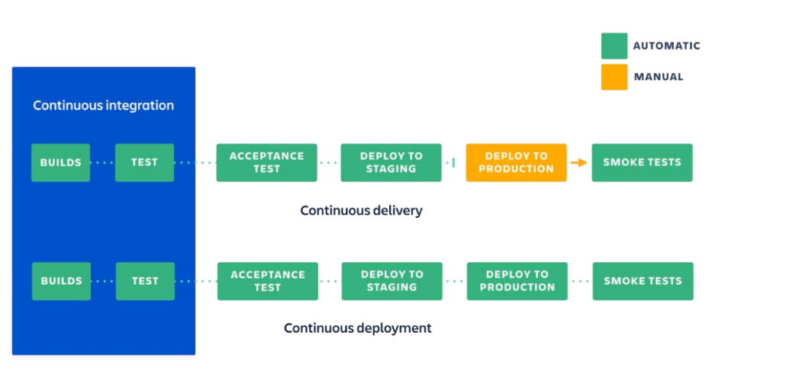

# [Control de Versiones y Cambios - Integracion Continua](#cam)

| Temas |
|----------|
| [Git vs Mercurial](#ent63) |
| [Para que nos sirve Git?](#cam1) |
| [Conceptos base de Git](#cam2) |
| [Algunos comandos de Git](#cam3) |
| [Git Flow](#cam4) |
| [trunk base dev. vs git flow](#cam5) |
| [Que es CI-CD?](#cam6)   |
| [Que es un CI-CD Pipeline?](#cam7) |
| [Que es Continuous Integration en detalle?](#cam8) |
| [Que es Continuous Delivery en detalle?](#cam9) |
| [Que es Continuous Deployment en detalle?](#cam10) |

---

## Control de Versiones y Cambios

### **Git vs Mercurial**

[Volver al indice](#cam-base)

Las diferencias principales entre **Git** y **Mercurial** son:

### **1. Filosofía y Diseño**

- **Git**:
  - **Modelo distribuido**: Git es un sistema distribuido de control de versiones. Cada desarrollador tiene una copia completa del repositorio, incluidos el historial de cambios y las ramas.
  - **Eficiencia y rendimiento**: Git está diseñado para ser rápido y manejar grandes repositorios con eficiencia, lo que lo hace ideal para proyectos de gran escala.
  - **Complejidad**: Git puede ser más complejo debido a su amplio conjunto de características y su sintaxis más complicada. Ofrece una gran flexibilidad, pero eso puede hacer que sea más difícil de aprender para los principiantes.

- **Mercurial**:
  - **Modelo distribuido**: Al igual que Git, Mercurial también es distribuido, lo que significa que cada usuario tiene una copia completa del repositorio.
  - **Simplicidad y enfoque**: Mercurial se centra en ser simple, intuitivo y fácil de usar. Su flujo de trabajo está diseñado para ser más sencillo, lo que puede facilitar su adopción en equipos pequeños o nuevos en el control de versiones.
  - **Curva de aprendizaje**: Mercurial es generalmente considerado más fácil de aprender que Git debido a su sintaxis más sencilla y menos características avanzadas.

### **2. Popularidad y Comunidad**

- **Git**:
  - **Adopción**: Git es más popular que Mercurial y se ha convertido en el estándar de facto para la mayoría de los proyectos de desarrollo de software, especialmente en plataformas como GitHub, GitLab y Bitbucket.
  - **Ecosistema y herramientas**: Dado que Git es más utilizado, tiene un ecosistema más grande de herramientas, bibliotecas y documentación disponible. Muchas plataformas de desarrollo, CI/CD y servicios de repositorio están optimizados para Git.

- **Mercurial**:
  - **Adopción**: Aunque Mercurial tiene una base de usuarios leal, ha sido menos adoptado que Git, y muchos proyectos más grandes han migrado a Git. Un ejemplo famoso de esto es el caso de **Bitbucket**, que inicialmente soportaba Mercurial antes de que decidiera centrarse exclusivamente en Git.
  - **Comunidad más pequeña**: Mercurial tiene una comunidad de usuarios más pequeña en comparación con Git, lo que puede resultar en una menor cantidad de recursos y soporte.

### **3. Flujo de trabajo y rendimiento**

- **Git**:
  - **Ramas**: Git es conocido por su fuerte soporte para **ramas (branching)**, lo que permite a los desarrolladores crear y fusionar ramas de manera rápida y flexible. Git es altamente eficiente en cuanto al manejo de ramas, lo que lo hace perfecto para flujos de trabajo que dependen de ramificación y fusiones frecuentes.
  - **Rendimiento**: Git generalmente tiene un buen rendimiento, incluso con repositorios grandes, aunque algunas operaciones complejas como el *merge* pueden ser lentas si no se gestionan correctamente.

- **Mercurial**:
  - **Ramas**: Mercurial utiliza un modelo de ramas diferente al de Git. Si bien Mercurial también soporta ramas, su enfoque es algo diferente y puede ser menos flexible en comparación con Git. Sin embargo, Mercurial proporciona soporte para **"named branches"** y **"bookmarks"** (que son más parecidos a las ramas en Git).
  - **Rendimiento**: Mercurial también tiene un buen rendimiento, aunque puede no ser tan rápido como Git en repositorios de gran escala debido a su menor optimización para estos casos.

### **4. Características clave**

- **Git**:
  - **Flexibilidad avanzada**: Git ofrece una gran cantidad de comandos y opciones avanzadas, lo que permite personalizar flujos de trabajo según las necesidades del equipo o el proyecto.
  - **Staging Area**: Git tiene una **staging area** o área de preparación que permite a los desarrolladores seleccionar qué cambios se deben incluir en el próximo commit, lo que proporciona un control más preciso sobre las modificaciones.

- **Mercurial**:
  - **Simplicidad y enfoque**: Mercurial es más simple en cuanto a su conjunto de características. No tiene un equivalente directo a la **staging area** de Git, lo que hace que el flujo de trabajo sea más directo (aunque menos flexible).
  - **Facilidad de uso**: Mercurial ofrece una interfaz de línea de comandos más simple y tiene menos configuraciones que gestionar.

### **5. Soporte y Herramientas**

- **Git**:
  - **Herramientas**: Git es ampliamente soportado por herramientas de desarrollo modernas, como **GitHub**, **GitLab**, **Bitbucket** y otras plataformas de CI/CD. Además, la integración de Git con herramientas como **Visual Studio Code**, **Atom** y **Sublime Text** es muy robusta.
  - **Servicios en la nube**: Git es compatible con todos los principales servicios en la nube de control de versiones (GitHub, GitLab, Bitbucket).

- **Mercurial**:
  - **Herramientas**: Mercurial tiene soporte en herramientas como **Bitbucket** (aunque ya no se usa para repositorios nuevos), **SourceForge**, y algunos editores de texto. Sin embargo, su integración no es tan amplia como la de Git.
  - **Soporte de la comunidad**: La comunidad de Mercurial es más pequeña, lo que puede dificultar encontrar recursos y soporte en comparación con Git.

### **6. Casos de uso y elección**

- **Git**: 
  - Ideal para equipos grandes, proyectos de código abierto y flujos de trabajo con ramificación frecuente.
  - Utilizado ampliamente en la industria del software, especialmente en proyectos que requieren una integración estrecha con plataformas como GitHub o GitLab.
  
- **Mercurial**: 
  - Mejor para equipos más pequeños que buscan una herramienta sencilla y rápida de implementar.
  - Aún se utiliza en ciertos proyectos grandes y populares como **Mozilla** y **Facebook**, que lo adoptaron debido a sus beneficios para sus flujos de trabajo específicos.

---

### **Resumen de las diferencias clave**

| Característica                 | **Git**                                  | **Mercurial**                        |
|---------------------------------|------------------------------------------|--------------------------------------|
| **Popularidad**                 | Mucho más popular, especialmente con GitHub | Menos popular, con base de usuarios más pequeña |
| **Complejidad**                 | Más complejo, con muchas características avanzadas | Más simple, fácil de aprender |
| **Rendimiento**                 | Muy eficiente, especialmente en grandes repositorios | Buen rendimiento, pero no tan optimizado en repositorios grandes |
| **Soporte para ramas**          | Muy fuerte, con ramificación avanzada    | Menos flexible, pero soporta ramas básicas y bookmarks |
| **Flujo de trabajo**            | Flexible, adecuado para equipos grandes y colaboraciones complejas | Flujo de trabajo más simple y directo |
| **Herramientas y servicios**    | Gran soporte (GitHub, GitLab, Bitbucket) | Menos herramientas, principalmente Bitbucket antes de eliminar soporte |
| **Curva de aprendizaje**       | Más empinada, requiere más tiempo para aprender | Más fácil de aprender, ideal para principiantes |

### **Conclusión**

**Git** es la opción preferida para la mayoría de los proyectos de desarrollo modernos debido a su flexibilidad, rendimiento, y soporte en plataformas como GitHub. Es ideal para proyectos grandes y equipos que necesitan un control detallado sobre sus flujos de trabajo y un ecosistema de herramientas robusto.

**Mercurial** puede ser una excelente opción para proyectos pequeños o equipos que buscan una solución más simple y fácil de aprender, aunque su adopción está disminuyendo debido a la creciente popularidad de Git.

### **Para que nos sirve Git?**

[Volver al indice](#cam-base)

Son herramientas que nos permiten saber, entre otras cosas:

- Quien
- Cuando
- Porque

Nos permite separar nueva funcionalidad de la estable.

### **Conceptos base de Git**

- **Repositorio remoto:** Es el lugar centralizado donde se guardan los archivos.
- **Repositorio local**: Es el lugar dentro de la computadora donde se guardan los archivos.
- **Working directory:** Copia del repositorio donde voy a empezar a trabajar.
- **Versión**: Captura del repositorio en un determinado momento.
- **Commit**: Modificaciones que le hacemos a los archivos del repositorio en nuestra computadora.
- **Branch**: Son referencias a un commit específico o al más actualizado. Por convención tenemos una llamada master o main

### **Algunos comandos de Git**

[Volver al indice](#cam-base)

**`git init`:** Iniciar repositorio GIT en ese directorio

**`git status`:** Ver el estado de los archivos, sí estan untracked o para subir. (Sí no quiero tanto texto pongo git status -s)

**`git add “archivo” o *.exe` :** Para agregar los archivos que aparecen como untracked en el estado

**`git commit -m “mensaje”` :** Para commitear, y poner de referencia que cambios se hicieron. El mensaje debe estar entre comillas

**`git log`:** Para ver los cambios hechos hasta el momento

**`git remote add origin (link)` :** Para agregar un link de GitHub para subir el proyecto

**`git push -u origin master`:** Para subir el contenido al repositorio online

**`git clone (url)` :** Para clonar el repositorio git de ese link

**`git pull origin master`:** Para ver los cambios en nuestro repositorio

**`git branch (nombre branch)`:** Crear un branch

**`git log --graph --all --oneline`:** Ver todos los commits resumidos

Sí agrego un **Git ignore** se ignoran los archivos cache propios del Programa

### **Niveles de configuración**

- -local : Configurar un solo repositorio
- -global: Una configuracion para mi usuario solamente
- -system: Para todos los usuarios

### **Git Flow**

[Volver al indice](#cam-base)

- **Master:** Es la rama principal, la que se va a subir a producción.
- **Develop:** Es la rama de desarrollo, donde se van a hacer los cambios.
- **Feature:** Es la rama donde se van a hacer los cambios de una nueva funcionalidad.
- **Hotfix:** Es la rama donde se van a hacer los cambios de una funcionalidad que no esta funcionando bien.
- **Release:** Es la rama donde se van a hacer los cambios de una nueva versión.

### **trunk base dev. vs git flow**

[Volver al indice](#cam-base)

En el desarrollo basado en tronco, se trabaja principalmente en una sola rama (generalmente llamada "tronco" o "master"), y las características se desarrollan y se integran directamente en esta rama principal. En cambio, en Git flow, se utilizan múltiples ramas para gestionar diferentes tipos de cambios, como características, versiones de lanzamiento y correcciones de errores.

En resumen, mientras que el desarrollo basado en tronco enfatiza la simplicidad y la integración continua, Git flow proporciona un modelo más estructurado para gestionar el flujo de trabajo en proyectos más grandes con diferentes necesidades de versión y despliegue. La elección entre ambos enfoques depende de los requisitos y la complejidad del proyecto.

### **Que es CI-CD?**

[Volver al indice](#cam-base)

Son dos acronimos usados en la rama de DevOps y desarrollo. 

- CI: Continuous Integration, la practica de constantemente mergear codigo a un repositorio o branch central donde corren checks automaticos
- CD: Continuous Delivery o Deployment

CI es parte de tanto el proceso de Continuous Delivery como Deployment, donde se corren ciertos checks automaticos para luego mergear el codigo. 
La diferencia entre Delivery y Deployment es la presencia de un approval manual para deployar el codigo a produccion. Con Continuous Deployment, el codigo es subido a produccion sin necesidad de un approval explicito.

La aplicacion de cualquiera de los 3 requiere una fuerte cultura del testing y especialmente del testing automatizado, para esto se requeriria tambien, por ejemplo, chequear el coverage del codigo, ya que no tiene sentido ninguna de estas practicas si no hay codigo testing que lo chequee. 

Las herramientas mas usadas son Jenkins (Solucion on premise), Amazon CodePipeline, BitBucket Pipelines, CircleCI, Azure Pipelines, GitLab, entre otros. 

Tambien mediante el uso de Docker, se puede realizar el build de forma isolada, asi que se soluciona el tipico problema en donde los cambios funcionan en la computadora del dev pero no en otras computadoras. 

### **Que es CI-CD Pipeline?**

[Volver al indice](#cam-base)

Es el set de pasos ordenados que corren de manera automatica para chequear cambios en un codigo, se pueden correr test de todo tipo y cada proceso dentro del Pipeline esta divido en Pipeline Stages. 

### **Que es Continuous Integration en detalle?**

[Volver al indice](#cam-base)

Es la herramienta encontrada para evitar el **integration hell** donde se espera hasta el fin de un sprint o proyecto para mergear todos los cambios de todos los dev en un solo codigo. 
Cada cambio es integrado lo mas rapido posible y debe pasar por una serie de checks automaticos, poniendo especial enfasis en el Test automatizado.

**Costos de su implementacion**

- El equipo debera escribir tests automatizados que deben correr ante cada codigo mergeado
- Se necesita un servidor de CI que pueda monitorear el branch principal ante cualquier problema
- Si se implementa desde cero al principio se debe frenar un poco el ritmo de releases
- Se vuelve un requerimiento el escribir tests y actualizarlos ante cada cambio importante

**Beneficios**

- Hay menos bugs ya que gracias a los tests automatizados se pueden encontrar problemas de forma temprana
- Los dev son alertados cuando el branch principal esta roto sin necesidad de estar yendo a produccion
- Menos tiempo de testing manual
- Los costos de testing son mucho menores ya que se pueden correr miles de tests en pocos segundos

### **Que es Continuous Delivery en detalle?**

[Volver al indice](#cam-base)

Es el hecho de que, luego de que los cambios son mergeados, los mismos son deployados de forma automatica a un ambiente, o manual si tambien se desea triggerear este proceso de forma temprana. 

Esto en el caso de ser usado de forma productiva acelera mucho las releases, especialmente si los mismos solo poseen cambios pequenios. 

### **Que es Continuous Deployment en detalle?**

[Volver al indice](#cam-base)

Es lo mismo que Delivery, pero un paso mas adelantado. Si un solo test falla, ya los cambios no van a ir deployados a produccion, quitando el peso del release day por completo, ya que la idea es, de nuevo, sacar releases lo mas rapido o seguido posible. 

Para esto se debe tener una excelente cultura del testing y de la documentacion. 