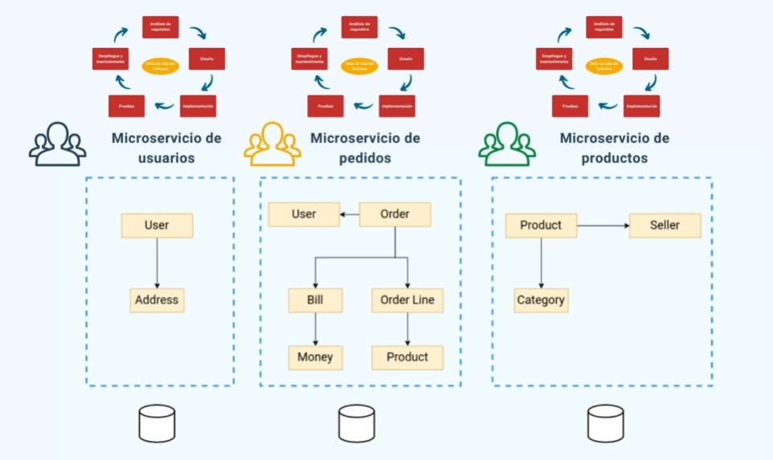

import IndiceTable from '@site/src/components/IndiceTable';

export const data = [
  { tema: '🧱', nombre: 'Microfrontends', link: 'microfrontends'},
  { tema: '🛠️', nombre: 'System Design', link: 'systemdesign' },
];

<IndiceTable data={data}/>

## **Multilayer - Multicapa** {#multilayer}

Organiza el sistema en capas logicas, donde cada una tiene una funcion especifica y cada capa solo se comunica con otras capas adyacentes, facilitando la modularidad. **Es el sistema MVC**

Es la mas tipica del mundo del software, aunque muy criticada. 

Se tiene todo el codigo en un unico componente desplegable. Dividido en capas logicas, habitalmente son 3 capas:

- **Capa de presentacion**: Se encarga de atender las peticiones de los clientes, enviandolas a la capa de logica de negocio, y una vez recibida la respuesta, mostrarla. 
- **Capa de logica de negocio**: Procesamiento necesario para la aplicacion, toda la logica.
- **Capa de Acceso a datos**: Comunicacion con las bases de datos y capas de datos. 

Se debe usar en proyectos pequeños, con corto ciclo de vida o con pocos requisitos, tambien es util con un equipo relativamente junior.

**Ventajas**

- Menos complejidad, arquitectura sencilla
- Es facil de adaptarse, hasta un dev con poca experiencia puede entenderlo
- Facil de testear
- Complicacion y deploy faciles

**Desventajas**

- Dificil de mantener, ya que existe una tendencia a una gran dependencia entre los distintos componentes
- Arquitectura rigida y dificil de escalar
- Mayor dificultad a la hora de distribuir trabajo, ya que todo el codigo se encuentra en el mismo componente, ergo, mismo repositorio
- Si se quiere actualizar el sistema, el mismo debe ser deployado de nuevo completamente. 

## **Multi-tier - Multinivel** {#multinivel}

Tambien esta dividido en niveles, no esta limitado, pero son los mismos 3 niveles habituales, **Presentacion, Logica de negocio y Acceso a datos**.

- Cada nivel representa un componente deployable independiente, se pueden compilar y deployar de manera independiente, y pueden ser escalados tanto horizontal como verticalmente.
- Cada componente tiene su propio repositorio, eliminando la dificultad de la distribucion de trabajo que tenia el modelo multilayer. 

**Desventajas**

- El nivel de logica de negocio suele ser mas pesado. Riesgo de monolito a ese nivel. 

## **Microservicios** {#microservicios}

Es una aplicación dividida en servicios más pequeños e independientes, que se encargan de distintas necesidades de negocio. Su deploy, desarrollo, base de datos y scaling son independientes entre sí.

Cada servicio debe ser de cualquier tamaño deseado (no necesariamente micro, como marca el nombre), si no que cumpla su tarea independientemente del tamaño. 

En el approach **Monolítico** los componentes de la aplicación funcionan todos juntos en un solo paquete, un solo deploy y un solo repositorio. 

Los microservicios se comunican mediante API Rest o Brokers de Mensajeria en caso de tener comunicacion asincrona.

La capa de presentacion o los clientes deben llamar a distintos microservicios para obtener informacion relacionada, esto se mitiga con **API Gateway**, realizando la llamada a un unico punto, y la Gateway encargandose de redireccionarlo. 

| Beneficios | Desventajas |
| --- | --- |
| Multiples equipos pueden trabajar en diversos servicios al mismo tiempo | El manejo de la latencia, tipo de comunicacion y consistencia es complicado |
| Si un servicio tiene problemas, no afecta al resto del sistema | Mas complejidad de desarrollo, testing y deployment |
| El sistema puede adaptarse a cambios de workloads | Mantener la consistencia de la información entre servicios puede ser complicado, se requiere cierta comunicacion entre equipos | 
| Cada microservicio puede funcionar con tecnologias completamente distintas y escalarse independientemente | El manejo de errores puede ser complejo, aunque mas aislados | 

No se recomienda su implementacion cuando se tiene un equipo pequeño.

**Sistemas Real-time**

Los microservicios permiten que los sistemas real-time operen de manera más eficiente, ya que cada funcionalidad se encuentra aislada en un servicio deployable independiente.

Se recomienda una arquitectura **event-driven** y herramientas como **Apache Kafka**, **Redis Streams** o **gRPC**.

Los microservicios procesan la información en paralelo, reduciendo la latencia y mejorando el tiempo de respuesta.

### Componentes

| Componente | Descripcion |
| --- | --- |
| API Gateway | Es un entry point que maneja las requests cuando se tienen microservicios. Se encarga de la autenticación, rate limiting, routing y logging. Facilita el monitoreo, Centraliza la seguridad y simplifica la lógica del lado del cliente |
| Service Registry | Mantiene un registro de las ubicaciones y direcciones de todos los microservicios, permitiendo que se comuniquen entre ellos de manera dinámica. |
| Load Balancer | Distribuye el tráfico entre varias instancias del servicio para prevenir que cualquier microservicio se vea sobrecargado. |
| Containerization | El uso de **Docker** para encapsular los microservicios en conjunto con sus dependencias. Se usan herramientas de orquestación como **Kubernetes** para manejar el deployment y scaling. |
| Event Bus - Message Broker | Facilita la comunicación entre microservicios, permitiendo interacciones pub-sub asíncronas de eventos entre componentes y microservicios.  |
| Bases de Datos | Cada microservicio tiene su propia base de datos generalmente, permitiendo que se tenga una cierta autonomía respecto a la información. |

## Patrones de diseño

### API Gateway Pattern

Es pensar al API Gateway como la puerta de entrada a nuestros microservicios. Es un único punto de entrada para los clientes.
Simplifica la experiencia del cliente escondiendo la complejidad de diversos servicios detrás de una sola interfaz.
También puede manejar tareas como la autenticación, logging, rate limiting, entre otros.

### Service Registry Pattern

Es como una guía telefónica para los microservicios. Mantiene una lista de todos los servicios activos y sus localizaciones. Cuando un servicio es iniciado, se registra.
Otros servicios pueden acceder a este registro para encontrar al servicio con el cual desean comunicarse. Esto permite cierta flexibilidad, y el no tener una lista de servicios hardcodeada.

### Circuit Breaker Pattern

Este sistema ayuda a prevenir fallas en cascada. Si un servicio falla de forma repetitiva, el mismo es automáticamente cortado, para evitar que más requests lleguen a este. Luego de un cierto timeout, el servicio vuelve a habilitarse de forma limitada a modo de canary.
Esto mejora la disponibilidad y la prevención de fallas de nuestros servicios.

### Saga Pattern

Este patrón es útil para manejar procesos de negocios complejos que requieren múltiples servicios. En vez de tratar al proceso como una sola transacción, se separa en pequeños pasos, y cada uno de estos, manejado por un servicio distinto.
Si un paso falla, se revierten los pasos anteriores, así se mantiene la consistencia de la información a través de todo el sistema.

## **Antipatrones**

- Compartir una sola base de datos entre todos los microservicios, comprometiendo la independencia y la escalabilidad.
- Microservicios que constantemente se comunican ante tareas muy pequeñas, ocasionando un gran peso en el tráfico de red y afectando la latencia.
- Crear demasiados microservicios con responsabilidades sumamente pequeñas, agregando complejidad innecesaria.
- Microservicios con limites poco definidos, responsabilidades poco claras.
- No prestar atencion a la seguridad del sistema, exponiendo los servicios a data breaches.

## **CQRS (Command Query Responsibility Segregation)**

**Comandos**: Acciones que realizan una modificacion en el estado del sistema y que no devuelven informacion, por ejemplo, escribir un comentario en un post. 

**Consultas**: Acciones que no alteran el estado del sistema, tan solo devuelven datos. Por ejemplo, obtener los ultimos comentarios de un post.

CQRS se divide la app en 2 stacks, uno de lectura (**Query Stack**) y otro de lectura (**Command Stack**). Ambos con un modelo distinto especificamente diseñado para tratar ambos tipos de operaciones. 

Por ejemplo, para los Comandos, un diseño SQL Relacional es muy util, ya que solo seria agregar un campo en una tabla, pero para las consultas no tanto, ya que se puede requerir realizar muchos `joins` para obtener cierta informacion.

En cambio para las consultas, un modelo NoSQL puede ser sumamente practico para obtener la informacion de forma rapida, pero no tanto para los Comandos. 

CQRS nos permite tener ambos sistemas, teniendo un SQL para las operaciones de escritura y NoSQL para las operaciones de lectura. 

Esto puede causar problemas de **Consistencia** entre ambas bases de datos, habiendo metodos de Sincronizacion entre ambas BBDD, aunque si la base de datos se vuelve mas compleja, la sincronizacion se vuelve mas complicada. Esto se soluciona con el **Event Sourcing**

## **Event Sourcing**

Son sistemas en donde los datos son almacenados como una secuencia de eventos. Por ejemplo, supongamos que se llevaron a cabo estas acciones:

1. Añadir post
2. Añadir comentario
3. Modificar post
4. Eliminar comentario

En el modelo tradicional, se traduciria en una unica accion -> Post sin comentarios

En el event sourcing se almacenaria lo siguiente:

- Añadir post #1
- Añadir comentario #1
- Modificar post #1
- Eliminar comentario #1

