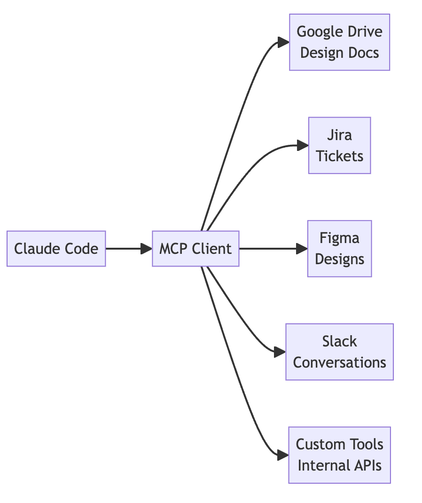

# ⚡ Claude

Claude es un LLM desarrollado por Anthropic, una empresa de investigación en IA fundada por ex empleados de OpenAI. Se lanzó en marzo de 2023 y se ha posicionado como uno de los principales competidores de ChatGPT.

Se lo describe como más que un chatbot, sino como un asistente de IA que puede ayudar a las personas a realizar tareas complejas, como escribir código, redactar emails, etc.

- Fue construido para ser **honesto, seguro y útil**, evitando outputs discriminatorios, ofensivos o peligrosos. Esto fue decidido bajo un approach conocido como **Constitutional AI**.
- A Claude se lo describe como un asistente que puede ayudar en varios tipos de tareas, desde Coding hasta escribir emails, no solo para responder preguntas simples.
- Diseñado para reconocer los tonos del usuario con el que se está comunicando para poder ajustar sus propios tonos acorde a eso. Por ejemplo, si el usuario es más formal, Claude se ajusta a ese tono.

Se describe que la mejor forma de comunicarse con Claude es teniendo una conversación fluida, como uno la tendría con cualquier colega, más que haciendo preguntas de una sola vez en cada sesión.

Actualmente (abril de 2026) hay 3 modelos de Claude:

- **Claude Opus**: Recomendado para pensamiento complejo y arquitectura.
- **Claude Sonnet**: Recomendado para el "Daily Coding", el más **Balanceado** entre costo y performance.
- **Claude Haiku**: Recomendado para tareas más simples y cotidianas, como escribir emails, redactar documentos, etc. **Cost Effective**

## Projects

Los mismos son marcos de trabajo que se basan sobre un tema en específico. Son útiles cuando estamos trabajando en una feature que requiere más que una sola pregunta y respuesta, sino que precisa un marco de trabajo más extenso.

- **Projects** son workspaces que poseen su propia memoria, historial de chat y base de datos con sus propias instrucciones personalizadas. Esto permite manejar distintos flujos de trabajo (streams de trabajo).
- **Project knowledge** es la base de datos de cada proyecto, la **knowledge base**, donde se pueden guardar documentos, archivos, etc. para que Claude pueda acceder a ellos y utilizarlos durante las conversaciones. Esto es especialmente útil para proyectos complejos donde se necesita tener acceso a mucha información y donde no queremos subir el mismo documento una y otra vez.
- **Project Instructions** guían cómo Claude debe comportarse en cada stream de trabajo, por ejemplo, el tono, el tipo de respuesta, entre otras especificaciones.
- Cada project escala de manera automática. Cuando el knowledge base alcanza un cierto límite (es decir, subí más de cierta cantidad de documentos a modo de contexto), se habilita **RAG (Retrieval Augmented Generation)**, lo que permite que Claude pueda acceder a la información guardada en el knowledge base de manera más eficiente, sin tener que cargar toda la información en cada sesión para poder mantener una buena calidad de respuesta.
- Los projects pueden ser compartidos entre varias personas para poder trabajar de manera colaborativa. Esto es especialmente útil para equipos de trabajo que necesitan compartir información y colaborar en proyectos complejos.

Cada project posee **permisos** dentro del mismo:

- **Owner**: Tiene control total sobre el proyecto, puede editar las instrucciones, agregar o eliminar documentos del knowledge base, invitar o eliminar miembros, etc.
- **Editor**: Puede editar las instrucciones, agregar o eliminar documentos del knowledge base, pero no puede invitar o eliminar miembros.
- **Viewer**: Solo puede ver el proyecto, no puede editar las instrucciones, ni agregar o eliminar documentos del knowledge base, ni invitar o eliminar miembros.

### Project Instructions

Los Project Instructions le "marcan" a Claude cómo comportarse en las conversaciones.

Una buena Project Instruction incluye:

- Contexto sobre el proyecto, por ejemplo, el rol del usuario, los objetivos del proyecto, entre otros.
- **Instrucciones de proceso** que guían a Claude sobre cómo abordar las tareas, por ejemplo, si se quiere que la IA haga preguntas para aclarar dudas o si se quiere que la IA dé sugerencias para mejorar el producto.
- **Referencias de tono**, por ejemplo, "utilizar tono profesional"
- **Requerimientos específicos** sobre el output, por ejemplo, "proporcionar una respuesta detallada de al menos 300 palabras" o "utilizar un formato específico para la respuesta".

## Skills

Son carpetas de instrucciones, scripts y recursos que Claude carga de manera dinámica para mejorar la performance en algunas tareas específicas y que pueden ser repetitivas. Muy usado en la creación de PPTs, Excels, etc.

- **Anthropic Skills**: Son creados y mantenidos por Anthropic. Son habilidades generales que pueden ser utilizadas en varios proyectos, por ejemplo, "Summarization", "Code Generation", "Data Analysis", etc.
- **Custom Skills**: Son creados por los usuarios. Pueden ser habilidades específicas para un proyecto en particular, por ejemplo, "Generar un resumen de un documento utilizando un formato específico" o "Generar un código en un lenguaje específico utilizando ciertas librerías".
- Se pueden obtener Skills de terceros, pero se debe tener cuidado con esto, ya que no se sabe exactamente cómo fueron creadas estas Skills y pueden contener errores o ser peligrosas. Es importante revisar el código de estas Skills antes de utilizarlas.

Claude maneja la selección de Skills de manera automática, basándose en nuestra conversación, pero también se pueden seleccionar manualmente para asegurarnos de que se utilice la habilidad correcta para la tarea que queremos realizar.

**¿Cómo crearlas?** Simplemente conversando con Claude. Ejemplo: "Claude, me gustaría crear una Skill para generar resúmenes de documentos utilizando un formato específico, ¿podrías ayudarme a crear esta Skill?"

### Skills vs Project Instructions

**Los proyectos guardan conocimiento, las skills guardan y realizan procesos**

| Project Instructions | Skills |
| --- | --- |
| Guían el comportamiento de Claude en las conversaciones | Realizan tareas específicas de manera automática |
| Pueden incluir instrucciones de proceso, referencias de tono, requerimientos específicos sobre el output, entre otros | Son scripts que pueden ser reutilizados en varios proyectos para realizar tareas específicas |
| Se enfocan en el contexto y las reglas de la conversación | Se enfocan en la ejecución de tareas específicas, como generar un resumen, analizar datos, generar código, etc. |

## Connectors

Los Connectors convierten a Claude en un colega, ya que le estamos dando acceso a todo nuestro contexto de herramientas utilizadas diariamente. **Es permitirle a Claude realizar tareas por nosotros**.

Una manera de potenciar los Connectors es mediante **MCP (Model Context Protocol)**, que es un protocolo que permite a los modelos de lenguaje acceder a herramientas externas de manera segura y controlada. Esto permite que Claude pueda interactuar con nuestras herramientas diarias, como Google Drive, Slack, Gmail, entre otras, para realizar tareas por nosotros, como enviar un email, crear un documento, etc. **Es un estándar abierto**.

Hay 2 tipos de Connectors:

- **Web Connectors**: Permiten a Claude acceder a herramientas web, como Google Drive, Slack, Gmail, entre otras. Esto permite que Claude pueda interactuar con estas herramientas para realizar tareas por nosotros, como enviar un email, crear un documento, etc.
- **Desktop Connectors**: Permiten a Claude acceder a herramientas de escritorio, como Microsoft Word, Excel, PowerPoint, entre otras. Esto permite que Claude pueda interactuar con estas herramientas para realizar tareas por nosotros, como crear un documento, generar una presentación, etc.

Podemos darle acceso, por ejemplo, a nuestro Jira para que pueda crear tickets por nosotros, o a nuestro Google Drive para que pueda crear documentos, o a nuestro Slack para que pueda enviar mensajes, etc.

Esto nos permite automatizar tareas repetitivas y ahorrar tiempo.

- Claude no puede compartir nada a lo cual vos no le hayas dado acceso, es decir, si le das acceso a un documento de Google Drive, Claude no puede compartir ese documento con nadie más, ni siquiera con otros proyectos, a menos que le des acceso a ese proyecto también.
- Claude no puede acceder a nada a lo que no le hayas dado acceso, es decir, si no le das acceso a un documento de Google Drive, Claude no puede acceder a ese documento, ni siquiera para leerlo, por lo que no puede compartirlo con nadie más.

## MCP

Se pueden extender las habilidades de Claude mediante MCP (Model Context Protocol), que es un protocolo que permite a los modelos de lenguaje acceder a herramientas externas de manera segura y controlada. Esto permite que Claude pueda interactuar con nuestras herramientas diarias, como Google Drive, Slack, Gmail, entre otras, para realizar tareas por nosotros, como enviar un email, crear un documento, etc.

Por ejemplo, uno muy popular es `Playwright MCP`, que permite a Claude interactuar con cualquier sitio web como si fuera un usuario, lo que le permite realizar tareas como hacer reservas, comprar productos, etc.



## Hooks

Si queremos que Claude ejecute todos los test de mi proyecto antes de realizar un push a un repositorio, esto de manera automatizada y todo el tiempo, podemos usar Hooks, que son una forma de conectar a Claude con nuestras herramientas de desarrollo para que pueda ejecutar tareas específicas de manera automática.

Hay dos tipos de Hooks:

- **PreToolUse hooks**: Se ejecutan antes de que se realice una acción específica, por ejemplo, antes de hacer un push a un repositorio, antes de enviar un email, etc.

```json
"PreToolUse": [
  {
    "matcher": "Read",
    "hooks": [
      {
        "type": "command",
        "command": "node /home/hooks/read_hook.ts"
      }
    ]
  }
]
```

- **PostToolUse hooks**: Se ejecutan después de que se realice una acción específica,  por ejemplo, después de hacer un push a un repositorio, después de enviar un email, etc.

```json
"PostToolUse": [
  {
    "matcher": "Write|Edit|MultiEdit",
    "hooks": [
      {
        "type": "command",
        "command": "node /home/hooks/edit_hook.ts"
      }
    ]
  }
]
```

Estos pueden ser definidos a 3 niveles:

- Global - `~/.claude/settings.json`, afecta a todos los proyectos globales
- Project - `.claude/settings.json`, compartido a nivel proyecto individual
- Project (not committed) - `.claude/settings.local.json`, es nuestra configuración personal, y nadie puede acceder a la misma

### Text Editor Tool

Es una herramienta que permite a Claude editar archivos de texto, como código, documentos, etc. Esto es especialmente útil para desarrolladores que quieren que Claude les ayude a escribir código, revisar código, etc. Permite:

- Ver el contenido de archivos o directorios
- Ver rangos específicos de líneas en un archivo
- Reemplazar texto en un archivo
- Crear nuevos archivos
- Insertar texto en líneas específicas de un archivo
- Deshacer ediciones recientes en archivos

Podrías preguntarte por qué existe esta herramienta si los editores de código modernos ya tienen asistentes de IA integrados. La herramienta de editor de texto resulta valiosa en escenarios donde:

- Estás construyendo aplicaciones que necesitan editar archivos programáticamente
- Estás trabajando en entornos sin acceso a editores de código con todas las funciones
- Quieres integrar capacidades de edición de archivos directamente en tus aplicaciones impulsadas por Claude

Esencialmente, la herramienta de editor de texto te permite replicar gran parte de la funcionalidad de un editor de código avanzado con IA dentro de tus propias aplicaciones, dándote un control detallado sobre cómo Claude interactúa con tu sistema de archivos.

### Web Search Tool

Es una herramienta que permite a Claude realizar búsquedas en la web para obtener información actualizada y relevante para responder a las preguntas de los usuarios. Esto es especialmente útil para tareas que requieren información actualizada, como noticias, eventos actuales, etc.

```python
web_search_schema = {
    "type": "web_search_20250305",
    "name": "web_search",
    "max_uses": 5
}
```

`max_uses` es la cantidad máxima de veces que se puede usar esta herramienta en una conversación. Esto es útil para evitar que Claude abuse de la herramienta y para controlar el costo asociado con su uso.

También se puede limitar en qué dominios realizar las búsquedas

```python
web_search_schema = {
    "type": "web_search_20250305",
    "name": "web_search",
    "max_uses": 5,
    "allowed_domains": ["nih.gov"]
}
```

Cuando Claude utiliza la herramienta de búsqueda web, la respuesta contiene varios tipos de bloques:

- Text blocks - La explicación de Claude sobre lo que está haciendo
- ServerToolUseBlock - Muestra la consulta de búsqueda exacta que Claude usó
- WebSearchToolResultBlock - Contiene los resultados de la búsqueda
- WebSearchResultBlock - Resultados de búsqueda individuales con títulos y URLs
- Citation blocks - Texto que respalda las afirmaciones de Claude


## Enterprise Search

Es un Search dedicado a un contexto interno de empresa, muy útil para realizar preguntas sobre el funcionamiento organizacional de la empresa.

Debe ser seteado primero por un Owner de la organización para poder ser accedido por otros.

## Plan Mode vs Thinking Mode

- **Plan Mode**: Es un modo de pensamiento más estructurado, donde Claude planifica su respuesta antes de generar el texto final. Es útil para tareas complejas que requieren un razonamiento más profundo y una estructura clara en la respuesta. **Recomendado para tareas que se deben realizar en pasos**
- **Thinking Mode**: Es un modo de pensamiento más fluido, donde Claude genera la respuesta de manera más natural y sin una planificación previa. Es útil para tareas que requieren creatividad o respuestas más informales. **Recomendado para lógica compleja**


## Effective Prompting

Para comunicarse de manera efectiva con Claude, se deben tener en cuenta los siguientes puntos:

- **Setear el escenario**: ¿Cuál es tu rol y objetivos? ¿Hay algún contexto de trabajo que Claude debería tener en cuenta?
- **Definir la tarea**: ¿Qué acción querés que Claude tome? ¿Análisis, escritura, coding, etc.?
- **Reglas**: ¿Qué tono querés que Claude utilice? ¿Querés que te haga preguntas para aclarar dudas? ¿Querés que te dé sugerencias para mejorar el producto? etc.

Ejemplo de prompt efectivo:

*I'm the marketing lead at an indie streaming startup, and we're preparing an investor pitch deck. Can you research the current state of the independent film streaming market and identify key trends, competitor positioning, and growth opportunities? Use current web research with citations and structure it as a professional report*

En este ejemplo, se le da a Claude un contexto claro sobre el rol del usuario, la tarea que se necesita realizar y las reglas de cómo se quiere que se comunique durante la sesión. Esto ayuda a que Claude pueda generar una respuesta más relevante y útil para el usuario.

Estas ideas sobre prompting pueden ayudarnos incluso a solucionar problemas cuando Claude nos da una respuesta que no es necesariamente la que esperamos.

| Problema | Solución |
| --- | --- |
| La respuesta es muy genérica | No se dio el suficiente contexto en la prompt |
| La respuesta es muy corta o muy larga | Claude intentó adivinar el largo adecuado en el cual responder. Esto puede ser especificado en la prompt, por ejemplo, "Por favor, proporciona una respuesta detallada de al menos 300 palabras" |
| Claude no siguió ningún tipo de formato | Claude entendió lo que querías, pero no CÓMO lo querías |
| Claude me dio información errónea como si fuera correcta | A veces puede suceder con LLMs. Esto se conoce como "alucinaciones". Para solucionarlo, se le puede pedir a Claude que revise su respuesta y corrija cualquier error, o se le puede pedir que cite sus fuentes para verificar la información proporcionada. |
| El tono no es correcto | Ajustar el tono en la prompt, por ejemplo, "Por favor, responde de manera formal y profesional" o "Responde de manera casual y amigable". |

También se recomienda que, si una conversación no está yendo en el camino deseado, iniciar una conversación nueva con una prompt más clara y específica, para que Claude pueda entender mejor lo que se necesita en vez de intentar redirigir la conversación ya existente.

### Ser específico

Una de las mejores formas de obtener buenos resultados es siendo específico en nuestros prompts acerca de lo que deseamos, sin dejar lugar a interpretación por parte del agente.


- Se pueden listar puntos especificando qué debería tener el output (o qué no debería tener)
    - Largo del output
    - Formato y estructura del output
    - Elementos a incluir
    - Tono o estilo del output


- Se puede listar qué tipo de camino de razonamiento debería seguir el agente para llegar a la respuesta.
    - Recomendado para soluciones complejas
    - Recomendado cuando queremos que Claude tenga en cuenta distintos puntos de vista o que analice distintas variables para llegar a una respuesta


En varias ocasiones **se recomienda usar una combinación de ambos** para llegar a un mejor resultado si así el problema lo requiere.


## **Claude API**

(Último update: marzo de 2026)

Cuando realizamos una request a la API de Claude, se sigue un flujo de 5 fases:

- Request al servidor
- Request a Anthropic API
- Procesamiento en el Modelo
- Response al servidor
- Response al cliente

### API Requests

Las request a la API de Anthropic **no deben ser hechas desde el código del cliente, sino desde un servidor que tengamos nosotros** ya que:

- Se requiere una API Key secreta para autenticar al usuario que está haciendo uso de la API
- Esta key NO debe ser expuesta en el código del cliente por temas de seguridad

Cuando usamos la API de Anthropic podemos usar un SDK (Python, JS, TS, Go, Ruby, entre otras) o una request HTTP básica, y debe tener los siguientes campos:

- `API Key`
- `Model`: El modelo a utilizar, por ejemplo, `claude-3-sonnet`
- `Messages`: El mensaje del usuario
- `Max Tokens`: El límite de tokens que Claude puede generar

Una vez que se recibe la request, la misma se procesa en 4 pasos:

- **Tokenización**: Separar el mensaje del usuario en tokens.
- **Embedding**: Cada token es convertido en un embedding, una larga lista de números que representan los posibles significados de esa palabra guardada en ese token. Además, una palabra puede tener más de un posible significado.
- **Contextualización**: Cada embedding es refinado dependiendo del contexto en el cual está. Una palabra puede tener más de un posible significado, y el mismo puede ser obtenido si se tiene en cuenta el contexto.
- **Generación**: Los embeddings contextualizados pasan por una capa de salida que calcula probabilidades para cada posible palabra siguiente. Claude no siempre elige la palabra con mayor probabilidad: usa una combinación de probabilidad y aleatoriedad controlada para crear respuestas naturales y variadas. Después de seleccionar cada palabra, Claude la agrega a la secuencia y repite todo el proceso para la siguiente palabra.

Este último paso de **Generación** continúa hasta que:

- Se alcanzó la mayor cantidad de tokens permitidos
- La oración se terminó (EOS End of Sequence)
- Algo detuvo la ejecución

### API Response

Cuando la ejecución termina, se devuelve una response que incluye:

- `Message`: El texto generado para responder
- `Usage`: La cantidad de input y output tokens usados
- `Stop Reason`: La razón por la cual se detuvo la generación, por ejemplo, "max_tokens", "eos", "stop_sequence", entre otras.

### Environment

Para poder usar la API de Anthropic aunque sea para testing se debe:

- Obtener una API Key
- Instalar Jupyter Notebook
- Instalar las dependencias necesarias `%pip install anthropic python-dotenv`
- Crear un archivo `.env` con la variable de entorno `ANTHROPIC_API_KEY` y su valor correspondiente a la API Key obtenida
- Crear el API Client

```python
from dotenv import load_dotenv
load_dotenv()

from anthropic import Anthropic

client = Anthropic()
model = "claude-sonnet-4-0"
```

### Primera request a Claude

Para poder enviar una request a la API de Anthropic, se debe usar el método `client.messages.create()` y pasarle los siguientes parámetros:

-  `model: string`: El modelo a utilizar, por ejemplo, `claude-3-sonnet`
-  `messages: []`: El mensaje del usuario
- `max_tokens: int`: El límite de tokens que Claude puede generar. Si lo seteamos en, por ejemplo, 1000, Claude dejará de ejecutar el `Generation` una vez que se hayan generado 1000 tokens, aunque la oración no haya terminado.

```python
message = client.messages.create(
    model=model,
    max_tokens=1000,
    messages=[
        {
            "role": "user",
            "content": "What is quantum computing? Answer in one sentence"
        }
    ]
)
```

¿Qué es eso del `role` que se ve dentro de `messages`? Es el rol del mensaje, que puede ser `user` o `assistant`. Esto es importante para que Claude pueda entender el contexto de la conversación y generar una respuesta adecuada.

Por ejemplo, si el mensaje tiene el rol de `user`, Claude entenderá que es una pregunta o una solicitud, mientras que si el mensaje tiene el rol de `assistant`, Claude entenderá que es una respuesta o una información adicional.

Luego para obtener la respuesta, podemos acceder a ella directamente con: `message.content[0].text`

### Multi-turn conversations

Las Multi-turn conversations son conversaciones que tienen más de un mensaje, es decir, una conversación fluida entre el usuario y Claude.

Por default, ni Claude ni la Anthropic API guardan ningún mensaje. Si queremos que Claude recuerde lo sucedido en algún mensaje anterior, debemos manejarlo. Por default, las conversaciones son **stateless**.

Para esto, simplemente se deben agregar más mensajes al array de `messages` con el rol correspondiente. Es por eso que existe el rol `user` y `assistant`, para poder diferenciar entre los mensajes del usuario y los mensajes de Claude, y así poder mantener el contexto de la conversación.

Se sugiere crear las siguientes funciones helper para manejar estos casos:

```python
def add_user_message(messages, text):
    user_message = {"role": "user", "content": text}
    messages.append(user_message)

def add_assistant_message(messages, text):
    assistant_message = {"role": "assistant", "content": text}
    messages.append(assistant_message)

def chat(messages):
    message = client.messages.create(
        model=model,
        max_tokens=1000,
        messages=messages,
    )
    return message.content[0].text
```

Y así quedaría la configuración básica de una conversación fluida con Claude:

```python
# Start with an empty message list
messages = []

# Add the initial user question
add_user_message(messages, "Define quantum computing in one sentence")

# Get Claude's response
answer = chat(messages)

# Add Claude's response to the conversation history
add_assistant_message(messages, answer)

# Add a follow-up question
add_user_message(messages, "Write another sentence")

# Get the follow-up response with full context
final_answer = chat(messages)
```

### System Prompts

Estas son una forma de personalizar la interacción del usuario con Claude. Por ejemplo, si nuestro chatbot es un asistente de cocina, podemos agregar un System Prompt que le diga a Claude que debe responder como si fuera un chef profesional y que debe dar consejos de cocina, recetas, etc.

Esto ayuda a que Claude pueda generar respuestas más relevantes y útiles para el usuario, ya que tiene un contexto claro sobre el rol que debe desempeñar en la conversación.

Estos prompts pueden ser enviados en conjunto con la request de `messages`.

```python
system_prompt = """You are a helpful assistant that provides cooking advice and recipes."""

message = client.messages.create(
    model=model,
    system=system_prompt,
    max_tokens=1000,
    messages=[
        {
            "role": "user",
            "content": "What can I make with chicken and rice?"
        }
    ]
)
```

### Temperatura

Como se mencionó [acá](./ia#temperatura), la temperatura es un valor decimal entre 0 y 1 que controla el nivel de aleatoriedad en las respuestas generadas por el modelo. Un valor bajo (cercano a 0) hace que el modelo sea más determinista y repetitivo, mientras que un valor alto (cercano a 1) aumenta la creatividad y diversidad de las respuestas.

En Claude podemos setear la misma desde nuestro request:

```python
def chat(messages, system=None, temperature=1.0):
    params = {
        "model": model,
        "max_tokens": 1000,
        "messages": messages,
        "temperature": temperature
    }

    if system:
        params["system"] = system

    message = client.messages.create(**params)
    return message.content[0].text

# Low temperature - more predictable
answer = chat(messages, temperature=0.0)

# High temperature - more creative
answer = chat(messages, temperature=1.0)
```

### Response Streaming

Uno de los challenges más grandes que se tienen en aplicaciones que consumen Claude u otros servicios es que la respuesta completa puede tardar entre 10 y 30 segundos en generarse.

Si esperamos ese tiempo, el usuario vería un spinner por esa cantidad de segundos.

La solución a esto es el **Response Streaming**, que consiste en mostrarle al usuario en tiempo real los chunks de respuesta a medida que son generados por Claude.

En la configuración que hacemos hasta ahora en este documento, estamos esperando ante cada Request-Response-Request, lo que da lugar a la experiencia del spinner antes mencionada. La "experiencia" del Streaming puede ser habilitada transformando un poco nuestra comunicación Servidor-Claude.

- Enviamos el mensaje
- Claude nos responde inmediatamente con una confirmación de que el mensaje fue recibido
- Se reciben una serie de eventos que contienen un pedazo pequeño del texto generado

Todos estos eventos son parte de una sola request. Los tipos de eventos son:

- `MessageStart`: Un nuevo mensaje está siendo enviado
- `ContentBlockStart`: Un nuevo bloque de contenido está comenzando
- `ContentBlockDelta`: Bloques del texto generado actualmente. Se reciben varios con muchos chunks.
- `ContentBlockStop`: Un bloque de contenido ha terminado de generarse
- `MessageDelta`: El mensaje está completo
- `MessageStop`: Fin de la información sobre el mensaje actual

Para habilitar el Streaming, agregamos la propiedad `stream` a nuestro `message`:

```python
messages = []
add_user_message(messages, "Write a 1 sentence description of a fake database")

stream = client.messages.create(
    model=model,
    max_tokens=1000,
    messages=messages,
    stream=True
)

for event in stream:
    print(event)
```

### Extended Thinking

Es una funcionalidad que le permite al modelo "pensar" antes de responder, especialmente ante problemas complejos, y esta linea de pensamiento puede ser vista por el usuario. 

Cuando esta funcionalidad es habilitada, la respuesta del modelo cambia de un bloque de texto basico a una respuesta estructurada que consta de dos partes:

- **Thinking**: El pensamiento del modelo
- **Response**: La respuesta final del modelo
- **Signature**: Un identificador unico para el bloque de contenido, esto se agrega para asegurar que los bloques no fueron modificados entre generacion y generacion, ya que esto puede conducir a direcciones poco seguras. 

El "pensamiento" es un texto que se genera antes de la respuesta final y que contiene el razonamiento que llevó al modelo a esa respuesta.

Es importante remarcar que el thinking no es parte de la respuesta final y no debe ser mostrado al usuario. Solo debe ser mostrado el "Response".

A continuación se muestra un ejemplo de cómo se ve una respuesta con Extended Thinking:

```json
{
    "type": "message",
    "content": [
        {
            "type": "Thinking",
            "text": "El usuario quiere saber qué es el Extended Thinking. Le explicaré qué es y cómo funciona.",
            "signature": "5b4d86a1-91c1-4879-99a1-d99b93a62c1f"
        },
        {
            "type": "Response",
            "text": "El Extended Thinking es una funcionalidad que le permite al modelo 'pensar' antes de responder, especialmente ante problemas complejos, y esta linea de pensamiento puede ser vista por el usuario. ",
            "signature": "5b4d86a1-91c1-4879-99a1-d99b93a62c1f"
        }
    ]
}
```

Sus **beneficios** son:

- Mejor linea de pensamiento ante problemas complejos
- Mayor accuracu en problemas complejos
- Transparencia ante el usuario

Aunque sus **desventajas** son:

- Mayor costo, se paga por los thinking tokens
- Mayor latencia, ya que el pensamiento toma mas tiempo
- Mayor complejidad, ya que se debe manejar la respuesta estructurada

Se recomienda su uso cuando notamos que nuestros prompts no nos estan llevando a donde deseamos. 

Si se recibe un **Redacted Thinking block** en vez de un texto leible dentro de la respuesta del modelo, significa que el modelo encontro contenido de alta peligrosidad en su linea de pensamiento, por lo que se recomienda revisar nuestro prompt y ajustar las medidas de seguridad si es necesario.

### Image Support