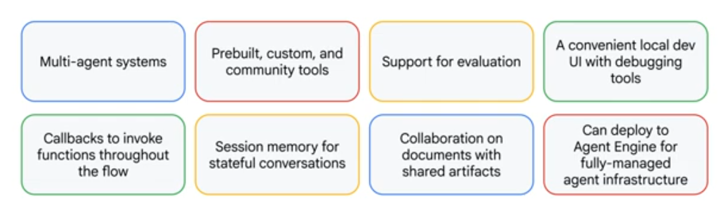
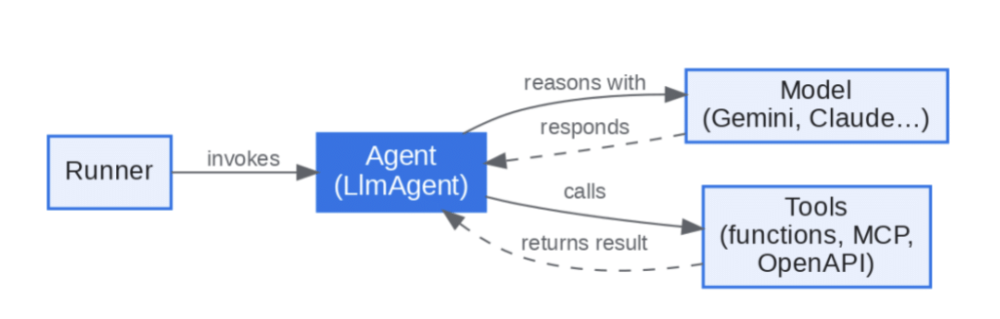
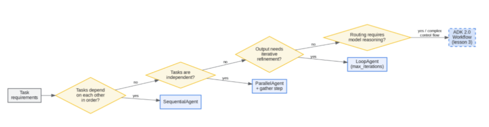

import IndiceTable from '@site/src/components/IndiceTable';


export const data = [
  { tema: '⚡', nombre: 'Claude', link: '#claude' },
];

<IndiceTable data={data}/>

## LLM vs IA

Se suelen usar como sinónimos, pero son dos tipos de sistemas completamente distintos.

La **IA** es todo sistema que intenta simular el razonamiento humano, es decir, que intenta imitar la inteligencia humana. Por ejemplo, un sistema de recomendación de películas o un sistema de reconocimiento de voz son ejemplos de IA.

Es el **universo completo**.

Un **LLM** es un tipo de modelo de lenguaje que se entrena con grandes cantidades de texto para aprender a generar texto coherente y relevante. Por ejemplo, **ChatGPT es un LLM que se entrena con grandes cantidades de texto para aprender a generar respuestas coherentes y relevantes a preguntas y solicitudes**

Son las **estrellas** de la IA, pero no son la IA completa.

## ¿Qué es un Coding Assistant?

Es un sistema que utiliza LLM para resolver tareas complejas de código.

Cuando se le da una task al coding assistant, el mismo toma los siguientes pasos:

1) Recoger contexto: Reconocer a qué refiere el error, qué archivos pueden estar involucrados.
2) Armar un plan: Decidir cómo resolver el error, por ejemplo, cambiar el código y luego correr los tests.
3) Tomar acción: Implementar el cambio y correr los comandos necesarios.

El paso número 1 y 3 son los más complejos y los cuales requieren el uso de **Tools use**, ya que un coding assistant por sí solo no puede leer código ni correr comandos.

## **Tools Use**

Cuando se le envía una petición al Coding Assistant, el mismo agrega instrucciones "under the hood" para cumplir con el requerimiento.

Por ejemplo, `"If you want to read a file, respond with 'ReadFile: name of file'"`, estas instrucciones permiten que el Coding assistant pueda leer archivos, lo cual es fundamental para poder resolver tareas complejas de código.

No todos los LLM son buenos en el uso de Tools, por lo que es importante elegir un LLM que tenga buenas capacidades de **Tools Use** para poder desarrollar un Coding Assistant efectivo.

- Pueden combinar el uso de varias Tools para manejar tareas complejas, por ejemplo, pueden usar una herramienta para leer un archivo, otra para escribir en un archivo y otra para correr comandos.
- En algunos LLM estos tools pueden ser extensibles, lo que significa que se pueden agregar nuevas herramientas para que el LLM pueda usarlas, por ejemplo, se le puede agregar una herramienta para acceder a una base de datos o para interactuar con una API externa.
- En el caso de algunos LLM, el uso de Tools ayuda a poder acceder al código fuente sin tener que indexarlo, lo cual significa que no es necesario enviar todo el codebase a un servidor externo.


### Tool Functions

Son funciones Python que son ejecutadas cuando nuestro agente decide que se precisa información extra para ayudar al usuario. Por ejemplo, si preguntamos "¿Qué hora es?", podemos tener una función en Python que obtenga la fecha de hoy, e invocarla.

Estas funciones deben:

- Usar nombres descriptivos, mismo para los parámetros.
- Validar los inputs de forma correcta, y si algo de esto no se cumple, devolver un error claro para que el agente pueda entenderlo y corregirlo.
- Los mensajes de error deben explicar bien el error, para que el agente pueda entenderlo y corregirlo. Por ejemplo, si se espera un número entero y se recibe un string, el mensaje de error debe decir `Se esperaba un número entero, pero se recibió un string`, en lugar de simplemente decir `Error: Invalid input`.

```python
def get_current_datetime(date_format="%Y-%m-%d %H:%M:%S"):
    if not date_format:
        raise ValueError("date_format cannot be empty")
    return datetime.now().strftime(date_format)
```

Para que nuestro LLM entienda cómo usar estas funciones, debemos crear un **JSON Schema** con la descripción de cada una de las funciones, sus parámetros y el formato de los mismos. Por ejemplo:

```json
{
  "name": "get_current_datetime",
  "description": "Returns the current date and time in the specified format.",
  "input_schema": {
    "type": "object",
    "properties": {
      "date_format": {
        "type": "string",
        "description": "The format in which to return the date and time. Default is '%Y-%m-%d %H:%M:%S'."
      }
    },
    "required": []
  }
}
```

La estructura posee:

- `name`: El nombre de la función, que es el mismo que se usará para invocarla.
- `description`: Una descripción clara de lo que hace la función.
- `input_schema`: Un esquema JSON que describe los parámetros de entrada de la función, incluyendo su tipo, descripción y si son requeridos o no.

```python
def get_current_datetime(date_format="%Y-%m-%d %H:%M:%S"):
    if not date_format:
        raise ValueError("date_format cannot be empty")
    return datetime.now().strftime(date_format)

get_current_datetime_schema = {
    "name": "get_current_datetime",
    "description": "Returns the current date and time formatted according to the specified format",
    "input_schema": {
        "type": "object",
        "properties": {
            "date_format": {
                "type": "string",
                "description": "A string specifying the format of the returned datetime. Uses Python's strftime format codes.",
                "default": "%Y-%m-%d %H:%M:%S"
            }
        },
        "required": []
    }
}
```

Una vez que la tool es ejecutada, debemos obtener los resultados de la misma.

- `tool_use_id`: Un identificador único que debe coincidir con el id del bloque ToolUse al que corresponde este ToolResult.
- `content`: El output de la función, serializado como un string.
- `is_error`: Un booleano que indica si ocurrió un error durante la ejecución de la función.

Se pueden usar más de 2 tools en una misma interacción, por lo que es importante que cada ToolResult tenga un `tool_use_id` único que permita asociarlo con el bloque ToolUse correspondiente.

```json
{
  "tool_use_id": "12345",
  "content": "2024-06-01 12:00:00",
  "is_error": false
}
```

Si tenemos varias tools podemos crear un map con los nombres y las funciones correspondientes

```python
def run_tool(tool_name, tool_input):
    if tool_name == "get_current_datetime":
        return get_current_datetime(**tool_input)
    elif tool_name == "another_tool":
        return another_tool(**tool_input)
    # Add more tools as needed
```

Y podremos informarle a nuestro LLM sobre la lista de tools que posee disponibles para usar

```python
response = chat(messages, tools=[
    get_current_datetime_schema,
    add_duration_to_datetime_schema,
    set_reminder_schema
])
```

### Multi-Turn Tool Use (Conversation Loops)

También puede suceder que ante una sola request, nuestro LLM requiera llamar a tools de manera consecuente para resolver algo. Por ejemplo, ante la pregunta "¿Qué día va a ser desde hoy 103 días más?", el LLM podría necesitar llamar a una tool para obtener la fecha actual, y luego llamar a otra tool para sumar 103 días a esa fecha, a esto se le conoce como un **Conversation Loop** en el uso de herramientas (Multi-Turn Tool Use).

1. El usuario pregunta: "¿Qué día va a ser desde hoy 103 días más?"
2. El LLM llama a la tool `get_current_datetime` para obtener la fecha actual
3. El LLM recibe el resultado de la tool `get_current_datetime`, por ejemplo, "2024-06-01 12:00:00"
4. El LLM llama a la tool `add_days_to_date` con los parámetros `date="2024-06-01 12:00:00"` y `days=103` para obtener la fecha resultante de sumar 103 días a la fecha actual
5. El LLM recibe el resultado de la tool `add_days_to_date`, por ejemplo, "2024-09-12 12:00:00"
6. El LLM responde al usuario con la fecha resultante: "El día que va a ser desde hoy 103 días más es el 2024-09-12"

Para manejar esto se requiere un **conversation loop** que continúa hasta que nuestro LLM deja de precisar el uso de Tools.

```python
def run_conversation(messages):
    while True:
        response = chat(messages)

        add_user_message(messages, response)

        # Pseudo code
        if response isn't asking for a tool:
            break

        tool_result_blocks = run_tools(response)
        add_user_message(tool_result_blocks)

    return messages
```

El hecho de saber que nuestro LLM quiere usar una tool está en el `stop_reason` que devuelve el mismo, el cual puede ser `tool_use` o `stop_sequence`.

```python
if response.stop_reason != "tool_use":
    break
```

- El usuario hace una pregunta o solicitud que el LLM no puede resolver con su conocimiento interno
- El LLM identifica que necesita información adicional o realizar una acción específica para resolver la solicitud del usuario
- El LLM responde con una solicitud de herramienta, indicando qué herramienta necesita usar y con qué parámetros
- El sistema ejecuta la herramienta solicitada por el LLM y obtiene el resultado
- El resultado de la herramienta se envía de vuelta al LLM como parte de la conversación

### Manejo de errores - Fine-grained tool calling

Puede suceder que nuestra tool nos devuelva una respuesta no válida, como un `undefined` inesperado. Estos errores deben ser manejados.

```python
try:
    parsed_args = json.loads(chunk.snapshot)
except json.JSONDecodeError:
    # Handle invalid JSON appropriately
    print("Received invalid JSON, continuing...")
```

Se recomienda implementar esto cuando:

- Necesitas mostrar a los usuarios el progreso en tiempo real sobre la generación de argumentos de las herramientas
- Quieres comenzar a procesar resultados parciales de las herramientas lo más rápido posible
- Los retrasos de buffering afectan negativamente tu experiencia de usuario
- Estás cómodo implementando un manejo robusto de errores JSON


## ¿Cómo funciona la IA?

Se reduce a un concepto sencillo: son sistemas que toman decisiones automatizadas para maximizar cualquier objetivo que se les haya asignado.

Estos sistemas precisan 4 elementos básicos:

- Posibles acciones entre las que elegir
- Un objetivo a maximizar
- Algunos conocimientos básicos
- Conjuntos de datos para el entrenamiento

El aprendizaje automático lo hace posible al detectar patrones en grandes cantidades de datos, en lugar de seguir instrucciones codificadas manualmente. En el corazón de todo sistema de IA existe una tensión crucial: el **equilibrio entre la exploración y la explotación**.

Por ejemplo, si quieres cenar una pizza y nunca probaste la pizza italiana, elegirla representa arriesgarse a probar algo nuevo, pero con la posibilidad de encontrar mejores opciones en el futuro. Los sistemas de IA navegan siempre entre esta tensión, siguiendo el principio de **optimismo ante la incertidumbre**. Esto significa que el sistema de IA siempre opta por la opción que tiene el mayor potencial de recompensa, incluso si esa opción es incierta o arriesgada.

Se asumen ciertos riesgos mientras se despliegan técnicas ya probadas.

Los sistemas actuales de LLM fueron desarrollados gracias a 3 pilares:

- Muchos datos para el entrenamiento de modelos
- Mayor poder computacional
- Nuevas técnicas de entrenamiento

Todo sistema de IA es una máquina de probabilidades, no de certezas. Esto significa que siempre existe la posibilidad de que el sistema de IA genere una respuesta incorrecta o inexacta, incluso si se le da el mismo input varias veces.

La IA aprende a través de patrones en los datos, no a través de la comprensión del mundo real. Esto significa que la IA puede generar respuestas que parecen coherentes, pero que son completamente falsas o sin sentido.

## Orígenes

Se dice que Ramón Llull, un filósofo y místico del siglo XIII, fue el primer generador de contenido automatizado. Creó un sistema de combinaciones de conceptos para generar nuevas ideas y textos. Se dice que este sistema fue una especie de precursor de la computación y la IA: el Ars Magna.

- 1921: Karel Capek acuña el término "robot" en su obra de teatro "R.U.R. (Rossum's Universal Robots)".
- 1950: Alan Turing publica "Computing Machinery and Intelligence", proponiendo el test de Turing para evaluar la inteligencia de las máquinas.
- 1956: John McCarthy organiza la conferencia de Dartmouth, donde se acuña el término "Inteligencia Artificial" y se establece como un campo de estudio formal.
- 1966: Joseph Weizenbaum desarrolla ELIZA, uno de los primeros programas de procesamiento de lenguaje natural, que simula una conversación humana con una voz.
- 1997: Deep Blue de IBM derrota al campeón mundial de ajedrez Garry Kasparov, marcando un hito en la historia de la IA.
- 2008: Apple lanza Siri, el primer asistente virtual de voz integrado en un smartphone, popularizando el uso de la IA en dispositivos móviles.
- 2011: IBM Watson gana el concurso de televisión "Jeopardy!", demostrando avances significativos en el procesamiento de lenguaje natural y la comprensión de preguntas complejas.
- 2012: Se populariza el uso de redes neuronales profundas (deep learning) para tareas de visión por computadora y procesamiento de lenguaje natural, lo que impulsa un gran avance en el campo de la IA.
- 2020: OpenAI lanza GPT-3, un modelo de lenguaje con 175 mil millones de parámetros, que demuestra capacidades impresionantes en generación de texto y comprensión del lenguaje natural.
- 2026: Se espera que los modelos de IA continúen evolucionando, con mejoras en la eficiencia, la capacidad de razonamiento y la generación de contenido, así como una mayor integración en diversas industrias y aplicaciones.

## Tokens

Cuando le mandamos un mensaje a un LLM, el mismo no lee palabras: lee **tokens**, los cuales son unidades de división del texto para poder ser procesado por el LLM.

**Los tokens son fragmentos de texto que un modelo de lenguaje utiliza como unidad básica para leer, interpretar y generar contenido. El modelo piensa en tokens, no en palabras**

Por ejemplo, la frase "Me gusta programar" puede ser separada en tokens como "Me", "gusta", "program" y "ar". Cada token puede estar compuesto de palabras enteras, partes de palabras, espacios o símbolos.

- Determinan cuánto texto puede procesar el modelo a la vez
- Afectan el costo de uso de las APIs
- Influyen en la longitud máxima de entrada y salida
- Cuantos más tokens, más trabajo debe realizar el modelo.

En el contexto de tokens tenemos:

- **Input tokens**: Los enviados al modelo
- **Output tokens**: Los tokens que el modelo responde
- **Context Window**: La cantidad máxima de tokens que el modelo puede manejar en una interacción

## Temperatura

La temperatura es un valor decimal entre 0 y 1 que controla el nivel de aleatoriedad en las respuestas generadas por el modelo. Un valor bajo (cercano a 0) hace que el modelo sea más determinista y repetitivo, mientras que un valor alto (cercano a 1) aumenta la creatividad y diversidad de las respuestas.

La **temperatura baja** se recomienda para respuestas más precisas y coherentes, como análisis de información.

La **temperatura alta** se utiliza para generar respuestas más creativas y variadas, como chistes y escritura creativa.

La temperatura **no asegura respuestas distintas ante cada intento**, sino que **controla el nivel de aleatoriedad en las respuestas generadas**.

## Contexto

El contexto es la información adicional que se le proporciona al modelo para ayudarlo a generar una respuesta más relevante y precisa. Esto puede incluir información sobre el tema de la conversación, el tono deseado, o cualquier otro detalle que pueda ser útil para que el modelo entienda mejor lo que se le está pidiendo.

Si tengo un pipeline de investigacion que investiga diversas fuentes, y algunas de esas fuentes son mucho mas largas que otras fuentes, se recomienda normalizarlas de antemano a un largo especifico, para que no tengan mas importancia sobre otras fuentes, ya que existe el bias de longitud por parte del modelo. 

## IA generativa

La IA generativa es un sistema que, en vez de analizar datos para tomar decisiones, también crea contenido nuevo, como imágenes, vídeos, etc.

La misma aprende en 2 etapas:

- Pre-training: Analizar patrones a lo largo de millones de ejemplos
- Fine-tuning: Ajustar el modelo para tareas específicas, por ejemplo, para que un LLM pueda responder preguntas de forma coherente.

Dentro de sus **limitaciones** podemos mencionar:

- Sesgo: Si el modelo se entrena con datos sesgados, puede generar resultados sesgados.
- Alucinaciones: El modelo puede generar respuestas que parecen coherentes, pero que son completamente falsas.

## Retrieval Augmented Generation (RAG)

Es una técnica que nos ayuda a trabajar con documentos grandes que superan la capacidad de una prompt. RAG separa estos documentos en chunks y solo toma las partes necesarias para resolver una request.

Hay que considerar que **las prompts largas son más costosas y lentas en resolver**, es por eso que no es 100% útil agregar todo el contenido del documento directamente en la prompt, por lo que RAG ayuda a reducir costos y mejorar la velocidad de respuesta al solo enviar la información relevante para cada request.

RAG se compone de 3 pasos:

- Indexación: El documento se divide en chunks y se indexa para facilitar su búsqueda.
- Recuperación: Cuando se recibe una request, se recuperan los chunks relevantes del documento utilizando técnicas de búsqueda.
- Generación: El modelo de lenguaje genera una respuesta basada en la información recuperada.

Todo esto requiere un preprocesamiento del documento a analizar. **No es una solución simple, pero es escalable y eficiente para trabajar con documentos grandes.**

### Chunk Strategies

Es uno de los pasos mas importantes para que el sistema funcione de manera correcta, ya de que como separamos los documentos depende la calidad de la busqueda y del sistema, y si este es pobre, podemos hacer que la IA devuelva informacion que no tenga nada que ver con lo preguntado en un principio.

Para esto, hay diversas estrategias para realizar esta operacion.

- **Structured-based chunking**: Cuando controlamos el formato del documento y conocemos que es correcto.
- **Sentence-based chunking**: Es un buen punto medio para la mayoria de los documentos.
- **Size-based chunking**: Es el que funciona en cualquier tipo de texto, incluyendo codigo. Tambien cuando buscamos algo simple pero no perfecto.

#### Size-based chunking

Divide el texto en chunks de un tamaño fijo. La forma mas simple de hacerlo, pero puede cortar frases por la mitad, rompiendo el sentido de la informacion. 

Por ejemplo, dividir un texto en chunks de 500 caracteres. Tampoco se toma en cuenta el contexto de los chunks de alrededor, para esto, se agregan algunos caracteres del chunk anterior a modo de contexto para completar oraciones o palabras de ser necesario.

```python
def chunk_by_char(text, chunk_size=150, chunk_overlap=20):
    chunks = []
    start_idx = 0
    
    while start_idx < len(text):
        end_idx = min(start_idx + chunk_size, len(text))
        chunk_text = text[start_idx:end_idx]
        chunks.append(chunk_text)
        
        start_idx = (
            end_idx - chunk_overlap if end_idx < len(text) else len(text)
        )
    
    return chunks

```

#### Structured-based chunking

Divide el texto en chunks según su estructura, como párrafos, oraciones, etc. La forma mas inteligente de hacerlo, ya que se toma en cuenta el contexto de los chunks de alrededor para completar oraciones o palabras de ser necesario.

```python
def chunk_by_sentence(text, chunk_size=3, chunk_overlap=1):
    sentences = text.split('.')
    chunks = []
    start_idx = 0
    
    while start_idx < len(sentences):
        end_idx = min(start_idx + chunk_size, len(sentences))
        chunk_text = '.'.join(sentences[start_idx:end_idx])
        chunks.append(chunk_text)
        
        start_idx = (
            end_idx - chunk_overlap if end_idx < len(sentences) else len(sentences)
        )
    
    return chunks
```

Esto es util cuando conocemos la estructura del texto, y ademas sabemos que es correcta. De otra forma, el sistema no va a entender bien la informacion que se le proporciona.

#### Semantic-based chunking

Divide el texto en chunks según su significado, es decir, separa el texto en chunks que tengan sentido semántico. La forma mas inteligente de hacerlo, ya que se toma en cuenta el contexto de los chunks de alrededor para completar oraciones o palabras de ser necesario.

```python
from langchain_text_splitters import RecursiveCharacterTextSplitter

text_splitter = RecursiveCharacterTextSplitter(
    separators=["\n\n", "\n", ".", " "],
    chunk_size=500,
    chunk_overlap=20,
)

chunks = text_splitter.split_text(text)
```

Este tipo de chunking puede fallar cuando se buscan terminos especificos, ya que se enfoca mas en contexto y no en terminos espeficicos, por ejemplo, buscando un numero de inciente tecnico podriamos recibir informacion relacionada a seguridad que puede no tener que ver con la problematica en particular. 

Para solucionar esto, se recomienda **combinar Semantic-based con Lexical Search usando una tecnica llamada BM25 (Best Match 25)**

- Semantic Search encuentra contenido conceptualmente relacionado
- Lexical Search encuentra contenido que contiene los terminos buscados
- BM25 encuentra contenido que contiene los terminos buscados y ademas es conceptualmente relacionado, **los combina**

#### BM25 - Best Match 25

Es un algoritmo de busqueda que encuentra contenido que contiene los terminos buscados y ademas es conceptualmente relacionado, **los combina**.

1. Dividir la pregunta del usuario en terminos individuales, "a INC-2023-Q4-011" se convierte en ["a", "INC-2023-Q4-011"].
2. Contar la frecuencia de cada termino en el documento. Que tanto se repite cada termino en el documento a consultar.
3. Cada termino obtiene un puntaje, no es lo mismo buscar "INC-2023-Q4-011" que buscar "a" en el documento. El puntaje de "INC-2023-Q4-011" sera mucho mas alto que el de "a", ya que este segundo se repite mucho mas.
4. Devolver los documentos que contengan más instancias de los términos con mayor ponderación

Este algoritmo funciona muy bien ya que

- Da mayor importancia a terminos raros y especificos
- Ignora las palabras comunes que no dan valor a la busqueda
- Se centra en la frecuencia de los terminos en lugar del significado semantico
- Funciona bien para terminos tecnicos, identificadores y frases especificas


### Text Embeddings

Luego de que separamos el documento en pedazos, el siguiente paso es descubrir cuales chunks son relevantes para responder la pregunta del usuario. Para esto, transformamos cada chunk en un vector, y comparamos con el vector de la pregunta del usuario. El chunk con el vector mas cercano a la pregunta del usuario es el mas relevante.

Por ejemplo, si temos el documento: "El perro es un mamifero, tiene pelo y ladra". Si la pregunta es "Que tipo de animal es el perro?", el vector de la pregunta sera: "mamifero, pelo, ladra", esto ultimo en numeros, por lo que la representacion del vector sera de varios numeros, tales como "[0.1, 0.2, 0.3, 0.4, 0.5, 0.6, 0.7, 0.8, 0.9, 1.0]"

No conocemos que representa cada numero, solo sabemos que cada uno representa un score respecto al texto, por ejemplo, que tan "feliz" es el texto, que tanto que charla sobre cierto tema, etc.. Cada significado lo da el modelo y es dependiendo de como fue entrenado.


### RAG Pipeline

1. Se da un texto y una pregunta
2. Se separa el texto en Chunks
3. Generamos los embeddings 
4. Guardamos estos embeddings en una base de datos Vectorial, especializada en guardar largas listas de numeros.
5. Procesamos la pregunta del usuario pasandola por el mismo Pipeline de Embedding.
6. La base de datos busca los chunks mas relevantes mediante el **algortimo de cosine**
7. Devolvemos el final prompt


## **Errores comunes en los sistemas de IA**

### Alucinaciones

Son secuencias de palabras que parecen tener sentido a simple vista, pero que no tienen ninguna base en la realidad. Es decir, se equivocan; es como información inventada.

Este error se puede ver mucho en los modelos LLM con tópicos tales como **noticias recientes** (2026), en donde, si realizamos alguna pregunta sobre una noticia reciente, la IA podría respondernos con inventos o alucinaciones, ya que no tiene acceso a esa información y, al no tenerla, intenta adivinar lo que podría ser la respuesta, lo que puede llevar a generar respuestas completamente falsas o sin sentido.

### Errores en resúmenes

Cuando le damos un documento a ChatGPT para que nos realice un resumen, es muy común que el mismo omita información importante sobre estos documentos y nos dé un resumen incorrecto o con información faltante. Incluso puede insertar varios puntos que no son reales sobre el documento dado.

### Bias o sesgo

Los LLM se alimentan no solo de información de gente que piensa como nosotros, sino también de gente que justamente no es como nosotros. A veces pueden dar información que no es del todo justa o que refleja un cierto bias que la sociedad tiene respecto a un tema. **Se representa el punto de vista dominante**

Esto se puede ver mucho en la IA generativa. Si le pedimos que genere una imagen de un doctor y una enfermera, la mayoría de las veces la IA generativa va a generar una imagen de un doctor hombre y una enfermera mujer, lo que refleja un cierto sesgo de género que existe en la sociedad respecto a estos roles.

### Exceso de complacencia

Los LLM intentarán tener un comportamiento sumamente complaciente, dándonos la razón en cosas que no necesariamente son correctas. Esto se debe a que los LLM fueron entrenados con grandes cantidades de texto de internet y, en internet, la gente suele ser muy complaciente, por lo que el modelo aprende a ser complaciente para generar respuestas que sean bien recibidas por los usuarios.

**Validan ideas y creencias que pueden ser incorrectas**

## **AI Fluency**

Hay 3 formas con las cuales las personas se involucran con la IA:

- Automatización: La IA completa ciertas tareas basadas en tus instrucciones.
- Augmentation: La IA funciona como un buddy con el cual planificas en conjunto; por ejemplo, un sistema de IA que te ayuda a planificar tu día.
- Agency: La IA toma decisiones por sí misma basadas en ciertas instrucciones tuyas. Por ejemplo, un sistema de IA que toma decisiones de compra y venta en el mercado de valores.

Dentro del concepto de AI Fluency, hay algo conocido como los 4Ds de la IA:

- **Delegation**: Decidir qué trabajo prefieres hacer tú o dejarle a la IA. (¿Cuáles aspectos del proyecto vas a dejar a la IA? Por ejemplo, la redacción de los emails.)
- **Descripción**: Comunicación clara con los sistemas de IA. (¿Qué instrucciones le vas a dar a la IA para que redacte los emails? Por ejemplo, "Redacta un email de marketing para promocionar nuestro nuevo producto, asegúrate de incluir un llamado a la acción claro y un tono amigable".)
- **Discernimiento**: Evaluar la respuesta de la IA con un ojo crítico. (Evaluar la respuesta de la IA con un ojo crítico. Por ejemplo, revisar el email redactado por la IA para asegurarse de que cumple con los requisitos y tiene un tono adecuado.)
- **Diligencia**: Asegurarse de que nuestras interacciones con la IA sean responsables. (Asegurarse de que nuestras interacciones con la IA sean responsables. Por ejemplo, asegurarse de que el email redactado por la IA no contenga información falsa o engañosa.)

### Delegation

Como se describió anteriormente, esta capacidad se define por:

- Definir cuál trabajo realizar nosotros
- Qué delegar a la IA
- Cómo distribuir estas tareas de manera efectiva

Para poder tomar decisiones en base a esto, se deben tener en cuenta 3 puntos:

- **Conocer el problema**, entender las metas y qué tareas se deben llevar a cabo
- **Conocer los distintos sistemas de IA** y sus capacidades, para poder elegir el sistema adecuado para cada tarea
- **Delegar de manera correcta** las tareas a la IA, asegurándose de que se le den instrucciones claras y específicas para que pueda realizar la tarea de manera efectiva.

La meta no es **automatizar el 100% de las tareas**, sino encontrar el equilibrio adecuado entre lo que hacemos nosotros y lo que delegamos a la IA, para maximizar nuestra productividad y eficiencia.

### Descripción

La **Descripción** (la segunda "D" de AI Fluency) es el arte de comunicarse de manera efectiva con los sistemas de IA, creando un ambiente de colaboración claro entre el humano y la máquina. Se compone de 3 puntos clave:

- **Descripción del producto**: Definir con claridad qué se necesita que cree la IA.
- **Descripción del proceso**: Detallar el camino o flujo que debe seguir para construirlo.
- **Descripción de la Performance o Desempeño**: Establecer cómo se quiere que la IA se comporte durante este trabajo colaborativo (por ejemplo, el tono o si debe hacer preguntas de aclaración).

Para conocer técnicas detalladas y buenas prácticas de comunicación con modelos, consulta la sección completa de [Prompt Engineering](#prompt-engineering).

### Discernimiento

Es la forma de identificar si la respuesta recibida de la IA nos fue útil. Hay 3 tipos de discernimiento:

- **Discernimiento de Producto**: Evaluar la calidad del output.
- **Discernimiento del Proceso**: Evaluar cómo la IA procesó o abarcó la tarea.
- **Discernimiento de Performance o Desempeño**: Evaluar cómo la IA cumplió con los objetivos y expectativas establecidos, cómo se comportó a lo largo de la tarea, teniendo en cuenta el estilo de comunicación.

### Diligencia

Mientras que el Discernimiento y la Descripción se enfocan en la efectividad y la eficiencia, la Diligencia se enfoca en criterios de seguridad y ética.

- **Diligencia de Creación** es tener en cuenta qué sistemas de IA se eligen para trabajar y cómo se elige trabajar con los mismos.
- **Diligencia de Transparencia** es ser abierto respecto al rol de la IA en tu trabajo u organización.
- **Diligencia de Deployment** es asumir la responsabilidad por los resultados dados por la IA que se comparten con otras personas; es nuestra responsabilidad su revisión.

Diferentes contextos tienen distintas diligencias, expectativas de verificación y revisión.

## **Prompt Engineering**

Es un conjunto de técnicas para diseñar y perfeccionar los prompts de manera que los modelos de lenguaje generen respuestas óptimas. Involucra un proceso iterativo de diseño, evaluación y refinamiento:

1. **Setear una meta**: Qué queremos lograr con este prompt.
2. **Crear el primer prompt**: Escribir una versión inicial (draft).
3. **Evaluar el prompt**: Probar el comportamiento del modelo frente a diversos casos.
4. **Aplicar técnicas**: Usar diferentes estrategias y estructuras para mejorar la performance.
5. **Re-evaluar**: Medir si los resultados mejoraron con las modificaciones.

La concurrencia en la evaluación puede ser controlada. Se recomienda manejar valores pequeños para evitar errores de cuota (quota limits):

```python
evaluator = PromptEvaluator(max_concurrent_tasks=5)
```

### Principios de Prompting Efectivo

Para comunicarse de manera efectiva con un modelo de lenguaje (como Claude o Gemini), se deben aplicar las siguientes buenas prácticas fundamentales:

- **Setear el escenario**: Definir claramente cuál es tu rol, tu contexto y tus objetivos.
  - *Ejemplo de prompt*: `"I'm the marketing lead at an indie streaming startup, and we're preparing an investor pitch deck. Can you research the current state of the independent film streaming market and identify key trends, competitor positioning, and growth opportunities? Use current web research with citations and structure it as a professional report"`
- **Dar contexto**: Ser claro sobre lo que se precisa, por qué se precisa y cómo se precisa.
- **Definir la tarea**: Qué acción específica querés que la IA tome (análisis, escritura, refactorización de código, etc.).
- **Dar ejemplos (Few-shot prompting)**: Mostrar ejemplos del formato o el tipo de respuesta esperada.
- **Especificar constantes y reglas**: Definir el formato deseado, los límites de caracteres (si aplica) y qué especificaciones de output deseamos obtener.
- **Separar en pasos lógicos**: Dividir las tareas complejas en pasos individuales para que la IA los realice secuencialmente.
- **Permitir que la IA piense primero**: Darle espacio (o indicarle en el prompt) que analice la información y estructure su razonamiento antes de responder.
- **Definir el tono**: Indicar el estilo de comunicación (formal, casual, conciso, etc.).

Incluso se le puede pedir directamente a la IA que mejore tu prompt inicial antes de comenzar a trabajar con él.

#### Resolución de Problemas Comunes en Prompts

Cuando un prompt no está dando los resultados esperados, se pueden aplicar las siguientes soluciones:

| Problema | Solución |
| --- | --- |
| La respuesta es muy genérica | No se dio el suficiente contexto en el prompt. Aporta más detalles sobre el escenario de uso. |
| La respuesta es muy corta o muy larga | El modelo intentó adivinar la longitud adecuada. Especifícalo explícitamente (ej. "proporciona una respuesta de al menos 300 palabras"). |
| No se sigue ningún tipo de formato | El modelo entendió la tarea, pero no *cómo* querías estructurar el resultado. Usa instrucciones de formato claras o etiquetas XML. |
| El modelo da información errónea como si fuera correcta | Esto se conoce como alucinación. Pídele al modelo que cite fuentes o que verifique su razonamiento paso a paso antes de responder. |
| El tono no es el correcto | Ajusta el tono de forma explícita en el prompt (ej. "responde de manera formal y profesional"). |

Si notas que una conversación larga ha tomado un mal rumbo, a menudo es más eficiente iniciar una conversación nueva con un prompt refinado en lugar de intentar redirigir al modelo en el historial existente.

### Ser específico

Una de las mejores formas de obtener buenos resultados es siendo específico en nuestros prompts acerca de lo que deseamos, sin dejar lugar a interpretación por parte del agente.


- Se pueden listar puntos especificando qué debería tener el output (o qué no debería tener):
    - Largo del output.
    - Formato y estructura del output.
    - Elementos a incluir.
    - Tono o estilo del output.

- Se puede listar qué tipo de camino de razonamiento debería seguir el agente para llegar a la respuesta:
    - Recomendado para soluciones complejas.
    - Recomendado cuando queremos que el modelo tenga en cuenta distintos puntos de vista o que analice distintas variables para llegar a una respuesta.


En varias ocasiones **se recomienda usar una combinación de ambos** (especificar el formato esperado y el camino de razonamiento) para llegar a un mejor resultado.

### Ejemplo - Agente de Alimentación

Por ejemplo, tenemos el siguiente prompt que debe encargarse de dar un meal plan a una persona dependiendo de su peso, altura y dieta.

```python
def run_prompt(prompt_inputs):
    prompt = f"""
What should this person eat?

- Height: {prompt_inputs["height"]}
- Weight: {prompt_inputs["weight"]}
- Goal: {prompt_inputs["goal"]}
- Dietary restrictions: {prompt_inputs["restrictions"]}
"""

    messages = []
    add_user_message(messages, prompt)
    return chat(messages)
```

Podemos agregarle detalles para que el resultado sea lo más efectivo posible

```python
results = evaluator.run_evaluation(
    run_prompt_function=run_prompt,
    dataset_file="dataset.json",
    extra_criteria="""
The output should include:
- Daily caloric total
- Macronutrient breakdown
- Meals with exact foods, portions, and timing
"""
)
```

Si usamos la herramienta de evaluación de **Claude**, obtendremos un HTML con los resultados, cada dataset, respuesta, razonamiento y un score.

```python
Guidelines:
1. Include accurate daily calorie amount
2. Show protein, fat, and carb amounts
3. Specify when to eat each meal
4. Use only foods that fit restrictions
5. List all portion sizes in grams
6. Keep budget-friendly if mentioned
```

### Estructura XML

Cuando enviamos un prompt con información específica, a veces es difícil para la IA entender que queremos que el output tenga una estructura específica. Para esto, se puede usar una estructura XML, que es un formato de texto que permite definir una estructura de datos de manera clara y legible.

```python
Here are the last 20 meals this person ate:

<meal_history>
{meal_history}
</meal_history>

<athlete_information>
- Height: 6'2"
- Weight: 180 lbs
- Goal: Build muscle
- Dietary restrictions: Vegetarian
</athlete_information>

Generate a meal plan based on the athlete information above.
```

También sirve para cuando queremos agregar código:

```python
Here is the code for the meal plan generator:
<code>
def generate_meal_plan(height, weight, goal, restrictions):
    # code goes here
</code>
```

No hay etiquetas XML predefinidas, se pueden crear las que se quieran, lo importante es que sean claras y que la IA entienda que el output debe tener esa estructura.

### Ejemplificación

Dentro de esta técnica tenemos dos subtécnicas,

- **one-shot**: Dar un solo ejemplo para que la IA entienda el formato deseado, por ejemplo:

```python
Here is an example of a meal plan for a person with the following information:
- Height: 5'8"
- Weight: 150 lbs
- Goal: Lose weight
- Dietary restrictions: None
Daily caloric total: 1500 calories
Macronutrient breakdown: 40% protein, 30% fat, 30%
```

- **multi-shot**: Dar varios ejemplos para cubrir distintos escenarios

```python
Here are some examples of meal plans for people with different information:

Example 1:
- Height: 5'8"
- Weight: 150 lbs
- Goal: Lose weight
- Dietary restrictions: None
Daily caloric total: 1500 calories
Macronutrient breakdown: 40% protein, 30% fat, 30%

Example 2:
- Height: 6'2"
- Weight: 180 lbs
- Goal: Build muscle
- Dietary restrictions: Vegetarian
Daily caloric total: 2500 calories
Macronutrient breakdown: 30% protein, 40% carbs, 30%
```

```python
<ideal_output>
[Your example output here]
</ideal_output>

This example is well-structured, provides detailed information
on food choices and quantities, and aligns with the athlete's
goals and restrictions.
```

### Ejemplo: Commit messages

Supongamos que tenemos un sistema que escribe mensajes de commit, el prompt ya detalla `mantener los commits cortos`, y los mismos son demasiado largos. Podemos usar el `maxLength` en el strict schema para limitar la cantidad de caracteres que el mensaje de commit puede tener, y así obtener mensajes de commit más cortos y concisos.

Podremos reemplazar el prompt original por otro que diga `maximo 70 caracteres`, y si bien los numeros son mejores que las palabras, sigue apuntando a una cuestion probabilistica, por lo que no es 100% seguro que el mensaje de commit tenga menos de 70 caracteres, pero si es mucho mas probable que lo tenga.


## **Prompt Evaluation**

Es la medición de la efectividad de los prompts de manera automática. Para esto se pueden usar distintas métricas, como:

- **Testing de respuesta esperada vs la recibida**
- **Comparación de versiones del mismo Prompt**
- **Revisión de Outputs en busca de errores**

Existen **Evaluation Pipelines** para automatizar este proceso de evaluación, lo que permite iterar rápidamente sobre los prompts y mejorar su efectividad de manera continua. Esto es necesario, aunque sea un poco más caro, ya que en producción los usuarios podrían interactuar con nuestro sistema de formas que no habíamos previsto.

- **Escribir un Prompt en Draft**
- **Crear un Dataset de evaluación**
- **Evaluar el Prompt con el Dataset**
- **Analizar los resultados con un Grader**: Se evalúa la calidad de la respuesta recibida por la IA, se le asigna una puntuación y se identifican los errores o áreas de mejora. Se asigna una puntuación del 1-10.
- **Mejorar el Prompt**
- **Repetir si es necesario**

Esto puede hacer que nuestro prompt del inicio:

```python
prompt = f"""
Please answer the user's question:

{question}
"""
```

Se convierta en esto (si detectamos que la respuesta no tiene el suficiente detalle):

```python
prompt = f"""
Please answer the user's question:

{question}

Answer the question with ample detail
"""
```

Este nuevo prompt puede pasarse de nuevo por el proceso de evaluación, y se puede obtener otro score, esto para saber si estamos mejorando o simplemente variando.

### Ejemplo de cadena de evaluación

Supongamos que queremos desarrollar una aplicación que ayude a los usuarios a escribir código AWS, y esta acepta outputs en Python, JSON Config files o expresiones regulares.

El principal requerimiento es que, cuando el usuario solicita ayuda con una tarea, el agente devuelva solo código, sin explicaciones ni texto adicional.

Comenzamos con este prompt:

```python
prompt = f"""
Please provide a solution to the following task:
{task}
"""
```

Luego creamos nuestro **Dataset de Evaluación**, que es un array de objetos JSON, con tareas como:

```json
[
  {
    "task": "Create a Python function to..."
  },
  {
    "task": "Write a JSON configuration for..."
  },
  ....
]
```

Se recomienda el uso de **Haiku** para realizar esta tarea, ya que es un modelo mucho más veloz.

Este Dataset se puede guardar en un `Dataset.json` y se puede cargar en nuestro código para realizar la evaluación de nuestro prompt.

Luego nos encargamos de *armar el pipeline de evaluación*:

- Combinamos el prompt con cada una de las tareas del Dataset

```python
def run_prompt(test_case):
    """Merges the prompt and test case input, then returns the result"""
    prompt = f"""
Please solve the following task:

{test_case["task"]}
"""

    messages = []
    add_user_message(messages, prompt)
    output = chat(messages)
    return output
```

- Luego, para cada output recibido, se le asigna una puntuación utilizando un **Grader**:

```python
def run_test_case(test_case):
    """Calls run_prompt, then grades the result"""
    output = run_prompt(test_case)

    # TODO - Grading
    score = 10

    return {
        "output": output,
        "test_case": test_case,
        "score": score
    }
```

Por ahora el 10 estará hardcodeado, pero se puede reemplazar por un sistema de puntuación automatizado que evalúe la calidad de la respuesta recibida por la IA, asignando una puntuación del 1-10 e identificando los errores o áreas de mejora. Además, debemos **elegir un tipo de Grader**, lo cual abordaremos en la siguiente sección.

Y finalmente, creamos la función que se encarga de correr todo el pipeline:

```python
def run_eval(dataset):
    """Loads the dataset and calls run_test_case with each case"""
    results = []

    for test_case in dataset:
        result = run_test_case(test_case)
        results.append(result)

    return results
```

Alimentamos este pipeline con nuestro dataset anteriormente creado

```python
with open("dataset.json", "r") as f:
    dataset = json.load(f)

results = run_eval(dataset)
```

Cada resultado devuelve un JSON estructurado de la siguiente manera:

```json
print(json.dumps(results, indent=2))

{
  "output": "The output generated by the model",
  "test_case": {
    "task": "The original task from the dataset"
  },
  "score": 10
}
```

### Graders

Hay 3 tipos de Graders:

- **Grader Humano**: Un humano evalúa la calidad de la respuesta recibida por la IA, asignando una puntuación del 1-10 e identificando los errores o áreas de mejora.
- **Code**: Se evalúa de manera programática la calidad de la respuesta recibida por la IA, utilizando criterios como la corrección sintáctica, la eficiencia del código, si el código corre y es válido, etc.

Por ejemplo, para chequear la sintaxis:

```python
def validate_json(text):
    try:
        json.loads(text.strip())
        return 10
    except json.JSONDecodeError:
        return 0

def validate_python(text):
    try:
        ast.parse(text.strip())
        return 10
    except SyntaxError:
        return 0

def validate_regex(text):
    try:
        re.compile(text.strip())
        return 10
    except re.error:
        return 0
```

Si la sintaxis es correcta, se devuelve un 10, si no, directamente un 0.

- **Model Grader**: Se utiliza otro modelo de lenguaje para evaluar la calidad de la respuesta recibida por la IA, asignando una puntuación del 1-10 e identificando los errores o áreas de mejora.

```python
def grade_by_model(test_case, output):
    # Create evaluation prompt
    eval_prompt = """
    You are an expert code reviewer. Evaluate this AI-generated solution.

    Task: {task}
    Solution: {solution}

    Provide your evaluation as a structured JSON object with:
    - "strengths": An array of 1-3 key strengths
    - "weaknesses": An array of 1-3 key areas for improvement
    - "reasoning": A concise explanation of your assessment
    - "score": A number between 1-10
    """

    messages = []
    add_user_message(messages, eval_prompt)
    add_assistant_message(messages, "```json")

    eval_text = chat(messages, stop_sequences=["```"])
    return json.loads(eval_text)
```

Antes de elegir cualquiera de estos Graders, se deben tener en cuenta los siguientes puntos:

- **¿Qué formato quiero?**: Para esto, un Code Grader es el más recomendado, ya que devuelve un output estructurado y fácil de analizar.
- **¿Qué syntax tomo como válido? (JSON, Python, etc.)**: Para esto, un Code Grader es el más recomendado, ya que puede evaluar la corrección sintáctica de la respuesta recibida por la IA.
- **¿Cómo se ejecutó la tarea?**: Para esto, un Model Grader es el más recomendado, ya que puede evaluar la calidad de la respuesta recibida por la IA en base a criterios como la relevancia y la coherencia.

## **Claude** {#claude}

Claude es un LLM desarrollado por Anthropic, una empresa de investigación en IA fundada por ex empleados de OpenAI. Se lanzó en marzo de 2023 y se ha posicionado como uno de los principales competidores de ChatGPT.

Se lo describe como más que un chatbot, sino como un asistente de IA que puede ayudar a las personas a realizar tareas complejas, como escribir código, redactar emails, etc.

- Fue construido para ser **honesto, seguro y útil**, evitando outputs discriminatorios, ofensivos o peligrosos. Esto fue decidido bajo un approach conocido como **Constitutional AI**.
- A Claude se lo describe como un asistente que puede ayudar en varios tipos de tareas, desde Coding hasta escribir emails, no solo para responder preguntas simples.
- Diseñado para reconocer los tonos del usuario con el que se está comunicando para poder ajustar sus propios tonos acorde a eso. Por ejemplo, si el usuario es más formal, Claude se ajusta a ese tono.

Se describe que la mejor forma de comunicarse con Claude es teniendo una conversación fluida, como uno la tendría con cualquier colega, más que haciendo preguntas de una sola vez en cada sesión.

Actualmente (abril de 2026) hay 3 modelos de Claude:

- **Claude Opus**: Recomendado para pensamiento complejo y arquitectura.
- **Claude Sonnet**: Recomendado para el "Daily Coding", el más **Balanceado** entre costo y performance.
- **Claude Haiku**: Recomendado para tareas más simples y cotidianas, como escribir emails, redactar documentos, etc. **Cost Effective**

### Projects

Los mismos son marcos de trabajo que se basan sobre un tema en específico. Son útiles cuando estamos trabajando en una feature que requiere más que una sola pregunta y respuesta, sino que precisa un marco de trabajo más extenso.

- **Projects** son workspaces que poseen su propia memoria, historial de chat y base de datos con sus propias instrucciones personalizadas. Esto permite manejar distintos flujos de trabajo (streams de trabajo).
- **Project knowledge** es la base de datos de cada proyecto, la **knowledge base**, donde se pueden guardar documentos, archivos, etc. para que Claude pueda acceder a ellos y utilizarlos durante las conversaciones.
- **Project Instructions** guían cómo Claude debe comportarse en cada stream de trabajo, por ejemplo, el tono, el tipo de respuesta, entre otras especificaciones.
- Cada project escala de manera automática. Cuando el knowledge base alcanza un cierto límite, se habilita **RAG (Retrieval Augmented Generation)**.
- Los projects pueden ser compartidos entre varias personas.

Cada project posee **permisos** dentro del mismo:

- **Owner**: Control total.
- **Editor**: Edita instrucciones y conocimiento, no gestiona miembros.
- **Viewer**: Solo lectura.

#### Project Instructions

Una buena Project Instruction incluye:

- Contexto sobre el proyecto (rol, objetivos).
- **Instrucciones de proceso** (cómo abordar tareas).
- **Referencias de tono** (ej. "profesional").
- **Requerimientos específicos** sobre el output.

### Skills

Son carpetas de instrucciones, scripts y recursos que Claude carga de manera dinámica.

- **Anthropic Skills**: Habilidades generales mantenidas por Anthropic.
- **Custom Skills**: Creadas por usuarios.
- **Skills vs Project Instructions**: Los proyectos guardan conocimiento, las skills guardan y realizan procesos.

### Connectors y MCP

Los Connectors permiten a Claude realizar tareas por nosotros accediendo a herramientas externas (Web Connectors, Desktop Connectors).

Una manera de potenciar e implementar estos Connectors es a través del estándar abierto **MCP (Model Context Protocol)**. Es un protocolo que permite a los modelos de lenguaje acceder a herramientas y fuentes de datos externas de manera segura y estandarizada.

### Hooks

Permiten conectar a Claude con herramientas de desarrollo (PreToolUse y PostToolUse).

- Global - `~/.claude/settings.json`
- Project - `.claude/settings.json`
- Project (not committed) - `.claude/settings.local.json`

### Herramientas Nativas

- **Text Editor Tool**: Permite a Claude editar archivos de texto, crear archivos, insertar texto, etc.
- **Web Search Tool**: Permite realizar búsquedas en la web (configurable con `max_uses` y `allowed_domains`).
- **Enterprise Search**: Search dedicado a contexto interno de empresa.

### Plan Mode vs Thinking Mode

- **Plan Mode**: Pensamiento estructurado para tareas por pasos.
- **Thinking Mode**: Pensamiento fluido y creativo.


### Claude API

(Último update: marzo de 2026)

Cuando realizamos una request a la API de Claude, se sigue un flujo de 5 fases:

- Request al servidor
- Request a Anthropic API
- Procesamiento en el Modelo
- Response al servidor
- Response al cliente

#### API Requests

Las request a la API de Anthropic **no deben ser hechas desde el código del cliente, sino desde un servidor que tengamos nosotros** ya que:

- Se requiere una API Key secreta para autenticar al usuario que está haciendo uso de la API
- Esta key NO debe ser expuesta en el código del cliente por temas de seguridad

Cuando usamos la API de Anthropic podemos usar un SDK (Python, JS, TS, Go, Ruby, entre otras) o una request HTTP básica, y debe tener los siguientes campos:

- `API Key`
- `Model`: El modelo a utilizar, por ejemplo, `claude-3-sonnet`
- `Messages`: El mensaje del usuario
- `Max Tokens`: El límite de tokens que Claude puede generar

Una vez que se recibe la request, la misma se procesa en 4 pasos:

- **Tokenización**: Separar el mensaje del usuario en tokens.
- **Embedding**: Cada token es convertido en un embedding, una larga lista de números que representan los posibles significados de esa palabra guardada en ese token. Además, una palabra puede tener más de un posible significado.
- **Contextualización**: Cada embedding es refinado dependiendo del contexto en el cual está. Una palabra puede tener más de un posible significado, y el mismo puede ser obtenido si se tiene en cuenta el contexto.
- **Generación**: Los embeddings contextualizados pasan por una capa de salida que calcula probabilidades para cada posible palabra siguiente. Claude no siempre elige la palabra con mayor probabilidad: usa una combinación de probabilidad y aleatoriedad controlada para crear respuestas naturales y variadas. Después de seleccionar cada palabra, Claude la agrega a la secuencia y repite todo el proceso para la siguiente palabra.

Este último paso de **Generación** continúa hasta que:

- Se alcanzó la mayor cantidad de tokens permitidos
- La oración se terminó (EOS End of Sequence)
- Algo detuvo la ejecución

#### API Response

Cuando la ejecución termina, se devuelve una response que incluye:

- `Message`: El texto generado para responder
- `Usage`: La cantidad de input y output tokens usados
- `Stop Reason`: La razón por la cual se detuvo la generación, por ejemplo, "max_tokens", "eos", "stop_sequence", entre otras.

#### Environment

Para poder usar la API de Anthropic aunque sea para testing se debe:

- Obtener una API Key
- Instalar Jupyter Notebook
- Instalar las dependencias necesarias `%pip install anthropic python-dotenv`
- Crear un archivo `.env` con la variable de entorno `ANTHROPIC_API_KEY` y su valor correspondiente a la API Key obtenida
- Crear el API Client

```python
from dotenv import load_dotenv
load_dotenv()

from anthropic import Anthropic

client = Anthropic()
model = "claude-sonnet-4-0"
```

#### Primera request a Claude

Para poder enviar una request a la API de Anthropic, se debe usar el método `client.messages.create()` and pasarle los siguientes parámetros:

-  `model: string`: El modelo a utilizar, por ejemplo, `claude-3-sonnet`
-  `messages: []`: El mensaje del usuario
- `max_tokens: int`: El límite de tokens que Claude puede generar. Si lo seteamos en, por ejemplo, 1000, Claude dejará de ejecutar el `Generation` una vez que se hayan generado 1000 tokens, aunque la oración no haya terminado.

```python
message = client.messages.create(
    model=model,
    max_tokens=1000,
    messages=[
        {
            "role": "user",
            "content": "What is quantum computing? Answer in one sentence"
        }
    ]
)
```

¿Qué es eso del `role` que se ve dentro de `messages`? Es el rol del mensaje, que puede ser `user` o `assistant`. Esto es importante para que Claude pueda entender el contexto de la conversación y generar una respuesta adecuada.

Por ejemplo, si el mensaje tiene el rol de `user`, Claude entenderá que es una pregunta o una solicitud, mientras que si el mensaje tiene el rol de `assistant`, Claude entenderá que es una respuesta o una información adicional.

Luego para obtener la respuesta, podemos acceder a ella directamente con: `message.content[0].text`

#### Conversaciones Multi-Turno y State Management

Las conversaciones multi-turno son interacciones fluidas que constan de una secuencia de mensajes entre el usuario y Claude.

Por default, la API de Anthropic no almacena ningún historial de mensajes. Para que Claude recuerde el contexto de los mensajes anteriores en una sesión de chat, el cliente debe almacenar y enviar de vuelta todo el historial de la conversación. Las interacciones con la API son **stateless** (sin estado).

Para lograr esto, simplemente se deben agregar más mensajes al array de `messages` alternando el rol correspondiente (`user` y `assistant`).

Se sugiere crear las siguientes funciones helper para manejar estos casos:

```python
def add_user_message(messages, text):
    user_message = {"role": "user", "content": text}
    messages.append(user_message)

def add_assistant_message(messages, text):
    assistant_message = {"role": "assistant", "content": text}
    messages.append(assistant_message)

def chat(messages):
    message = client.messages.create(
        model=model,
        max_tokens=1000,
        messages=messages,
    )
    return message.content[0].text
```

Y así quedaría la configuración básica de una conversación fluida con Claude:

```python
# Start with an empty message list
messages = []

# Add the initial user question
add_user_message(messages, "Define quantum computing in one sentence")

# Get Claude's response
answer = chat(messages)

# Add Claude's response to the conversation history
add_assistant_message(messages, answer)

# Add a follow-up question
add_user_message(messages, "Write another sentence")

# Get the follow-up response with full context
final_answer = chat(messages)
```

#### System Prompts

Estas son una forma de personalizar la interacción del usuario con Claude. Por ejemplo, si nuestro chatbot es un asistente de cocina, podemos agregar un System Prompt que le diga a Claude que debe responder como si fuera un chef profesional y que debe dar consejos de cocina, recetas, etc.

Esto ayuda a que Claude pueda generar respuestas más relevantes y útiles para el usuario, ya que tiene un contexto claro sobre el rol que debe desempeñar en la conversación.

Estos prompts pueden ser enviados en conjunto con la request de `messages`.

```python
system_prompt = """You are a helpful assistant that provides cooking advice and recipes."""

message = client.messages.create(
    model=model,
    system=system_prompt,
    max_tokens=1000,
    messages=[
        {
            "role": "user",
            "content": "What can I make with chicken and rice?"
        }
    ]
)
```

#### Temperatura

Como se detalló en la sección general de [Temperatura](#temperatura), este parámetro controla el nivel de aleatoriedad del modelo. En la API de Claude, podemos configurarlo al enviar la solicitud:

```python
def chat(messages, system=None, temperature=1.0):
    params = {
        "model": model,
        "max_tokens": 1000,
        "messages": messages,
        "temperature": temperature
    }

    if system:
        params["system"] = system

    message = client.messages.create(**params)
    return message.content[0].text

# Low temperature - more predictable
answer = chat(messages, temperature=0.0)

# High temperature - more creative
answer = chat(messages, temperature=1.0)
```

#### Response Streaming

Uno de los challenges más grandes que se tienen en aplicaciones que consumen Claude u otros servicios es que la respuesta completa puede tardar entre 10 y 30 segundos en generarse.

Si esperamos ese tiempo, el usuario vería un spinner por esa cantidad de segundos.

La solución a esto es el **Response Streaming**, que consiste en mostrarle al usuario en tiempo real los chunks de respuesta a medida que son generados por Claude.

En la configuración que hacemos hasta ahora en este documento, estamos esperando ante cada Request-Response-Request, lo que da lugar a la experiencia del spinner antes mencionada. La "experiencia" del Streaming puede ser habilitada transformando un poco nuestra comunicación Servidor-Claude.

- Enviamos el mensaje
- Claude nos responde inmediatamente con una confirmación de que el mensaje fue recibido
- Se reciben una serie de eventos que contienen un pedazo pequeño del texto generado

Todos estos eventos son parte de una sola request. Los tipos de eventos son:

- `MessageStart`: Un nuevo mensaje está siendo enviado
- `ContentBlockStart`: Un nuevo bloque de contenido está comenzando
- `ContentBlockDelta`: Bloques del texto generado actualmente. Se reciben varios con muchos chunks.
- `ContentBlockStop`: Un bloque de contenido ha terminado de generarse
- `MessageDelta`: El mensaje está completo
- `MessageStop`: Fin de la información sobre el mensaje actual

Para habilitar el Streaming, agregamos la propiedad `stream` a nuestro `message`:

```python
messages = []
add_user_message(messages, "Write a 1 sentence description of a fake database")

stream = client.messages.create(
    model=model,
    max_tokens=1000,
    messages=messages,
    stream=True
)

for event in stream:
    print(event)
```

#### Extended Thinking

Es una funcionalidad que le permite al modelo "pensar" antes de responder, especialmente ante problemas complejos, y esta linea de pensamiento puede ser vista por el usuario. 

Cuando esta funcionalidad es habilitada, la respuesta del modelo cambia de un bloque de texto basico a una respuesta estructurada que consta de dos partes:

- **Thinking**: El pensamiento del modelo
- **Response**: La respuesta final del modelo
- **Signature**: Un identificador unico para el bloque de contenido, esto se agrega para asegurar que los bloques no fueron modificados entre generacion y generacion, ya que esto puede conducir a direcciones poco seguras. 

El "pensamiento" es un texto que se genera antes de la respuesta final y que contiene el razonamiento que llevó al modelo a esa respuesta.

Es importante remarcar que el thinking no es parte de la respuesta final y no debe ser mostrado al usuario. Solo debe ser mostrado el "Response".

A continuación se muestra un ejemplo de cómo se ve una respuesta con Extended Thinking:

```json
{
    "type": "message",
    "content": [
        {
            "type": "Thinking",
            "text": "El usuario quiere saber qué es el Extended Thinking. Le explicaré qué es y cómo funciona.",
            "signature": "5b4d86a1-91c1-4879-99a1-d99b93a62c1f"
        },
        {
            "type": "Response",
            "text": "El Extended Thinking es una funcionalidad que le permite al modelo 'pensar' antes de responder, especialmente ante problemas complejos, y esta linea de pensamiento puede ser vista por el usuario. ",
            "signature": "5b4d86a1-91c1-4879-99a1-d99b93a62c1f"
        }
    ]
}
```

Sus **beneficios** son:

- Mejor linea de pensamiento ante problemas complejos
- Mayor accuracu en problemas complejos
- Transparencia ante el usuario

Aunque sus **desventajas** son:

- Mayor costo, se paga por los thinking tokens
- Mayor latencia, ya que el pensamiento toma mas tiempo
- Mayor complejidad, ya que se debe manejar la respuesta estructurada

Se recomienda su uso cuando notamos que nuestros prompts no nos estan llevando a donde deseamos. 

Si se recibe un **Redacted Thinking block** en vez de un texto leible dentro de la respuesta del modelo, significa que el modelo encontro contenido de alta peligrosidad en su linea de pensamiento, por lo que se recomienda revisar nuestro prompt y ajustar las medidas de seguridad si es necesario.

#### Image Support

Se pueden enviar imagenes a Claude para que las procese.

- Se pueden mandar hasta 100 imagenes entre todos los mensajes en un mismo request
- Max Size de 5 MB
- Se pueden enviar imagenes por URL o por base64

```python
with open("image.png", "rb") as f:
    image_bytes = base64.standard_b64encode(f.read()).decode("utf-8")

add_user_message(messages, [
    # Image Block
    {
        "type": "image",
        "source": {
            "type": "base64",
            "media_type": "image/png",
            "data": image_bytes,
        }
    },
    # Text Block
    {
        "type": "text",
        "text": "What do you see in this image?"
    }
])
```

Se pueden mejorar los prompts ante imagenes de la siguiente manera:

- Dar guidelines detallados y pasos de analisis

```
Analyze this image of marbles and determine the exact count using this methodology:
1. Begin by identifying each unique marble one at a time. Assign each a number as you identify it.
2. Verify your result by counting with a different method. Start from the bottom-left corner and work row by row, from left to right.

What is the exact, verified number of marbles in this image?
```

- Usar ejemplos one-shot o multi-shot 
- Separar el analisis en pasos mas pequeños

Por ejemplo, si mediante una imagen satelital de un hogar quiero reconocer los posibles puntos de riesgo para un seguro, se puede dar el siguiente prompt:

```
Analyze the attached satellite image of a property with these specific steps:

1. Residence identification: Locate the primary residence on the property by looking for:
   - The largest roofed structure
   - Typical residential features (driveway connection, regular geometry)
   - Distinction from other structures (garages, sheds, pools)

2. Tree overhang analysis: Examine all trees near the primary residence:
   - Identify any trees whose canopy extends directly over any portion of the roof
   - Estimate the percentage of roof covered by overhanging branches (0-25%, 25-50%, 50-75%, 75%+)
   - Note particularly dense areas of overhang

3. Fire risk assessment: For any overhanging trees, evaluate:
   - Potential wildfire vulnerability (ember catch points, continuous fuel paths to structure)
   - Proximity to chimneys, vents, or other roof openings if visible
   - Areas where branches create a "bridge" between wildland vegetation and the structure

4. Defensible space identification: Assess the property's overall vegetative structure:
   - Identify if trees connect to form a continuous canopy over or near the home
   - Note any obvious fuel ladders (vegetation that can carry fire from ground to tree to roof)

5. Fire risk rating: Based on your analysis, assign a Fire Risk Rating from 1-4:
   - Rating 1 (Low Risk): No tree branches overhanging the roof, good defensible space around the home
   - Rating 2 (Moderate Risk): Minimal overhang (<25% of roof), some separation between tree canopies
   - Rating 3 (High Risk): Significant overhang (25-50% of roof), connected tree canopies, multiple vulnerability points
   - Rating 4 (Severe Risk): Extensive overhang (>50% of roof), dense vegetation against structure
```

Es un prompt detallado que especifica el formato de respuesta.

#### PDF Support

```python
with open("earth.pdf", "rb") as f:
    file_bytes = base64.standard_b64encode(f.read()).decode("utf-8")

messages = []

add_user_message(
    messages,
    [
        {
            "type": "document",
            "source": {
                "type": "base64",
                "media_type": "application/pdf",
                "data": file_bytes,
            },
        },
        {"type": "text", "text": "Summarize the document in one sentence"},
    ],
)

chat(messages)
```

Claude puede procesar la siguiente informacion de los documentos:

- Texto y contenido dentro del documento
- Imagenes y charts dentro del documento
- Tablas y su relacion entre su data interna
- La estructura del documento y su formato

### Fork Sessions

Un Fork Session es una copia de una sesión de conversación que se puede compartir con otros colegas para que puedan seguir la conversación y agregar sus propios mensajes. Esto es especialmente útil para proyectos complejos donde se necesita tener acceso a mucha información y donde no queremos subir el mismo documento una y otra vez.

Para que otro colega pueda acceder a nuestra conversacion, le podemos pasar nuestro `session_id` y el mismo puede usarlo para crear un Fork Session y así tener acceso a toda la conversación y al contexto que se ha generado en la misma.

Con el session id, la conversacion puede ser resumida mediante el uso de `--restore`, lo que permite que el nuevo usuario tenga acceso a toda la informacion y contexto generado en la conversacion original sin tener que cargar toda la informacion nuevamente.

### `CLAUDE.md` y `.claude`

Tanto `CLAUDE.md` como `.claude` son archivos de configuración que se utilizan para personalizar el comportamiento de Claude en un proyecto específico.

No poseen historiales de conversacion ni informacion sobre las conversaciones, sino que son usados para configurar aspectos como:

- Project Instructions
- Skills
- Connectors
- Hooks
- Temperatura
- System Prompts

Entre otros..

## **Gemini** {#gemini}

### Kit de Desarrollo de Agentes ADK - Agent Development Kit

Si la idea es tener un agente conversacional de uso externo que pueda integrarse con equipos humanos de asistencia al cliente y plataformas de telefonia, se recomienda el **Customer Engagement Suite** en conjunto con sus agentes conversacionales

Si la idea es mejorar la documentacion interna de tu empresa para poder mejorar el knowledge sharing de una empresa, se recomienda **Agentspace** 

Si la idea es construir un agente desde cero, se recomienda empezar desde cero con diversos bloques de configuracion como **Google Gen AI SDK** o **LangChain** tomando decisiones sobre hosting e infraestructura

Y si tu idea es tener 100% de libetad, se puede usar el **Agent development Kit** para la construccion de sistemas multi-agente. Se toman decisiones de infraestructura, como escalamiento automatico con **Agent engine**, para que te puedas enfocar en la logica. 

Esta diseñado para devs sin conocimiento previo en AI para que puedan construir rapido. Es un Client Side SDK de Python



Se debe elegir cuando mi producto posee las siguientes funcionalidades

- **Managed Tool Orchestration**: Necesito que mis agentes puedan usar herramientas de manera autónoma, sin necesidad de que un humano les indique cuándo y cómo usarlas.
- **Multi-Step Workflows**: Necesito que mis agentes puedan realizar tareas complejas que requieran múltiples pasos, como planificar una estrategia, ejecutar acciones y evaluar resultados.
- **Multi-Agent Collaboration**: Necesito que mis agentes puedan colaborar entre sí, compartiendo información y delegando tareas para lograr objetivos comunes.
- **Production Operations**: Necesito una solución que me permita implementar, administrar y escalar mis agentes de IA en producción de forma segura y eficiente.

Para inicializar un nuevo proyecto se debe usar el comando `adk create my_agent` y luego puede ser ejecutado con `adk run my_agent` y con `adk web` podemos ver una version web de nuestro agente.

El loop de desarollo es:

- Escribir el agente
- Ejecutar `adk web`
- Enviar un mensaje
- Ver el trace
- Ajustar la instruccion o las tools si es necesario
- Repetir el proceso hasta que el agente cumpla con las expectativas

### Desarrollo de agentes con ADK

Los conceptos claves del ADK son:

- **Agente**: Es la unidad de trabajador esencial diseñada para tareas especificas, pueden usar modelos de lenguaje para razonamiento complejo o actuar como controladores para administrar flujos de trabajo, delegando tareas o invocando tools en otros agentes cuando es preciso.
    - **SequentialAgent**: Un agente que sigue una secuencia de pasos predefinidos para completar una tarea.
    - **ParallelAgent**: Un agente que puede ejecutar múltiples tareas simultáneamente.
    - **LoopAgent**: Un agente que puede repetir un conjunto de pasos hasta que se cumpla una condición específica.
- **Artifact Management**: Permite a los agentes guardar, cargar y gestionar artefactos, archivos o datos binarios como imagenes, documentos o informes generados con control de versiones asociados a sesiones o usuarios. 
- **Tools**: Es lo que le brinda a los agentes diversas capacidades, usar a otros agentes como tools y funciones personalizadas. 
- **Session Management**: Se controla el contexto de una conversacion (`session`), incluido su historial (`events`) and la memoria que tiene el agente sobre esa conversacion (`state`)
- **Memory**: Permite que los agentes recuperen la informacion sobre un usuario en varias sesiones, lo que proporciona contexto a largo plazo. 
- **Orchestration**: Sirve para definir flujos de trabajo complejos, esto se hace mediante el uso de **Runners** que es un motor que administra el flujo de ejecucion, organiza las interacciones del agente segun los eventos y se coordina con los servicios de backend.
- **Evaluation**: Permite verificar el rendimiento de los agentes de manera sistematica para poder medir la calidad y orientar mejoras. 
- **Code Execution**: Permite que los agentes ejecuten codigo y puedan tomar decisiones logicas complejas en puntos especificos o mas generales. Esto generalmente se hace con el apoyo de algunas tools.
- **Callbacks**: Son fragmentos de codigo personalizados que se ejecutan en puntos especificos del proceso del agente lo que permite hacer verificaciones, generar registros o modificar comportamientos. 
- **Deployment**: Google se apoya en **Agent Engine** un servicio de GCP donde se implementan, administran y escalan agentes de IA en produccion. Controla la infraestructura para escalar agentes en produccion de forma automatica.
- **Planning**: Es una capacidad avanzada que permite que los agentes desglocen objetivos complejos en pasos mas pequeños y planeen lograrlos como un ReAct Planner. 



### Agentes

Los agentes constan de 4 componentes principales:

- **Models**: Los modelos sirven para razonar sobre objetivos, determinar planes y generar respuestas. Un agente puede usar más de un modelo.
- **Tools**:  se usan para recuperar datos y realizar acciones o transacciones mediante llamadas a otras APIs o servicios.
- **Orchestration**: Es el cerebro del agente. Es el mecanismo para configurar los pasos necesarios para completar una tarea y la lógica para procesar estos pasos y acceder a las herramientas necesarias. Mantiene la memoria y el estado, incluido el enfoque utilizado para planificar y cualquier dato proporcionado o recuperado, así como las herramientas necesarias.
- **Runtime**: se usa para ejecutar el sistema cuando se invoca después de recibir una pregunta de un usuario final

Para funcionar precisan solo 3 cosas:

- Un Nombre, debe ser unico ya que es usado como referencia para otros agentes en el caso de un sistema multi-agente
- Un modelo, en el ejemplo se utiliza `gemini-flash-latest`, pero se puede usar cualquier modelo disponible en la plataforma de Google Gen AI, o incluso modelos personalizados. Agregando el `-latest` se envita referir a un modelo con una version especifica como `gemini-flash-1.0`, lo que permite que el agente se actualice automaticamente a medida que se lanzan nuevas versiones del modelo.
- Una instruccion, es lo mas importante de todo ya que le dice al agente como actuar, debe ser lo mas especifico posible para evitar que el agente se salga de lo que queremos que haga. Por ejemplo, si queremos un agente de billing, la instruccion debe ser algo asi como "You are a billing specialist. Answer questions about account balances, payment history, and invoices." Esto le da al agente un contexto claro sobre su rol y sus responsabilidades.

Por ejemplo, un Agente de Billing se veria algo asi:

```python
from google.adk import Agent

# Dummy function representing a tool
def lookup_account(account_id: str):
    """Retrieves the current balance and status for a given billing account.

    Args:
        account_id: The unique identifier for the customer account.
    Returns:
        dict: The account details, or an error status if not found.
    """
    return query_billing_database(account_id)

billing_agent = Agent(
    name="billing_agent",
    model="gemini-flash-latest",
    instruction="You are a billing specialist. Answer questions about account balances, payment history, and invoices.",
    tools=[lookup_account],
)
```

- `lookup_account` es una funcion de Python que ejecuta una Query en la base de datos de Billing

Si se trata de un sistema multi-agente, parametros extra puede que sean necesarios como:

```python 
billing_agent = Agent(
    name="billing_agent",
    model="gemini-flash-latest",
    description="Answers billing and payment questions.",
    instruction="...",
    tools=[lookup_account, list_invoices],
    output_key="billing_response",
)
```

- `description` es lo que usa el agente principal para decidir si referir, o no, al agente especifico. Por ejemplo, si el agente principal recibe una pregunta sobre billing, puede revisar la descripcion de cada agente para decidir a cual referir la pregunta.
- `tool` es la lista de funciones a las cuales el agente puede llamar
- `output_key` es el nombre del campo que el agente usará para guardar su respuesta en el estado compartido, lo que permite que otros agentes puedan acceder a esa respuesta si es necesario. Tambien se puede usar `output_schema` para definir un JSON, pero esto no es compatible con todos los modelos. 

### Agent Runtime vs. Agent Sandbox

ADK tiene dos entornos de ejecución para agentes:

- **Agent Runtime**: Es el entorno de ejecución de producción, donde los agentes se ejecutan en un entorno seguro y escalable. Se utiliza para ejecutar agentes en producción y manejar solicitudes de usuarios finales.
- **Agent Sandbox**: Es un entorno de desarrollo y prueba, donde los agentes se ejecutan en un entorno aislado y controlado. Se utiliza para probar y depurar agentes antes de implementarlos en producción.

### Tools, Context y State

Cuando agregamos funciones disponibles al array de `tools` de un agente, estas funciones se convierten en herramientas que el agente pueda usar para obtener informacion o realizar acciones. 
ADK inspecciona la firma de la funcion y construye un JSON Schema que el modelo luego recibe para saber cuando llamarlo y que parametros pasarle. 

Tambien se acepta el uso de MCP Tools, que son herramientas que permiten a los agentes interactuar con servicios externos de manera estandarizada y segura.

```python
def get_account_balance(account_id: str) -> dict:
    """Returns the current balance for the given account.

    Args:
        account_id: The unique identifier for the customer account.
    Returns:
        dict: 'balance' (float) on success, or 'error' (str) if not found.
    """
```

### Orquestacion Multi-Agent 

Un solo agente es mas que suficiente cuando nuestra tarea cabe en una sola pregunta-respuesta en un contexto limitado, y solo requiere una linea de razonamiento. 



- **Contect window limits**: Un modelo puede razonar solo un texto a la vez, un agente que funciona como customer support debe encargarse de billing, retornos, envios, etc.. lo cual requiere el uso de muchas tools y mucho contexto. Mientras mas contexto e historial es requerido, la respuesta se vuelve mas costosa y lenta, por lo que es mejor dividir la tarea en varios agentes especializados.
- **Task specialization**: Cada tarea precisa distintas tools y distintos conocimientos, por ejemplo un agente de billing precisa tener acceso a los sistemas de pago, mientras que un agente de envios precisa tener acceso a los sistemas de tracking. Por lo tanto, es mejor tener un agente especializado para cada tarea y asi, separar los scopes.
- **Parallelism**: A veces tareas que son independientes entre si pueden ocurrir en paralelo, por ejemplo, un agente de billing puede estar procesando una solicitud de pago mientras que un agente de envios esta procesando una solicitud de tracking. Esto permite que los agentes trabajen de manera mas eficiente y rapida. Con un solo agente, estas tareas se harian de manera secuencial, lo que puede ser mas lento y costoso.

La solucion a esto es separar las tareas en agentes especializados con instrucciones y herramientas especificas para cada tarea, y luego tener un agente principal que se encargue de orquestar la interaccion entre los agentes especializados.

ADK provee 3 templates de orquestacion para multi-agente:

- **SequentialAgent**: Ejecuta los agentes uno luego del otro en un orden especifico. Todos los agentes comparten el mismo contexto. Se requiere cuando una tarea tiene dependencias estrictas, por ejemplo un agente precisa si o si la resolucion el agente anterior

```python
from google.adk.agents.sequential_agent import SequentialAgent  

order_pipeline = SequentialAgent(     

      name="order_pipeline",     

      sub_agents=[validate_agent, pricing_agent, confirm_agent],

)
```

- **ParallelAgent**: Ejecuta varios sub-agentes de manera concurrente. Se requiere cuando los agentes son independientes entre si y no necesitan compartir contexto ni resultados. Esto minimiza la latencia, ya que se pueden realizar tareas en paralelo y no se bloquean entre si. 

```python
from google.adk.agents.parallel_agent import ParallelAgent  

lookup_parallel = ParallelAgent(     

       name="account_lookup",     

       sub_agents=[inventory_agent, promotions_agent, account_agent],

)
```

- **LoopAgent**: Ejecuta un sub-agente de manera repetitiva hasta que se cumpla una condición de salida. Se requiere cuando una tarea necesita ser repetida varias veces, por ejemplo, un agente que necesita procesar una lista de items y no sabe cuántos hay. Se precisa `max_iterations` para evitar loops infinitos, y se termina mediante `exit_loop()`

```python
from google.adk.agents.loop_agent import LoopAgent  

refine_loop = LoopAgent(     

     name="response_refiner",     

     sub_agents=[draft_agent, quality_agent],     

     max_iterations=5,

)
```

A veces un solo approach no es suficiente, entonces ADK 2.0 por Google ofrece dos herramientas

- **Graph-powered workflows**: 
- **Task-based Collaboration**: 


## GEMINI.md

Se le dice **archivo de contexto** y suelen ser archivos markdown que configuran el contexto instruccional o la memoria que se le da al modelo de Gemini. Permite incluir instrucciones especificas del proyecto, lineamientos de estilo de programacion o informacion general pertinente para que Gemini pueda adaptar sus respuestas.

El archivo se puede ver asi:

```markdown
# Proyecto: Mi increíble biblioteca TypeScript

## Instrucciones generales:

- Cuando generes nuevo código TypeScript, sigue el estilo de programación existente.

- Asegúrate de que todas las funciones y clases nuevas incluyan comentarios JSDoc.

- Prioriza paradigmas de programación funcional cuando sea apropiado.

- Todo el código debe ser compatible con TypeScript 5.0 y Node.js 20 o versiones posteriores.

## Estilo de programación:

- Usa 2 espacios para la sangría.

- Los nombres de las interfaces deben llevar el prefijo `I` (p. ej., `IUserService`).

- Los miembros de clases privadas deben llevar un guion bajo como prefijo (`_`).

- Usa siempre igualdad estricta (`===` y `!==`).
```

### Carga Jerarquica

Puede haber mas de un GEMINI.md en el proyecto y el mismo se carga en cierto orden, ya que uno puede anular al anterior.

1. Archivo de contexto global: ` ~/.gemini/GEMINI.md`, proporciona instrucciones para todos los proyectos.
2. Archivo en la raiz del proyecto o directorios principales, proporciona contexto relevante para un proyecto o un subdirectorio.
3. Pueden haber contextos dentro de directorios mas pequeños que incluyan reglas aun mas especificas

## Gemini CLI

Posee dos paquetes principales:

- **Paquete de la CLI**: administra la interaccion con el usuario
    - Procesamiento de entradas
    - Administracion del historial
    - Renderizacion de la pantalla
    - Personalizacion de la UI
    - Configuracion de la CLI
- **CORE**: administra la comunicacion con el modelo de Gemini. Es como el backend del CLI. 
    - API para comunicarse con el modelo a traves de la API de Gemini
    - Construccion y administracion de instrucciones
    - Registro de herramientas y logica de ejecucion
    - Administracion del estado para sesiones y conversaciones
    - Configuracion del lado del servidor
- Tambien puede haber un paquete con tools integradas para interactuar con el sistema y con internet. 