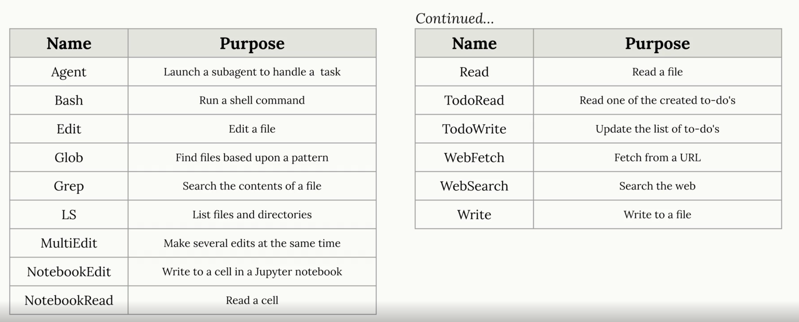

import IndiceTable from '@site/src/components/IndiceTable';


export const data = [
  { tema: '⚡', nombre: 'Claude', link: 'claude' },
  { tema: '🔌', nombre: 'Model Context Protocol (MCP)', link: 'mcp' },
];

<IndiceTable data={data}/>

## LLM vs IA

Se suelen usar como sinónimos, pero son dos tipos de sistemas completamente distintos.

La **IA** es todo sistema que intenta simular el razonamiento humano, es decir, que intenta imitar la inteligencia humana. Por ejemplo, un sistema de recomendación de películas o un sistema de reconocimiento de voz son ejemplos de IA.

Es el **universo completo**.

Un **LLM** es un tipo de modelo de lenguaje que se entrena con grandes cantidades de texto para aprender a generar texto coherente y relevante. Por ejemplo, **ChatGPT es un LLM que se entrena con grandes cantidades de texto para aprender a generar respuestas coherentes y relevantes a preguntas y solicitudes**

Son las **estrellas** de la IA, pero no son la IA completa.

## ¿Qué es un Coding Assistant?

Es un sistema que utiliza LLM para resolver tareas complejas de código.

Cuando se le da una task al coding assistant, el mismo toma los siguientes pasos:

1) Recoger contexto: Reconocer a qué refiere el error, qué archivos pueden estar involucrados.
2) Armar un plan: Decidir cómo resolver el error, por ejemplo, cambiar el código y luego correr los tests.
3) Tomar acción: Implementar el cambio y correr los comandos necesarios.

El paso número 1 y 3 son los más complejos y los cuales requieren el uso de **Tools use**, ya que un coding assistant por sí solo no puede leer código ni correr comandos.

## Tools Use

Cuando se le envía una petición al Coding Assistant, el mismo agrega instrucciones "under the hood" para cumplir con el requerimiento.

Por ejemplo, `"If you want to read a file, respond with 'ReadFile: name of file'"`, estas instrucciones permiten que el Coding assistant pueda leer archivos, lo cual es fundamental para poder resolver tareas complejas de código.

No todos los LLM son buenos en el uso de Tools, por lo que es importante elegir un LLM que tenga buenas capacidades de **Tools Use** para poder desarrollar un Coding Assistant efectivo.

- Pueden combinar el uso de varias Tools para manejar tareas complejas, por ejemplo, pueden usar una herramienta para leer un archivo, otra para escribir en un archivo y otra para correr comandos.
- En algunos LLM estos tools pueden ser extensibles, lo que significa que se pueden agregar nuevas herramientas para que el LLM pueda usarlas, por ejemplo, se le puede agregar una herramienta para acceder a una base de datos o para interactuar con una API externa.
- En el caso de algunos LLM, el uso de Tools ayuda a poder acceder al código fuente sin tener que indexarlo, lo cual significa que no es necesario enviar todo el codebase a un servidor externo.



### Tool Functions

Son funciones Python que son ejecutadas cuando nuestro agente decide que se precisa información extra para ayudar al usuario. Por ejemplo, si preguntamos "¿Qué hora es?", podemos tener una función en Python que obtenga la fecha de hoy, e invocarla.

Estas funciones deben:

- Usar nombres descriptivos, mismo para los parámetros.
- Validar los inputs de forma correcta, y si algo de esto no se cumple, devolver un error claro para que el agente pueda entenderlo y corregirlo.
- Los mensajes de error deben explicar bien el error, para que el agente pueda entenderlo y corregirlo. Por ejemplo, si se espera un número entero y se recibe un string, el mensaje de error debe decir `Se esperaba un número entero, pero se recibió un string`, en lugar de simplemente decir `Error: Invalid input`.

```python
def get_current_datetime(date_format="%Y-%m-%d %H:%M:%S"):
    if not date_format:
        raise ValueError("date_format cannot be empty")
    return datetime.now().strftime(date_format)
```

Para que nuestro LLM entienda cómo usar estas funciones, debemos crear un **JSON Schema** con la descripción de cada una de las funciones, sus parámetros y el formato de los mismos. Por ejemplo:

```json
{
  "name": "get_current_datetime",
  "description": "Returns the current date and time in the specified format.",
  "input_schema": {
    "type": "object",
    "properties": {
      "date_format": {
        "type": "string",
        "description": "The format in which to return the date and time. Default is '%Y-%m-%d %H:%M:%S'."
      }
    },
    "required": []
  }
}
```

La estructura posee:

- `name`: El nombre de la función, que es el mismo que se usará para invocarla.
- `description`: Una descripción clara de lo que hace la función.
- `input_schema`: Un esquema JSON que describe los parámetros de entrada de la función, incluyendo su tipo, descripción y si son requeridos o no.

```python
def get_current_datetime(date_format="%Y-%m-%d %H:%M:%S"):
    if not date_format:
        raise ValueError("date_format cannot be empty")
    return datetime.now().strftime(date_format)

get_current_datetime_schema = {
    "name": "get_current_datetime",
    "description": "Returns the current date and time formatted according to the specified format",
    "input_schema": {
        "type": "object",
        "properties": {
            "date_format": {
                "type": "string",
                "description": "A string specifying the format of the returned datetime. Uses Python's strftime format codes.",
                "default": "%Y-%m-%d %H:%M:%S"
            }
        },
        "required": []
    }
}
```

Una vez que la tool es ejecutada, debemos obtener los resultados de la misma.

- `tool_use_id`: Un identificador único que debe coincidir con el id del bloque ToolUse al que corresponde este ToolResult.
- `content`: El output de la función, serializado como un string.
- `is_error`: Un booleano que indica si ocurrió un error durante la ejecución de la función.

Se pueden usar más de 2 tools en una misma interacción, por lo que es importante que cada ToolResult tenga un `tool_use_id` único que permita asociarlo con el bloque ToolUse correspondiente.

```json
{
  "tool_use_id": "12345",
  "content": "2024-06-01 12:00:00",
  "is_error": false
}
```

Si tenemos varias tools podemos crear un map con los nombres y las funciones correspondientes

```python
def run_tool(tool_name, tool_input):
    if tool_name == "get_current_datetime":
        return get_current_datetime(**tool_input)
    elif tool_name == "another_tool":
        return another_tool(**tool_input)
    # Add more tools as needed
```

Y podremos informarle a nuestro LLM sobre la lista de tools que posee disponibles para usar

```python
response = chat(messages, tools=[
    get_current_datetime_schema,
    add_duration_to_datetime_schema,
    set_reminder_schema
])
```

### Multi-Turn Conversations

También puede suceder que ante una sola request, nuestro LLM requiera llamar a tools de manera consecuente para resolver algo. Por ejemplo, ante la pregunta "¿Qué día va a ser desde hoy 103 días más?", el LLM podría necesitar llamar a una tool para obtener la fecha actual, y luego llamar a otra tool para sumar 103 días a esa fecha, a esto se le dice **Multi-Turn Conversations**

1. El usuario pregunta: "¿Qué día va a ser desde hoy 103 días más?"
2. El LLM llama a la tool `get_current_datetime` para obtener la fecha actual
3. El LLM recibe el resultado de la tool `get_current_datetime`, por ejemplo, "2024-06-01 12:00:00"
4. El LLM llama a la tool `add_days_to_date` con los parámetros `date="2024-06-01 12:00:00"` y `days=103` para obtener la fecha resultante de sumar 103 días a la fecha actual
5. El LLM recibe el resultado de la tool `add_days_to_date`, por ejemplo, "2024-09-12 12:00:00"
6. El LLM responde al usuario con la fecha resultante: "El día que va a ser desde hoy 103 días más es el 2024-09-12"

Para manejar esto se requiere un **conversation loop** que continúa hasta que nuestro LLM deja de precisar el uso de Tools.

```python
def run_conversation(messages):
    while True:
        response = chat(messages)

        add_user_message(messages, response)

        # Pseudo code
        if response isn't asking for a tool:
            break

        tool_result_blocks = run_tools(response)
        add_user_message(tool_result_blocks)

    return messages
```

El hecho de saber que nuestro LLM quiere usar una tool está en el `stop_reason` que devuelve el mismo, el cual puede ser `tool_use` o `stop_sequence`.

```python
if response.stop_reason != "tool_use":
    break
```

- El usuario hace una pregunta o solicitud que el LLM no puede resolver con su conocimiento interno
- El LLM identifica que necesita información adicional o realizar una acción específica para resolver la solicitud del usuario
- El LLM responde con una solicitud de herramienta, indicando qué herramienta necesita usar y con qué parámetros
- El sistema ejecuta la herramienta solicitada por el LLM y obtiene el resultado
- El resultado de la herramienta se envía de vuelta al LLM como parte de la conversación

### Manejo de errores - Fine-grained tool calling

Puede suceder que nuestra tool nos devuelva una respuesta no válida, como un `undefined` inesperado. Estos errores deben ser manejados.

```python
try:
    parsed_args = json.loads(chunk.snapshot)
except json.JSONDecodeError:
    # Handle invalid JSON appropriately
    print("Received invalid JSON, continuing...")
```

Se recomienda implementar esto cuando:

- Necesitas mostrar a los usuarios el progreso en tiempo real sobre la generación de argumentos de las herramientas
- Quieres comenzar a procesar resultados parciales de las herramientas lo más rápido posible
- Los retrasos de buffering afectan negativamente tu experiencia de usuario
- Estás cómodo implementando un manejo robusto de errores JSON


## ¿Cómo funciona la IA?

Se reduce a un concepto sencillo: son sistemas que toman decisiones automatizadas para maximizar cualquier objetivo que se les haya asignado.

Estos sistemas precisan 4 elementos básicos:

- Posibles acciones entre las que elegir
- Un objetivo a maximizar
- Algunos conocimientos básicos
- Conjuntos de datos para el entrenamiento

El aprendizaje automático lo hace posible al detectar patrones en grandes cantidades de datos, en lugar de seguir instrucciones codificadas manualmente. En el corazón de todo sistema de IA existe una tensión crucial: el **equilibrio entre la exploración y la explotación**.

Por ejemplo, si quieres cenar una pizza y nunca probaste la pizza italiana, elegirla representa arriesgarse a probar algo nuevo, pero con la posibilidad de encontrar mejores opciones en el futuro. Los sistemas de IA navegan siempre entre esta tensión, siguiendo el principio de **optimismo ante la incertidumbre**. Esto significa que el sistema de IA siempre opta por la opción que tiene el mayor potencial de recompensa, incluso si esa opción es incierta o arriesgada.

Se asumen ciertos riesgos mientras se despliegan técnicas ya probadas.

Los sistemas actuales de LLM fueron desarrollados gracias a 3 pilares:

- Muchos datos para el entrenamiento de modelos
- Mayor poder computacional
- Nuevas técnicas de entrenamiento

Todo sistema de IA es una máquina de probabilidades, no de certezas. Esto significa que siempre existe la posibilidad de que el sistema de IA genere una respuesta incorrecta o inexacta, incluso si se le da el mismo input varias veces.

La IA aprende a través de patrones en los datos, no a través de la comprensión del mundo real. Esto significa que la IA puede generar respuestas que parecen coherentes, pero que son completamente falsas o sin sentido.

## Orígenes

Se dice que Ramón Llull, un filósofo y místico del siglo XIII, fue el primer generador de contenido automatizado. Creó un sistema de combinaciones de conceptos para generar nuevas ideas y textos. Se dice que este sistema fue una especie de precursor de la computación y la IA: el Ars Magna.

- 1921: Karel Capek acuña el término "robot" en su obra de teatro "R.U.R. (Rossum's Universal Robots)".
- 1950: Alan Turing publica "Computing Machinery and Intelligence", proponiendo el test de Turing para evaluar la inteligencia de las máquinas.
- 1956: John McCarthy organiza la conferencia de Dartmouth, donde se acuña el término "Inteligencia Artificial" y se establece como un campo de estudio formal.
- 1966: Joseph Weizenbaum desarrolla ELIZA, uno de los primeros programas de procesamiento de lenguaje natural, que simula una conversación humana con una voz.
- 1997: Deep Blue de IBM derrota al campeón mundial de ajedrez Garry Kasparov, marcando un hito en la historia de la IA.
- 2008: Apple lanza Siri, el primer asistente virtual de voz integrado en un smartphone, popularizando el uso de la IA en dispositivos móviles.
- 2011: IBM Watson gana el concurso de televisión "Jeopardy!", demostrando avances significativos en el procesamiento de lenguaje natural y la comprensión de preguntas complejas.
- 2012: Se populariza el uso de redes neuronales profundas (deep learning) para tareas de visión por computadora y procesamiento de lenguaje natural, lo que impulsa un gran avance en el campo de la IA.
- 2020: OpenAI lanza GPT-3, un modelo de lenguaje con 175 mil millones de parámetros, que demuestra capacidades impresionantes en generación de texto y comprensión del lenguaje natural.
- 2026: Se espera que los modelos de IA continúen evolucionando, con mejoras en la eficiencia, la capacidad de razonamiento y la generación de contenido, así como una mayor integración en diversas industrias y aplicaciones.

## Tokens

Cuando le mandamos un mensaje a un LLM, el mismo no lee palabras: lee **tokens**, los cuales son unidades de división del texto para poder ser procesado por el LLM.

**Los tokens son fragmentos de texto que un modelo de lenguaje utiliza como unidad básica para leer, interpretar y generar contenido. El modelo piensa en tokens, no en palabras**

Por ejemplo, la frase "Me gusta programar" puede ser separada en tokens como "Me", "gusta", "program" y "ar". Cada token puede estar compuesto de palabras enteras, partes de palabras, espacios o símbolos.

- Determinan cuánto texto puede procesar el modelo a la vez
- Afectan el costo de uso de las APIs
- Influyen en la longitud máxima de entrada y salida
- Cuantos más tokens, más trabajo debe realizar el modelo.

En el contexto de tokens tenemos:

- **Input tokens**: Los enviados al modelo
- **Output tokens**: Los tokens que el modelo responde
- **Context Window**: La cantidad máxima de tokens que el modelo puede manejar en una interacción

## Temperatura

La temperatura es un valor decimal entre 0 y 1 que controla el nivel de aleatoriedad en las respuestas generadas por el modelo. Un valor bajo (cercano a 0) hace que el modelo sea más determinista y repetitivo, mientras que un valor alto (cercano a 1) aumenta la creatividad y diversidad de las respuestas.

La **temperatura baja** se recomienda para respuestas más precisas y coherentes, como análisis de información.

La **temperatura alta** se utiliza para generar respuestas más creativas y variadas, como chistes y escritura creativa.

La temperatura **no asegura respuestas distintas ante cada intento**, sino que **controla el nivel de aleatoriedad en las respuestas generadas**.

## IA generativa

La IA generativa es un sistema que, en vez de analizar datos para tomar decisiones, también crea contenido nuevo, como imágenes, vídeos, etc.

La misma aprende en 2 etapas:

- Pre-training: Analizar patrones a lo largo de millones de ejemplos
- Fine-tuning: Ajustar el modelo para tareas específicas, por ejemplo, para que un LLM pueda responder preguntas de forma coherente.

Dentro de sus **limitaciones** podemos mencionar:

- Sesgo: Si el modelo se entrena con datos sesgados, puede generar resultados sesgados.
- Alucinaciones: El modelo puede generar respuestas que parecen coherentes, pero que son completamente falsas.

## Retrieval Augmented Generation (RAG)

Es una técnica que nos ayuda a trabajar con documentos grandes que superan la capacidad de una prompt. RAG separa estos documentos en chunks y solo toma las partes necesarias para resolver una request.

Hay que considerar que **las prompts largas son más costosas y lentas en resolver**, es por eso que no es 100% útil agregar todo el contenido del documento directamente en la prompt, por lo que RAG ayuda a reducir costos y mejorar la velocidad de respuesta al solo enviar la información relevante para cada request.

RAG se compone de 3 pasos:

- Indexación: El documento se divide en chunks y se indexa para facilitar su búsqueda.
- Recuperación: Cuando se recibe una request, se recuperan los chunks relevantes del documento utilizando técnicas de búsqueda.
- Generación: El modelo de lenguaje genera una respuesta basada en la información recuperada.

Todo esto requiere un preprocesamiento del documento a analizar. **No es una solución simple, pero es escalable y eficiente para trabajar con documentos grandes.**

### Chunck Strategies

Es uno de los pasos mas importantes para que el sistema funcione de manera correcta, ya de que como separamos los documentos depende la calidad de la busqueda y del sistema, y si este es pobre, podemos hacer que la IA devuelva informacion que no tenga nada que ver con lo preguntado en un principio.

Para esto, hay diversas estrategias para realizar esta operacion.

- **Structured-based chuncking**: Cuando controlamos el formato del documento y conocemos que es correcto.
- **Sentence-based chunking**: Es un buen punto medio para la mayoria de los documentos.
- **Size-based chunking**: Es el que funciona en cualquier tipo de texto, incluyendo codigo. Tambien cuando buscamos algo simple pero no perfecto.

#### Size-based chunking

Divide el texto en chunks de un tamaño fijo. La forma mas simple de hacerlo, pero puede cortar frases por la mitad, rompiendo el sentido de la informacion. 

Por ejemplo, dividir un texto en chunks de 500 caracteres. Tampoco se toma en cuenta el contexto de los chuncks de alrededor, para esto, se agregan algunos caracteres del chunck anterior a modo de contexto para completar oraciones o palabras de ser necesario.

```python
def chunk_by_char(text, chunk_size=150, chunk_overlap=20):
    chunks = []
    start_idx = 0
    
    while start_idx < len(text):
        end_idx = min(start_idx + chunk_size, len(text))
        chunk_text = text[start_idx:end_idx]
        chunks.append(chunk_text)
        
        start_idx = (
            end_idx - chunk_overlap if end_idx < len(text) else len(text)
        )
    
    return chunks

```

#### Structured-based chunking

Divide el texto en chunks según su estructura, como párrafos, oraciones, etc. La forma mas inteligente de hacerlo, ya que se toma en cuenta el contexto de los chuncks de alrededor para completar oraciones o palabras de ser necesario.

```python
def chunk_by_sentence(text, chunk_size=3, chunk_overlap=1):
    sentences = text.split('.')
    chunks = []
    start_idx = 0
    
    while start_idx < len(sentences):
        end_idx = min(start_idx + chunk_size, len(sentences))
        chunk_text = '.'.join(sentences[start_idx:end_idx])
        chunks.append(chunk_text)
        
        start_idx = (
            end_idx - chunk_overlap if end_idx < len(sentences) else len(sentences)
        )
    
    return chunks
```

Esto es util cuando conocemos la estructura del texto, y ademas sabemos que es correcta. De otra forma, el sistema no va a entender bien la informacion que se le proporciona.

#### Semantic-based chunking

Divide el texto en chunks según su significado, es decir, separa el texto en chunks que tengan sentido semántico. La forma mas inteligente de hacerlo, ya que se toma en cuenta el contexto de los chuncks de alrededor para completar oraciones o palabras de ser necesario.

```python
from langchain_text_splitters import RecursiveCharacterTextSplitter

text_splitter = RecursiveCharacterTextSplitter(
    separators=["\n\n", "\n", ".", " "],
    chunk_size=500,
    chunk_overlap=20,
)

chunks = text_splitter.split_text(text)
```

Este tipo de chunking puede fallar cuando se buscan terminos especificos, ya que se enfoca mas en contexto y no en terminos espeficicos, por ejemplo, buscando un numero de inciente tecnico podriamos recibir informacion relacionada a seguridad que puede no tener que ver con la problematica en particular. 

Para solucionar esto, se recomienda **combinar Semantic-based con Lexical Search usando una tecnica llamada BM25 (Best Match 25)**

- Semantic Search encuentra contenido conceptualmente relacionado
- Lexical Search encuentra contenido que contiene los terminos buscados
- BM25 encuentra contenido que contiene los terminos buscados y ademas es conceptualmente relacionado, **los combina**

#### BM25 - Best Match 25

Es un algoritmo de busqueda que encuentra contenido que contiene los terminos buscados y ademas es conceptualmente relacionado, **los combina**.

1. Dividir la pregunta del usuario en terminos individuales, "a INC-2023-Q4-011" se convierte en ["a", "INC-2023-Q4-011"].
2. Contar la frecuencia de cada termino en el documento. Que tanto se repite cada termino en el documento a consultar.
3. Cada termino obtiene un puntaje, no es lo mismo buscar "INC-2023-Q4-011" que buscar "a" en el documento. El puntaje de "INC-2023-Q4-011" sera mucho mas alto que el de "a", ya que este segundo se repite mucho mas.
4. Devolver los documentos que contengan más instancias de los términos con mayor ponderación

Este algoritmo funciona muy bien ya que

- Da mayor importancia a terminos raros y especificos
- Ignora las palabras comunes que no dan valor a la busqueda
- Se centra en la frecuencia de los terminos en lugar del significado semantico
- Funciona bien para terminos tecnicos, identificadores y frases especificas


### Text Embeddings

Luego de que separamos el documento en pedazos, el siguiente paso es descubrir cuales chunks son relevantes para responder la pregunta del usuario. Para esto, transformamos cada chunk en un vector, y comparamos con el vector de la pregunta del usuario. El chunk con el vector mas cercano a la pregunta del usuario es el mas relevante.

Por ejemplo, si temos el documento: "El perro es un mamifero, tiene pelo y ladra". Si la pregunta es "Que tipo de animal es el perro?", el vector de la pregunta sera: "mamifero, pelo, ladra", esto ultimo en numeros, por lo que la representacion del vector sera de varios numeros, tales como "[0.1, 0.2, 0.3, 0.4, 0.5, 0.6, 0.7, 0.8, 0.9, 1.0]"

No conocemos que representa cada numero, solo sabemos que cada uno representa un score respecto al texto, por ejemplo, que tan "feliz" es el texto, que tanto que charla sobre cierto tema, etc.. Cada significado lo da el modelo y es dependiendo de como fue entrenado.


### RAG Pipeline

1. Se da un texto y una pregunta
2. Se separa el texto en Chunks
3. Generamos los embeddings 
4. Guardamos estos embeddings en una base de datos Vectorial, especializada en guardar largas listas de numeros.
5. Procesamos la pregunta del usuario pasandola por el mismo Pipeline de Embedding.
6. La base de datos busca los chunks mas relevantes mediante el **algortimo de cosine**
7. Devolvemos el final prompt


## **Errores comunes en los sistemas de IA**

### Alucinaciones

Son secuencias de palabras que parecen tener sentido a simple vista, pero que no tienen ninguna base en la realidad. Es decir, se equivocan; es como información inventada.

Este error se puede ver mucho en los modelos LLM con tópicos tales como **noticias recientes** (2026), en donde, si realizamos alguna pregunta sobre una noticia reciente, la IA podría respondernos con inventos o alucinaciones, ya que no tiene acceso a esa información y, al no tenerla, intenta adivinar lo que podría ser la respuesta, lo que puede llevar a generar respuestas completamente falsas o sin sentido.

### Errores en resúmenes

Cuando le damos un documento a ChatGPT para que nos realice un resumen, es muy común que el mismo omita información importante sobre estos documentos y nos dé un resumen incorrecto o con información faltante. Incluso puede insertar varios puntos que no son reales sobre el documento dado.

### Bias o sesgo

Los LLM se alimentan no solo de información de gente que piensa como nosotros, sino también de gente que justamente no es como nosotros. A veces pueden dar información que no es del todo justa o que refleja un cierto bias que la sociedad tiene respecto a un tema. **Se representa el punto de vista dominante**

Esto se puede ver mucho en la IA generativa. Si le pedimos que genere una imagen de un doctor y una enfermera, la mayoría de las veces la IA generativa va a generar una imagen de un doctor hombre y una enfermera mujer, lo que refleja un cierto sesgo de género que existe en la sociedad respecto a estos roles.

### Exceso de complacencia

Los LLM intentarán tener un comportamiento sumamente complaciente, dándonos la razón en cosas que no necesariamente son correctas. Esto se debe a que los LLM fueron entrenados con grandes cantidades de texto de internet y, en internet, la gente suele ser muy complaciente, por lo que el modelo aprende a ser complaciente para generar respuestas que sean bien recibidas por los usuarios.

**Validan ideas y creencias que pueden ser incorrectas**

## **AI Fluency**

Hay 3 formas con las cuales las personas se involucran con la IA:

- Automatización: La IA completa ciertas tareas basadas en tus instrucciones.
- Augmentation: La IA funciona como un buddy con el cual planificas en conjunto; por ejemplo, un sistema de IA que te ayuda a planificar tu día.
- Agency: La IA toma decisiones por sí misma basadas en ciertas instrucciones tuyas. Por ejemplo, un sistema de IA que toma decisiones de compra y venta en el mercado de valores.

Dentro del concepto de AI Fluency, hay algo conocido como los 4Ds de la IA:

- **Delegation**: Decidir qué trabajo prefieres hacer tú o dejarle a la IA. (¿Cuáles aspectos del proyecto vas a dejar a la IA? Por ejemplo, la redacción de los emails.)
- **Descripción**: Comunicación clara con los sistemas de IA. (¿Qué instrucciones le vas a dar a la IA para que redacte los emails? Por ejemplo, "Redacta un email de marketing para promocionar nuestro nuevo producto, asegúrate de incluir un llamado a la acción claro y un tono amigable".)
- **Discernimiento**: Evaluar la respuesta de la IA con un ojo crítico. (Evaluar la respuesta de la IA con un ojo crítico. Por ejemplo, revisar el email redactado por la IA para asegurarse de que cumple con los requisitos y tiene un tono adecuado.)
- **Diligencia**: Asegurarse de que nuestras interacciones con la IA sean responsables. (Asegurarse de que nuestras interacciones con la IA sean responsables. Por ejemplo, asegurarse de que el email redactado por la IA no contenga información falsa o engañosa.)

### Delegation

Como se describió anteriormente, esta capacidad se define por:

- Definir cuál trabajo realizar nosotros
- Qué delegar a la IA
- Cómo distribuir estas tareas de manera efectiva

Para poder tomar decisiones en base a esto, se deben tener en cuenta 3 puntos:

- **Conocer el problema**, entender las metas y qué tareas se deben llevar a cabo
- **Conocer los distintos sistemas de IA** y sus capacidades, para poder elegir el sistema adecuado para cada tarea
- **Delegar de manera correcta** las tareas a la IA, asegurándose de que se le den instrucciones claras y específicas para que pueda realizar la tarea de manera efectiva.

La meta no es **automatizar el 100% de las tareas**, sino encontrar el equilibrio adecuado entre lo que hacemos nosotros y lo que delegamos a la IA, para maximizar nuestra productividad y eficiencia.

### Descripción - Prompting efectivo

Es el arte de comunicarse de manera efectiva con los sistemas de IA; es la creación de un ambiente de colaboración entre el humano y la máquina. La misma se compone de 3 puntos:

- **Descripción del producto**: Definir de manera clara qué se precisa que cree la IA.
- **Descripción del proceso**: Definir de manera clara el proceso que se debe seguir para crear el producto.
- **Descripción de la Performance o Desempeño**: Definir cómo se quiere que la IA se comporte durante este trabajo colaborativo, es decir, cómo quieres que sea la interacción entre vos y la IA; por ejemplo, si quieres que la IA te haga preguntas para aclarar dudas o si quieres que la IA te dé sugerencias para mejorar el producto.

La comunicación clara desde el comienzo ayuda a que el trabajo sea más efectivo.

Los puntos fundamentales para realizar **prompting efectivo** son:

- **Dar contexto**: Ser claro sobre lo que se precisa, por qué se precisa y cómo se precisa.
- **Dar ejemplos**: Mostrar ejemplos de lo que se espera como respuesta o resultado.
- **Especificar constantes**: Definir el formato deseado y qué especificaciones de output deseamos obtener.
- Separar la lógica en **pasos lógicos** para que la IA los pueda llevar a cabo en "cuotas".
- **Permití que la IA piense primero**, darle espacio para poder establecer bien el contexto y las especificaciones.
- **Definí el tono** en el cual deseas que la IA se comunique con vos durante toda la sesión.

Incluso se le puede **pedir a la IA que mejore tu prompt** mientras trabajas con la misma.

### Discernimiento

Es la forma de identificar si la respuesta recibida de la IA nos fue útil. Hay 3 tipos de discernimiento:

- **Discernimiento de Producto**: Evaluar la calidad del output.
- **Discernimiento del Proceso**: Evaluar cómo la IA procesó o abarcó la tarea.
- **Discernimiento de Performance o Desempeño**: Evaluar cómo la IA cumplió con los objetivos y expectativas establecidos, cómo se comportó a lo largo de la tarea, teniendo en cuenta el estilo de comunicación.

### Diligencia

Mientras que el Discernimiento y la Descripción se enfocan en la efectividad y la eficiencia, la Diligencia se enfoca en criterios de seguridad y ética.

- **Diligencia de Creación** es tener en cuenta qué sistemas de IA se eligen para trabajar y cómo se elige trabajar con los mismos.
- **Diligencia de Transparencia** es ser abierto respecto al rol de la IA en tu trabajo u organización.
- **Diligencia de Deployment** es asumir la responsabilidad por los resultados dados por la IA que se comparten con otras personas; es nuestra responsabilidad su revisión.

Diferentes contextos tienen distintas diligencias, expectativas de verificación y revisión.

## Prompt Engineering

Es un kit de herramientas para armar prompts efectivos mediante distintas técnicas, como:

- **Multishot prompting**
- **Estructura XML**
- Entre otros.

Es escribir un prompt y mejorarlo de manera iterativa, para que el mismo sea cada vez más efectivo.

- Setear una meta: qué queremos lograr con este prompt
- Crear el primer prompt
- Evaluar el prompt
- Aplicar distintas técnicas para mejorar la performance
- Re-evaluar si los resultados fueron mejorados

Los últimos dos pasos son iterativos, ya que se pueden seguir aplicando distintas técnicas para mejorar la performance del prompt, y luego re-evaluar si los resultados fueron mejorados o no.

La concurrencia puede ser controlada. Se recomienda manejar valores pequeños para evitar un error de quota.

```python
evaluator = PromptEvaluator(max_concurrent_tasks=5)
```

### Ejemplo - Agente de Alimentación

Por ejemplo, tenemos el siguiente prompt que debe encargarse de dar un meal plan a una persona dependiendo de su peso, altura y dieta.

```python
def run_prompt(prompt_inputs):
    prompt = f"""
What should this person eat?

- Height: {prompt_inputs["height"]}
- Weight: {prompt_inputs["weight"]}
- Goal: {prompt_inputs["goal"]}
- Dietary restrictions: {prompt_inputs["restrictions"]}
"""

    messages = []
    add_user_message(messages, prompt)
    return chat(messages)
```

Podemos agregarle detalles para que el resultado sea lo más efectivo posible

```python
results = evaluator.run_evaluation(
    run_prompt_function=run_prompt,
    dataset_file="dataset.json",
    extra_criteria="""
The output should include:
- Daily caloric total
- Macronutrient breakdown
- Meals with exact foods, portions, and timing
"""
)
```

Si usamos la herramienta de evaluación de **Claude**, obtendremos un HTML con los resultados, cada dataset, respuesta, razonamiento y un score.

```python
Guidelines:
1. Include accurate daily calorie amount
2. Show protein, fat, and carb amounts
3. Specify when to eat each meal
4. Use only foods that fit restrictions
5. List all portion sizes in grams
6. Keep budget-friendly if mentioned
```

### Estructura XML

Cuando enviamos un prompt con información específica, a veces es difícil para la IA entender que queremos que el output tenga una estructura específica. Para esto, se puede usar una estructura XML, que es un formato de texto que permite definir una estructura de datos de manera clara y legible.

```python
Here are the last 20 meals this person ate:

<meal_history>
{meal_history}
</meal_history>

<athlete_information>
- Height: 6'2"
- Weight: 180 lbs
- Goal: Build muscle
- Dietary restrictions: Vegetarian
</athlete_information>

Generate a meal plan based on the athlete information above.
```

También sirve para cuando queremos agregar código:

```python
Here is the code for the meal plan generator:
<code>
def generate_meal_plan(height, weight, goal, restrictions):
    # code goes here
</code>
```

No hay etiquetas XML predefinidas, se pueden crear las que se quieran, lo importante es que sean claras y que la IA entienda que el output debe tener esa estructura.

### Ejemplificación

Dentro de esta técnica tenemos dos subtécnicas,

- **one-shot**: Dar un solo ejemplo para que la IA entienda el formato deseado, por ejemplo:

```python
Here is an example of a meal plan for a person with the following information:
- Height: 5'8"
- Weight: 150 lbs
- Goal: Lose weight
- Dietary restrictions: None
Daily caloric total: 1500 calories
Macronutrient breakdown: 40% protein, 30% fat, 30%
```

- **multi-shot**: Dar varios ejemplos para cubrir distintos escenarios

```python
Here are some examples of meal plans for people with different information:

Example 1:
- Height: 5'8"
- Weight: 150 lbs
- Goal: Lose weight
- Dietary restrictions: None
Daily caloric total: 1500 calories
Macronutrient breakdown: 40% protein, 30% fat, 30%

Example 2:
- Height: 6'2"
- Weight: 180 lbs
- Goal: Build muscle
- Dietary restrictions: Vegetarian
Daily caloric total: 2500 calories
Macronutrient breakdown: 30% protein, 40% carbs, 30%
```

```python
<ideal_output>
[Your example output here]
</ideal_output>

This example is well-structured, provides detailed information
on food choices and quantities, and aligns with the athlete's
goals and restrictions.
```


## Prompt Evaluation

Es la medición de la efectividad de los prompts de manera automática. Para esto se pueden usar distintas métricas, como:

- **Testing de respuesta esperada vs la recibida**
- **Comparación de versiones del mismo Prompt**
- **Revisión de Outputs en busca de errores**

Existen **Evaluation Pipelines** para automatizar este proceso de evaluación, lo que permite iterar rápidamente sobre los prompts y mejorar su efectividad de manera continua. Esto es necesario, aunque sea un poco más caro, ya que en producción los usuarios podrían interactuar con nuestro sistema de formas que no habíamos previsto.

- **Escribir un Prompt en Draft**
- **Crear un Dataset de evaluación**
- **Evaluar el Prompt con el Dataset**
- **Analizar los resultados con un Grader**: Se evalúa la calidad de la respuesta recibida por la IA, se le asigna una puntuación y se identifican los errores o áreas de mejora. Se asigna una puntuación del 1-10.
- **Mejorar el Prompt**
- **Repetir si es necesario**

Esto puede hacer que nuestro prompt del inicio:

```python
prompt = f"""
Please answer the user's question:

{question}
"""
```

Se convierta en esto (si detectamos que la respuesta no tiene el suficiente detalle):

```python
prompt = f"""
Please answer the user's question:

{question}

Answer the question with ample detail
"""
```

Este nuevo prompt puede pasarse de nuevo por el proceso de evaluación, y se puede obtener otro score, esto para saber si estamos mejorando o simplemente variando.

### Ejemplo de cadena de evaluación

Supongamos que queremos desarrollar una aplicación que ayude a los usuarios a escribir código AWS, y esta acepta outputs en Python, JSON Config files o expresiones regulares.

El principal requerimiento es que, cuando el usuario solicita ayuda con una tarea, el agente devuelva solo código, sin explicaciones ni texto adicional.

Comenzamos con este prompt:

```python
prompt = f"""
Please provide a solution to the following task:
{task}
"""
```

Luego creamos nuestro **Dataset de Evaluación**, que es un array de objetos JSON, con tareas como:

```json
[
  {
    "task": "Create a Python function to..."
  },
  {
    "task": "Write a JSON configuration for..."
  },
  ....
]
```

Se recomienda el uso de **Haiku** para realizar esta tarea, ya que es un modelo mucho más veloz.

Este Dataset se puede guardar en un `Dataset.json` y se puede cargar en nuestro código para realizar la evaluación de nuestro prompt.

Luego nos encargamos de *armar el pipeline de evaluación*:

- Combinamos el prompt con cada una de las tareas del Dataset

```python
def run_prompt(test_case):
    """Merges the prompt and test case input, then returns the result"""
    prompt = f"""
Please solve the following task:

{test_case["task"]}
"""

    messages = []
    add_user_message(messages, prompt)
    output = chat(messages)
    return output
```

- Luego, para cada output recibido, se le asigna una puntuación utilizando un **Grader**:

```python
def run_test_case(test_case):
    """Calls run_prompt, then grades the result"""
    output = run_prompt(test_case)

    # TODO - Grading
    score = 10

    return {
        "output": output,
        "test_case": test_case,
        "score": score
    }
```

Por ahora el 10 estará hardcodeado, pero se puede reemplazar por un sistema de puntuación automatizado que evalúe la calidad de la respuesta recibida por la IA, asignando una puntuación del 1-10 e identificando los errores o áreas de mejora. Además, debemos **elegir un tipo de Grader**, lo cual abordaremos en la siguiente sección.

Y finalmente, creamos la función que se encarga de correr todo el pipeline:

```python
def run_eval(dataset):
    """Loads the dataset and calls run_test_case with each case"""
    results = []

    for test_case in dataset:
        result = run_test_case(test_case)
        results.append(result)

    return results
```

Alimentamos este pipeline con nuestro dataset anteriormente creado

```python
with open("dataset.json", "r") as f:
    dataset = json.load(f)

results = run_eval(dataset)
```

Cada resultado devuelve un JSON estructurado de la siguiente manera:

```json
print(json.dumps(results, indent=2))

{
  "output": "The output generated by the model",
  "test_case": {
    "task": "The original task from the dataset"
  },
  "score": 10
}
```

### Graders

Hay 3 tipos de Graders:

- **Grader Humano**: Un humano evalúa la calidad de la respuesta recibida por la IA, asignando una puntuación del 1-10 e identificando los errores o áreas de mejora.
- **Code**: Se evalúa de manera programática la calidad de la respuesta recibida por la IA, utilizando criterios como la corrección sintáctica, la eficiencia del código, si el código corre y es válido, etc.

Por ejemplo, para chequear la sintaxis:

```python
def validate_json(text):
    try:
        json.loads(text.strip())
        return 10
    except json.JSONDecodeError:
        return 0

def validate_python(text):
    try:
        ast.parse(text.strip())
        return 10
    except SyntaxError:
        return 0

def validate_regex(text):
    try:
        re.compile(text.strip())
        return 10
    except re.error:
        return 0
```

Si la sintaxis es correcta, se devuelve un 10, si no, directamente un 0.

- **Model Grader**: Se utiliza otro modelo de lenguaje para evaluar la calidad de la respuesta recibida por la IA, asignando una puntuación del 1-10 e identificando los errores o áreas de mejora.

```python
def grade_by_model(test_case, output):
    # Create evaluation prompt
    eval_prompt = """
    You are an expert code reviewer. Evaluate this AI-generated solution.

    Task: {task}
    Solution: {solution}

    Provide your evaluation as a structured JSON object with:
    - "strengths": An array of 1-3 key strengths
    - "weaknesses": An array of 1-3 key areas for improvement
    - "reasoning": A concise explanation of your assessment
    - "score": A number between 1-10
    """

    messages = []
    add_user_message(messages, eval_prompt)
    add_assistant_message(messages, "```json")

    eval_text = chat(messages, stop_sequences=["```"])
    return json.loads(eval_text)
```

Antes de elegir cualquiera de estos Graders, se deben tener en cuenta los siguientes puntos:

- **¿Qué formato quiero?**: Para esto, un Code Grader es el más recomendado, ya que devuelve un output estructurado y fácil de analizar.
- **¿Qué syntax tomo como válido? (JSON, Python, etc.)**: Para esto, un Code Grader es el más recomendado, ya que puede evaluar la corrección sintáctica de la respuesta recibida por la IA.
- **¿Cómo se ejecutó la tarea?**: Para esto, un Model Grader es el más recomendado, ya que puede evaluar la calidad de la respuesta recibida por la IA en base a criterios como la relevancia y la coherencia.
