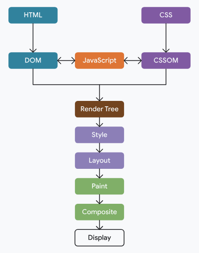

import IndiceTable from '@site/src/components/IndiceTable';

export const data = [
  { tema: '❤️', nombre: 'Angular', link: './angular' },
  { tema: '🩵', nombre: 'React', link: '../desarrollo-web/react' },
  { tema: '🩷', nombre: 'HTML', link: '../desarrollo-web/html' },
  { tema: '🖌️', nombre: 'CSS y SCSS', link: '../desarrollo-web/css' },
  { tema: '🖥️', nombre: 'Server Side Rendering', link: '../ssr' },
];

<IndiceTable data={data}/>

## **Performance**

### Code Splitting

Es una técnica de optimización que consiste en dividir el código de una aplicación en partes más pequeñas y cargarlas de manera asíncrona cuando se necesitan. 

Esto mejora el rendimiento al reducir el tiempo de carga inicial y permite que los usuarios accedan a la aplicación más rápidamente.

- **Route Based Splitting**: Divide el código según las rutas de la aplicación, cargando solo lo necesario para cada ruta. En React se hace mediante `React.lazy` y `Suspense`, en Angular con `loadChildren` y en Vue con `defineAsyncComponent`. La mayoría de las apps tienen más de 10 rutas, y los usuarios solo visitan 2 o 3, por lo que es una **gran mejora de rendimiento**.
- **Component Based Splitting**: Divide el código según los componentes, cargando solo los componentes necesarios para la vista actual.
- **Vendor Splitting**: Divide el código de las dependencias externas (librerías) para que se carguen por separado y puedan ser cacheadas por el navegador. Hecho automáticamente por Webpack mediante `optimization.splitChunks`, requiere configuración. 

Esto se realiza en **build time** con herramientas como Webpack, Rollup o Vite, y se configura mediante opciones específicas para cada tipo de splitting.

### Lazy Loading

Es el arte de no cargar un recurso hasta que sea necesario. Esto puede aplicarse a imágenes, scripts, estilos, etc.

- En React se puede hacer con `loading="lazy"` en las imágenes, o con `React.lazy` y `Suspense` para componentes. 
- En Angular se puede hacer con `loadChildren` para rutas y con `defineAsyncComponent` para componentes. 
- En Vue se puede hacer con `defineAsyncComponent` para componentes.

Esto se realiza en **runtime** y mejora el rendimiento al reducir el tiempo de carga inicial y permite que los usuarios accedan a la aplicación más rápidamente.

1. El usuario va a Profile Page.
2. La app carga el bundle `profile.chunk.js` que contiene el código necesario para renderizar la página de perfil.
3. La UI carga solo cuando se recibe el chunk correspondiente. 

### Critical Rendering Path

Es el paso a paso que el navegador lleva a cabo para transformar el HTML, CSS y JS de nuestra aplicación a píxeles en la pantalla.

1. Parseo del HTML -> DOM
2. Descarga del CSS -> CSSOM
3. Si hay JS en el HTML, el armado del DOM y CSSOM se detiene hasta la descarga total del mismo. Como el JS puede modificar tanto el HTML como el CSS, el navegador espera a su ejecución para continuar con el resto de pasos. -> **Posible bloqueo**
4. Combinación del DOM con CSSOM -> Render Tree
5. Cálculo de posiciones -> Layout
6. Dibujo en pantalla -> Paint

- Es por eso que es importante que nuestro código CSS y JS sea lo más pequeño posible, para que el navegador descargue y ejecute el código de manera más rápida. 
- Se recomienda agregar los scripts al final del HTML o usar `async`/`defer` para que el navegador no espere a la descarga y ejecución del JS.

### Pregunta Entrevista: Si la app tarda 8 segundos en cargar, ¿cómo mejorarías el rendimiento?

- Analizar el bundle con `webpack-bundle-analyzer` para identificar los módulos más pesados.
- Implementar **Route Based Splitting** para cargar solo lo necesario para cada ruta.
- Si tengo elementos pesados como modals o componentes que no se usan en la vista inicial, implementaría **Component Based Splitting**.
- Si tengo muchas dependencias externas, implementaría **Vendor Splitting** para que se carguen por separado y puedan ser cacheadas por el navegador.
- Optimizar las imágenes utilizando formatos modernos como WebP y cargándolas de manera asíncrona con `loading="lazy"`.

