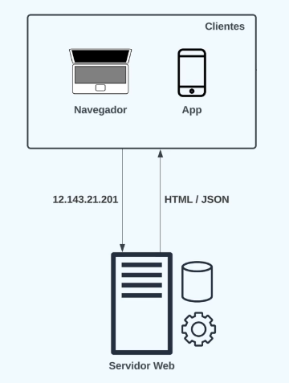
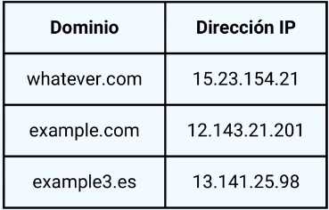
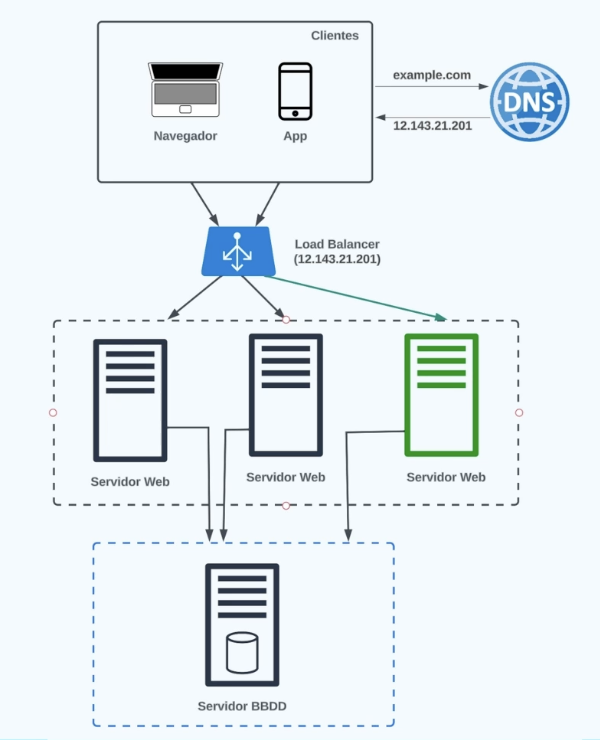

## Punto de partida en System Design

Un sistema utilizado por pocos usuarios puede ser construido de manera simple, un punto de partida común es:

- Es sencillo, fácil de implementar y mantener.
- No es escalable, hay un solo servidor web que se encarga de todo.
- Posee baja fiabilidad, ya que al tener un solo servidor, si el mismo cae, todo cae.

Si agrego más de un servidor, debo usar el [Load Balancer](#load-balancer) para que las requests de nuestros usuarios se distribuyan entre los servidores. El DNS apuntará a la IP del Load Balancer.

## DNS

Cuando escribimos una URL en el navegador, se hace en un formato particular:

Los dominios son una manera de identificar a qué servidor se quiere enviar una petición. Es como un alias a la dirección IP que sería el nombre real del servidor.

El DNS posee una tabla donde apunta el dominio a la IP correspondiente.

- **Servidores DNS gratuitos**: Google (8.8.8.8, 8.8.4.4) y Cloudflare (1.1.1.1, 1.0.0.1), sirven para traducir nombres de dominio en direcciones IP sin tener que pagar por el servicio. Compras un dominio barato en un registrador, pero usas un DNS gratuito como Cloudflare DNS para manejar los registros de forma más cómoda y rápida.
- **Servidores DNS de pago**: Ofrecen características avanzadas como Load Balancer basado en DNS, etc. Un DNS de pago te sirve cuando el DNS empieza a ser una parte crítica de tu producto, no solo “algo para apuntar el dominio”.
    - **Menor latencia global**: redes Anycast más optimizadas para responder rápido desde distintas regiones.
    - **Protección DDoS más fuerte**: importante si tu dominio recibe ataques o mucho tráfico.
    - **Failover automático**: si un servidor cae, el DNS puede dejar de apuntar a esa IP y mandar tráfico a otra.
    - **Health checks**: revisa si tu backend, servidor o endpoint está vivo antes de enviarle tráfico.
    - **GeoDNS / georouting**: enviar usuarios de Europa a servidores europeos y usuarios de EE.UU. a servidores de EE.UU.
    - Entre otras características.

## **Rendimiento**

### Response Time

Dentro del tiempo de respuesta se tiene:

- **Tiempo de procesamiento**: El tiempo que tarda el servidor en procesar la solicitud y generar una respuesta. Esto puede incluir la ejecución de código, consultas a bases de datos, etc.
- **Tiempo de espera**: El tiempo que tarda la solicitud en viajar desde el cliente al servidor y viceversa. Esto puede incluir la latencia de la red, el tiempo que tarda el servidor en recibir la solicitud, etc.

Se puede tener un servidor que procese requests de forma muy rápida, pero si está desplegado muy lejos geográficamente, el tiempo de espera puede ser muy alto. Esto se nota mucho si, por ejemplo, el usuario juega en línea.

La solución para esto es acercar nuestros servidores a los usuarios finales.

Lo que nos interesa disminuir es el **tail latency**, que es el tiempo de respuesta de las solicitudes más lentas. Esto es importante porque si tenemos un sistema que procesa el 99% de las solicitudes en 100 ms, pero el 1% restante tarda 1 segundo, esto puede ser un gran problema para los usuarios finales.

Se recomienda usar como enfoque: "El 99% de las solicitudes deben ser procesadas en menos de 100 ms", en lugar de "El tiempo promedio de respuesta debe ser de 100 ms". Esto es porque el tiempo promedio puede ser engañoso si hay algunas solicitudes que tardan mucho tiempo en procesarse.

### Throughput

Número de peticiones por unidad de tiempo que nuestro sistema puede llevar a cabo. Por ejemplo, podemos tener un sistema que procesa peticiones en 100 ms, pero si solo puede procesar una petición a la vez, el throughput será de 10 peticiones por segundo.

Si se tiene un sistema que procesa peticiones en 100 ms, pero puede procesar 10 peticiones a la vez, el throughput será de 100 peticiones por segundo.

Esto debe ser controlado si se espera que haya picos de tráfico, por ejemplo, en un sitio de e-commerce durante el Black Friday.

### Medición

Se recomienda el uso de **histogramas** para calcular los **percentiles** del tiempo de respuesta.

Por ejemplo, se tienen 10 servidores con su tiempo de respuesta en ms.

| Servidor | Tiempo de respuesta (ms) |
| --- | --- |
| Servidor 1 | 30 |
| Servidor 2 | 50 |
| Servidor 3 | 20 |
| Servidor 4 | 155 |
| Servidor 5 | 30 |
| Servidor 6 | 205 |
| Servidor 7 | 30 |
| Servidor 8 | 25 |
| Servidor 9 | 15 |
| Servidor 10 | 35 |

En esta lista podemos ver que los servidores 4 y 6 poseen un tiempo de respuesta mucho mayor al de los demás. Esto nos dice que algo raro está sucediendo con estos dos servidores.

Esto, con un gráfico del tipo histograma, sería fácilmente identificable, siendo las barras más altas o más bajas las problemáticas.

## **Fiabilidad**

No sirve si nuestro sistema es escalable y performante si falla constantemente. La **tolerancia a fallos** es la capacidad de un sistema para seguir funcionando correctamente incluso cuando ocurren fallos o errores.

- **Uptime**: Tiempo que nuestro sistema está operativo.

- **Downtime**: Tiempo en que nuestro sistema no está operativo.

**Disponibilidad (%) = Uptime / Tiempo total**

Si tenemos múltiples servicios, se tienen varios tipos de cálculos disponibles, ya que las caídas no son lineales (se puede caer solo una región, solo un servidor, etc.).

**Uptime = (cantidad de servicios operativos / Servicios totales) * tiempo** => no se tiene en cuenta el porcentaje de uso de cada uno.

**Uptime = (número de peticiones exitosas / número de peticiones totales) * tiempo** => se tiene en cuenta el porcentaje de uso de cada servicio, pero no la relevancia de cada uno.

Se debe ponderar cada servicio según importancia y uso del mismo. Por ejemplo, no es lo mismo un servicio que se encarga de publicar mensajes en Reddit como el login; el segundo es mucho menos usado que el primero en un producto como Reddit.

### Mean Time Between Failures (MTBF)

Es el tiempo medio entre fallos de nuestro sistema.

**Nos interesa un MTBF alto, ya que esto significa que nuestro sistema es más confiable y tiene menos fallos.**

#### Mean Time To Recover (MTTR)

Es el tiempo medio para que el sistema se recupere de un fallo.

**Nos interesa un MTTR bajo, ya que esto significa que nuestro sistema se recupera rápidamente de los fallos.**

### Disponibilidad

¿Qué significa que nuestro sistema tenga **alta disponibilidad**?

Obviamente nuestros clientes quieren que el sistema esté el 100% del tiempo disponible, pero esto no es posible, ya que siempre pueden ocurrir fallos humanos, de hardware, proveedores externos o mantenimiento.

Sin embargo, se puede diseñar un sistema para que tenga una alta disponibilidad, lo que significa que el sistema estará disponible la mayor parte del tiempo posible.

El 100% es inalcanzable, pero se puede apuntar a un 99.999% de disponibilidad, que quiere decir que nuestro sistema estará caído solo 5.26 minutos por año, lo que representa 800 milisegundos por día.

Empezamos a hablar de alta disponibilidad a partir del **99.9% Tres nueves**, que representa un downtime de 8.77 horas por año, o 49 minutos por mes.

## **Escalabilidad**

Significa que puede crecer sin romperse ni volverse muy lento cuando hay picos de tráfico. Simplemente se añaden más recursos sin afectar el rendimiento (CPU, memoria, etc.).

Si se pasa de 10 a 1000 usuarios, el sistema debería seguir respondiendo igual de bien.

Un ejemplo puede ser una cafetería: si se tiene un solo barista para 50 clientes, la cola se hace infinita.

### Vertical vs Horizontal

Existe la escalabilidad **vertical** y **horizontal**.

|Vertical|Horizontal|
| --- | --- |
| Se le agregan más recursos al servidor: CPU, memoria, etc. | Se añaden más instancias o máquinas virtuales para repartir la carga entre ellas |
| Se tiene el mismo barista, pero con una máquina más rápida | Se contratan más baristas para lidiar con el flujo de gente |
| Es un poco más fácil, pero a veces limitada; siempre hay un tope de mejora | Es más difícil de realizar, pero no tiene límite teórico |
| No es tolerante a fallos: si el servidor falla, todo el sistema cae | Es más tolerante a fallos: si una instancia falla, las demás siguen funcionando, lo que aporta **alta disponibilidad** |

**No hay relación directa entre más recursos y más rendimiento; a veces se pueden tener cuellos de botella que no se solucionan agregando recursos.**

Por ejemplo, si el sistema tiene un cuello de botella en la base de datos, agregar más CPU al servidor no va a solucionar el problema.

### Escalable entre múltiples equipos

Debemos tener en cuenta los siguientes puntos:

**Gobernanza clara**

- Core team (dueños del sistema): define estándares, revisa PRs, mantiene roadmap.
- Contribución abierta: cualquier equipo puede aportar, pero con guidelines y templates.
- RFC liviano para cambios grandes (nuevos patterns, breaking changes, tokens nuevos).

**Tokens primero (la base de la consistencia)**

Defino design tokens como fuente de verdad: colores, spacing, tipografía, radios, sombras, z-index, breakpoints.

**Arquitectura por capas**

- Foundations: tokens + guidelines.
- Primitives: Button, Input, Text, Stack, Grid.
- Composites: Modal, Table, DatePicker.
- Patterns: flows y ejemplos (login, checkout, settings).

Esto permite que equipos usen lo mínimo necesario sin romper todo.

**Documentación**

- Un Storybook / Docs site con: ejemplos reales, do/don’t, guidelines de UX, accesibilidad, snippets copy-paste.
- “Cómo migrar” entre versiones (no solo “breaking changes”).

**Calidad y compatibilidad en CI**

Tests:
- unitarios + visual regression (Chromatic / Playwright screenshots).
- a11y checks (axe).
- type tests (TS).

**Consumer-driven**: una app grande sirve como canary para detectar breaks.

## Servicios Stateful

En los **servicios stateful** el estado se mantiene en el servidor. Por ejemplo, si un usuario inicia sesión, el servidor guarda su información en memoria.

Esto puede ser un problema para la escalabilidad horizontal, ya que si se añaden más instancias, el estado no se comparte entre ellas. Para solucionar esto, se pueden usar bases de datos o cachés distribuidas para compartir el estado entre las instancias, o asignar un servidor a un usuario específico y siempre direccionar sus peticiones hacia el mismo servidor mediante **sticky sessions**, aunque esto reduciría la **tolerancia a fallos**.

## Servicios Stateless

En los **servicios stateless** no se almacena información del usuario en el servidor; cada petición es independiente y contiene toda la información necesaria para ser procesada. Esto facilita la escalabilidad horizontal, ya que se pueden añadir más instancias sin preocuparse por el estado.

Si hace falta guardar algún tipo de información, esta puede almacenarse en las **cookies** o en el **Local Storage** del cliente, o se puede usar un sistema de **tokens (JWT)** para mantener la información del usuario sin necesidad de almacenarla en el servidor.

## **Tolerancia a Fallos**

Los fallos son inevitables, lo importante es cómo los manejamos.

La misma consta de 3 prácticas:

- Prevención
- Detección
- Recuperación

### Prevención

Para prevenir los fallos de un sistema se debe entender el **Single Point of Failure (SPoF)**, que es un componente del sistema que, si falla, hará que todo el sistema falle.

- Servidor
- Base de datos
- Proveedor de servicios externos

Es importante **eliminar** estos puntos. Se debe aplicar **redundancia**.

- Múltiples servidores (escalado horizontal)
- Múltiples bases de datos (réplicas)

### Detección

La detección rápida es vital.

- Aviso a interesados
- Puesta en marcha de estrategias de mitigación (fallbacks, circuit breakers, etc.)

Esto se maneja mediante la **Monitorización** del sistema, que es el proceso de recopilar, analizar y utilizar datos para entender el rendimiento y la salud de un sistema. Esto incluye:

- **Logs**: Registros detallados de eventos que ocurren en el sistema. Pueden ser útiles para diagnosticar problemas y entender el comportamiento del sistema.
- **Métricas**: Datos cuantitativos que miden el rendimiento del sistema, como el tiempo de respuesta, el throughput, la tasa de errores, etc. Estas métricas pueden ser utilizadas para detectar anomalías y predecir fallos.
- **Alertas**: Notificaciones que se envían cuando se detecta un problema o una anomalía en el sistema. Las alertas pueden ser configuradas para diferentes niveles de gravedad y pueden ser enviadas a diferentes equipos o personas según el tipo de problema.

### Recuperación

Es importante recuperar el sistema lo antes posible para evitar que los usuarios se vean afectados a gran medida.

- Apagar por completo el sistema para dejar de propagar errores
- Rollback a una versión anterior estable
- Copia de seguridad de los datos

La recuperación debe ser lo más sencilla posible, ya que se considera una situación de estrés.

Luego, se debe hacer un **Post Mortem** para entender qué pasó, por qué pasó y cómo evitar que vuelva a pasar.

## **Mantenibilidad**

El desarrollo inicial de un sistema es solo el comienzo.

El sistema debe ser mantenido y actualizado a lo largo del tiempo para corregir errores, agregar nuevas funcionalidades, mejorar el rendimiento, etc.

El producto debe ser **sencillo de mantener** para que los devs puedan trabajar en el mismo y no se convierta en un sistema abandonado, ya que el costo de implementación es mayor a la ganancia.

### Observabilidad

Hacer sencillo el trabajo del equipo de operaciones, que el sistema se mantenga trabajando de la manera más fácil posible.

- Mantener la documentación actualizada
- Dar los accesos necesarios a los equipos de operaciones para que puedan monitorear el sistema de manera efectiva

No siempre el mismo equipo de devs compone el equipo de operaciones, por eso es importante que el sistema sea fácil de entender y mantener para cualquier persona que trabaje en él, incluso si no fue el equipo original que lo desarrolló. En este caso se debe **ofrecer soporte para la automatización y la integración del código**

Los mismos son responsables de:

- Monitorizar la salud del sistema y restaurarlo lo antes posible si algo sucede. **Es importante que la información interna del sistema tenga una buena visibilidad para que el monitoreo sea útil**
- Investigar la razón de los problemas
- Mantener la infraestructura y herramientas actualizadas
- Anticipar futuros problemas que puedan suceder, **nuestro sistema debe ser lo más predecible posible para minimizar las sorpresas**
- Mantenimiento, **se debe evitar la dependencia con máquinas individuales**

### Simplicidad

Que si un nuevo dev ingresa a nuestro equipo, pueda entender el sistema de manera fácil y rápida para poder aportar valor de manera más rápida.

- A medida que el código crece, la calidad baja.
- Si el código es complejo, la probabilidad de generar nuevos bugs es alta.
- El código debe ser sencillo de entender, con una buena estructura y organización, para que cualquier persona pueda entenderlo sin necesidad de tener un conocimiento profundo del mismo.

Algunos problemas comunes son:

- Módulos muy acoplados
- Dependencias innecesarias
- Nombres de variables o funciones inconsistentes
- Acciones inesperadas en el código, cuando se ejecuta una función, se espera que haga algo, pero hace otra cosa, lo que puede generar confusión y errores.

### Extensibilidad

Que nuestro sistema pueda ser extendido con nuevas funcionalidades sin necesidad de modificar el código existente, lo que facilita la incorporación de nuevas características y la adaptación a cambios futuros.

Facilitar futuros cambios en nuestro sistema, ya que los mismos son inevitables.

Esto se puede lograr mediante:

- **Lado código**: Mantener el código limpio y predecible
- **Lado organizativo**: Dar lugar a procesos de organización simples y claros para que los devs puedan seguirlos y no se convierta en un caos.
    - **Cascada**: Primero toma de requisitos, diseño, implementación y mantenimiento. Es un proceso lineal, donde cada etapa se completa antes de pasar a la siguiente. Este proceso es rígido y no permite cambios una vez que se ha pasado a la siguiente etapa. **Poca flexibilidad**
    - **Ágil**: Se divide el trabajo en sprints, donde se planifica, se ejecuta y se revisa el trabajo de manera iterativa. Este proceso es flexible y permite cambios a medida que se avanza en el proyecto, lo que facilita la adaptación a cambios futuros. **Alta flexibilidad**

## **Load Balancer**

Load Balancing es el proceso de distribuir el tráfico de red entre múltiples servidores para:

- No sobrecargar ninguno de ellos.
- Mejorar la performance reduciendo los tiempos de respuesta.
- Mejorar la availability/disponibilidad/fiabilidad del servicio redirigiendo el tráfico si algún servidor se cae.

El Load Balancer será público mientras que nuestros servidores se encontrarán en una red privada. El DNS apunta a la IP del Load Balancer.

Para implementar load balancing, hay **algoritmos** con sus pros y cons.

**Load Balancers populares**:

- NGINX
- HAProxy
- Amazon Elastic Load Balancer
- Azure Load Balancer
- Google Cloud Load Balancer

### Posibles errores

Si el Load Balancer falla, **todo el sistema queda no operativo**, se convierte en nuestro único punto de falla. Una forma de mitigar esto es:

- Se pueden tener múltiples Load Balancers
- Global Server Load Balancers, son servicios de pago que se pueden usar como Load Balancers.
- Desplegar nuestro sistema en diversos datacenters en varias regiones
- Load Balancer en el DNS, pero no conoce el estado de los servidores. Se puede enviar la request a un servidor roto y solo se da cuenta mediante los reintentos.

### Round Robin

Distribución en forma secuencial.

Supongamos que tenemos 3 servidores.

1. La primera request se envía al primer servidor.
2. La segunda request se envía al segundo servidor.
3. La tercera request se envía al tercer servidor.
4. Ante una cuarta request, el loop se reinicia y esta se envía al primer servidor.

**¿Cuándo se usa?**

- Todos los servidores tienen la misma o similar capacidad de procesamiento.
- Cuando la distribución pareja entre servidores es importante.
- Cuando la simplicidad es importante.

| Pros | Cons |
| --- | --- |
| Simple de entender | No considera el nivel de carga ni el tiempo de respuesta |
| Simple de implementar | Si los servidores tienen distinta capacidad de procesamiento, puede ser ineficiente |
| Asegura la distribución equitativa | |

### Weighted Round Robin

Se distribuye por peso.

Es la arquitectura perfecta para cuando **tenemos servidores con distinto procesamiento**.

- Cada servidor es asignado con una cantidad máxima de requests dependiendo de su poder de procesamiento.
- Más procesamiento, más requests, y viceversa.

| Pros | Cons |
| --- | --- |
| Se asigna carga dependiendo del poder de procesamiento | Un poco más complejo de implementar |
| Uso más eficiente de los recursos | No considera tiempo de respuesta |
| Asegura la distribución equitativa | |

### Least Connections

- Monitorea la cantidad de conexiones activas en cada servidor.
- Se le asignan nuevas requests al servidor que tiene menor carga.

Es una buena opción cuando se tienen varios servidores con capacidades de procesamiento similares, pero con distinto nivel de conexiones concurrentes.

| Pros | Cons |
| --- | --- |
| Distribuye la carga de forma más dinámica | Si los servidores tienen distinto nivel de procesamiento, puede no ser óptimo |
| Previene el overload de cualquier servidor | Requiere el tracking de la cantidad de conexiones por servidor |

### Least Response Time

- Se monitorea el tiempo de respuesta de cada servidor.
- Se le asigna la siguiente request al servidor con el tiempo de respuesta más rápido.

| Pros | Cons |
| --- | --- |
| Minimiza la latencia | Se debe monitorear el response time de forma exacta para poder tomar la mejor decisión |
| Se adapta dinámicamente a los cambios de tiempo de respuesta de los servidores | No se consideran factores como carga ni cantidad de conexiones |
| Mejora la experiencia del usuario, ya que el tiempo de respuesta es mucho mejor | |

### IP Hash

- Se usa la IP de origen del cliente para calcular un hash.
- Ese hash determina a qué servidor se enviará la request.
- Mientras la IP no cambie, el cliente tiende a caer siempre en el mismo servidor.

Es una buena opción cuando se necesita **session persistence (sticky sessions)**, por ejemplo, en aplicaciones donde el estado de sesión se guarda en memoria del servidor.

| Pros | Cons |
| --- | --- |
| Mantiene afinidad cliente-servidor de forma natural | Si muchos usuarios salen por una misma IP (NAT/proxy), puede generar desbalance |
| Reduce la necesidad de compartir estado entre servidores | Si un servidor cae, los clientes mapeados a ese nodo deben re-hashearse |
| Implementación simple y predecible | Cambios en la red (IP dinámica) pueden romper la persistencia |

## **¿Cómo solucionar un problema de entrevista?**

1. **Desarrollar el Scope del Problema**: Hacer preguntas para entender el problema, los requerimientos, las restricciones, etc. Esto es importante para poder entender el problema y no asumir cosas que no son ciertas. Por ejemplo, si el problema es diseñar un sistema de reservas de vuelos, se pueden hacer preguntas como: ¿Qué tipo de vuelos se van a reservar? ¿Solo vuelos comerciales o también vuelos privados? ¿Qué tipo de usuarios van a usar el sistema? ¿Solo clientes o también agentes de viajes? etc.
2. **Realizar un diseño abstracto**
3. **Encontrar cuellos de botella (bottlenecks) en tu solución**: Esto es importante para poder mejorar la solución y hacerla más escalable. Por ejemplo, si el sistema de reservas de vuelos tiene un solo servidor para manejar todas las reservas, esto puede ser un cuello de botella, ya que si el servidor falla, todo el sistema cae. Para solucionarlo, se pueden añadir más servidores clonados para repartir la carga entre ellos.

- Separar el problema en módulos más simples. Por ejemplo, si el problema es diseñar un sistema de reservas de vuelos, se puede separar en módulos como búsqueda de vuelos, reserva de vuelos y pago. **Top-down approach**
- Charlar sobre los trade-offs

## **API Gateway**

Es un entry point que maneja las requests cuando se tienen varios servicios backend y no queremos duplicar código.

- Lógica común de autenticación, seguridad, Rate Limiting, etc. Elimina código y lógica duplicada
- Facilita el monitoreo
- Único punto de entrada. Redirige las peticiones al servicio correspondiente
- Se pueden **cachear** peticiones sin pasar por los servicios. Por ejemplo, peticiones frecuentes.
- Gestión de tráfico y limitación de acceso. **Mayor observabilidad**
- Simplifica la lógica del lado del cliente. Sin el API Gateway, el frontend deberá llamar a un servicio distinto dependiendo de lo que se desee usar. Y esto no es práctico.

Cliente -> API Gateway -> Microservicio correspondiente

**Consideraciones**

- Se debe evitar llamar a los servicios de forma directa, siempre se debe pasar por API Gateway, ya que conserva el aislamiento de los servicios
- Tampoco debe tener lógica de negocio. La misma debe estar solo en los servicios.
- El rendimiento se verá un poco afectado. Se debe analizar si los beneficios compensan, ya que ahora pasamos por API Gateway, es un paso extra.
- Es un **único punto de fallo**, se debe monitorizar de cerca, si cae, los clientes no tendrán acceso a ningún servicio.

**API Gateways populares**:

- NGINX
- Spring Cloud Gateway
- Express Gateway
- Amazon API Gateway
- Azure API Management
- Google Cloud API Gateway

## **Message Brokers**

Generalmente podemos hablar de la **comunicación síncrona**.

1. El cliente hace una request
2. El servidor procesa la petición manteniendo la conexión abierta con el cliente
3. Se devuelve el resultado
4. Se cierra la conexión

Es muy simple y óptima para tareas de corta duración.

Para tareas largas es un poco más complicado, ya que se pueden dar **picos de tráfico** dada la conexión mantenida durante todo el procesamiento. Para esto se recomienda la **comunicación asíncrona** con Message Brokers.

1. El cliente hace una request
2. El servidor, en vez de mantener al cliente en una conexión abierta, envía el trabajo a un Message Broker.
3. El Message Broker guarda el mensaje en una cola.
4. Un worker consume el mensaje y procesa la tarea.
5. El resultado se informa luego mediante polling, webhook, WebSocket u otro mecanismo.

## **Cache**

Es un area de almacenamiento temporal donde se guarda la response de ciertas peticiones repetitivas y costosas para que las siguientes llamadas sean mucho mas rapidas.

La Cache esta hecha para que sea de alta velocidad de acceso y consulta. 

Algunas preguntas que debemos hacernos a la hora de seleccionar un tipo de cache son:

- Ver los costes
- Realmente se precisa? En donde? Observar metricas
- Que tipo de sistema tenemos? Write-heavy? Read-heavy? La consistencia eventual es aceptable? 
- Que tipo de consistencia deseamos? **Considerar que en sistemas de gran escala con caches y BBDD con multiples instancias en distintas regiones del mundo, la consistencia puede ser un problema**

| Característica | **Cache Aside** | **Read Through** | **Write Through** | **Write Behind (Back)** |
| :--- | :--- | :--- | :--- | :--- |
| **Responsable de la lógica** | La Aplicación | La propia Caché | La Aplicación / Caché | La Caché (Asíncrono) |
| **Flujo de Datos** | App → BBDD → Caché | App → Caché → BBDD | App → Caché → BBDD | App → Caché ... → BBDD |
| **Actualización BBDD** | Manual (por la App) | Automática (Lectura) | Síncrona (Escritura) | **Asíncrona** (Batch) |
| **Acoplamiento** | **Bajo** (Independientes) | **Alto** | **Alto** | **Alto** |
| **Latencia de Escritura** | Baja | N/A | **Alta** (Espera BBDD) | **Mínima** (Confirmación inmediata) |
| **Consistencia** | Eventual / Manual | Alta (en lectura) | **Fuerte** (Síncrona) | Baja (Riesgo de pérdida) |
| **Uso Ideal** | Read-heavy / General | Read-heavy / Limpieza de código | Consistencia crítica | **Write-heavy** / Alto rendimiento |
| **Ventaja Principal** | Flexibilidad total | Transparencia para la App | Datos siempre íntegros | Máxima velocidad de escritura |

**Caches Populares:**

- Redis
- Memcached
- Spring Cache
- Caffeine
- AWS ElastiCache
- Microsoft Azure Cache for Redis

### Expiration Policy

No es recomendable mantener los datos cacheados demasiado tiempo. Se debe establecer un TTL (Tiempo de vida - Time to Live) de los datos

- Una vez superado, se elimina el dato de la cache
- Si es muy alto, los datos estaran desactualizados
- Si es bajo, los datos tendran que ser actualizados continuamente

### Eviction Policy

Es la politica de reemplazo de datos. Si llega un nuevo dato y se encuentra llena, debemos eliminar algun elemento.

La cache no es infinita, y su costo puede ser elevado. 

- **LRU (Least recently used)**: Se elimina el dato que se consulto por ultima vez hace mas tiempo. **La mas popular de todas**
- **LFU (Least Frequently Used)**: Se elimina el dato menos consultado de todos
- **FIFO (First In First Out)**: Se elimina el dato que primero se haya insertado

## **CDN (Content Delivery Network)**

No importa si nuestra aplicacion en materia de codigo es performante, si los **Recursos estaticos** tardan en cargar, el usuario tendra una mala experiencia. 

Los recursos estaticos pueden ser:

- Imagenes
- Videos
- CSS
- JS

Los recursos no se descargan con el HTML, se enlazan con el mismo. Dentro de DevTools, en la parte de recursos, podemos ver la cantidad que son cargados, 100 archivos no es mucho. 

Esto hace que un recurso no este attacheado a un archivo si no a una direccion de CDN. 

Los recursos se descargan de manera paralela, pero hay un limite de descargas paralelas por navegador. 

Los CDN son una infraestructura distribuida compuesta por servidores en muchas ubicaciones fisicas. 

- Almacenan y entregan recursos de forma rapida y eficiente
- Optimizan la experiencia del usuario reduciendo la latencia, haciendo que el usuario de Europa acceda a los recursos del servidor Europeo y no al de America.
- Mejoran la **disponibilidad** del contenido, ya que el contenido es guardado en el servidor mas cercano al usuario, y si este falla, se elige el siguiente mas cercano. 
- Optimizado para cachear recursos. Algoritmos de compresion (Brotli, Gzip) y minificacion de JS y CSS, esto **reduce el ancho de banda**

**Es un cache de recursos estaticos**

Tiene un costo importante, y varia dependiendo de la cantidad de informacion que queremos guardar. A mayor frecuencia de actualizacion de los recursos tambien, mayor el coste. **Compensa solo si tenemos usuarios alrededor del mundo**

Ademas nuestro sistema debe ser **reciliente a fallos del CDN**. Si el CDN falla, los usuarios deben poder acceder a los recursos desde el servidor o tener un fallback, ya que se trata de un servicio de terceros.

**CDN Populares**

- Cloudflare
- Akamai
- AWS CloudFront
- Google Cloud CDN
- Microsoft Azure CDN

### Estrategia Pull

El CDN realiza una llamada al servidor para obter los recursos estaticos, y los mismos son cacheados. Es una estrategia que no necesita mantenimiento de nuestra parte, de todo se encarga del CDN. 

1. El usuario solicita un recurso al CDN
2. Si el CDN no tiene el recurso, lo busca en el servidor mas cercano y ahora si, lo almacena
3. Se devuelve el recurso al usuario desde el CDN 

Esto puede dar problemas, **que sucede si un recurso cacheado se modifica en el servidor?**, se debe establecer una **politica de vencimiento** para no devolver recursos desactualizados.

1. El usuario solicita un recurso al CDN
2. Si el CDN no tiene el recurso, **o el mismo ya esta expirado**
3. Si el recurso esta cacheado y expirado, se verifica si fue modificado, y si lo fue, se actualiza en el CDN
4. Ahora si, se devuelve el recurso al usuario desde el CDN 

Otra desventaja es que, ante una primera request, la performance puede no ser la mejor, ya que se va al servidor. 

### Estrategia Push

El servidor tiene la responsabilidad de enviar los recursos nuevos, o actualizados, al CDN. Si el recurso no existe en el CDN, **se devolvera un error**

- El contenido siempre estara actualizado
- Todo estara cacheado, desde la primera request
- **Requiere mayor mantenimiento de nuestra parte** ya que el servidor tiene la responsabilidad del envio de recursos. 

## **Data Centers**

Si mantenemos todos nuestros servidores en una unica ubicacion geografica, podremos enfrentar problemas. 

- Latencia alta para algunos usuarios que se encuentren lejos, inaceptable para juegos online o sistemas en tiempo real. 
- Robustez insuficiente, pueden suceder cortes de luz en la zona geograficas donde se encuentre nuestro data center. **Seria aceptable una caida total debido a un fallo en un data center?**